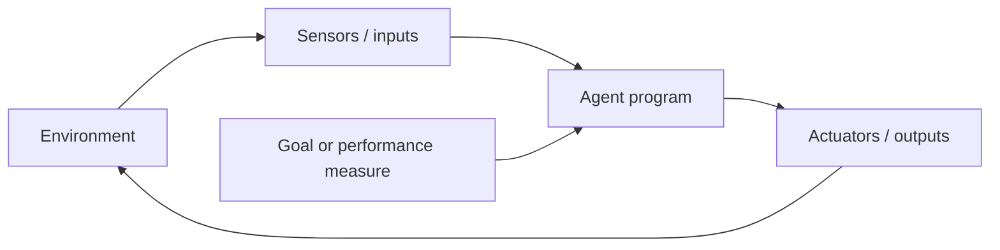
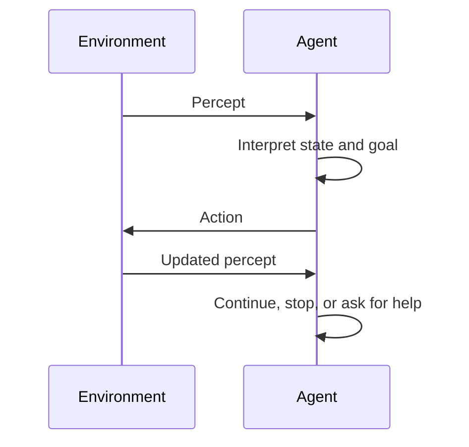
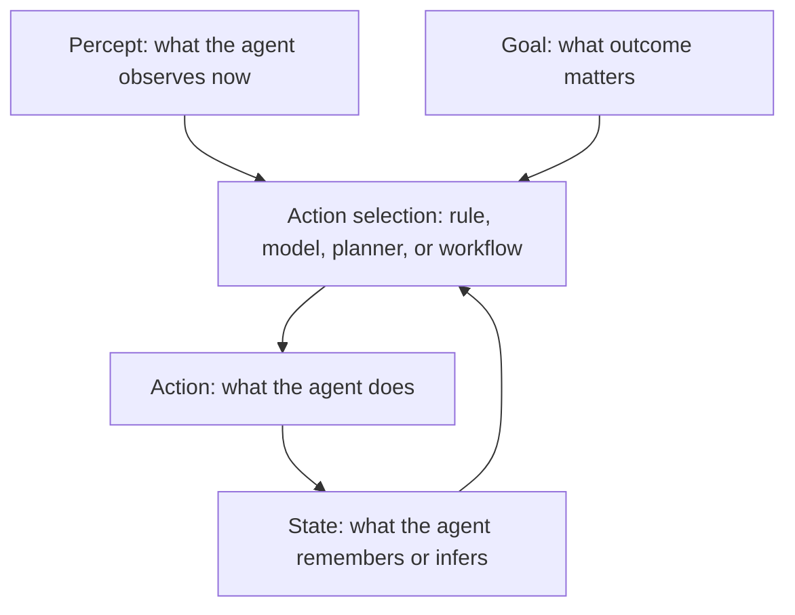
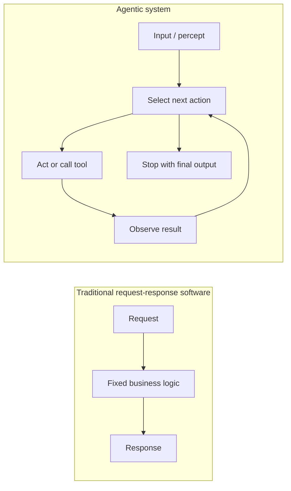
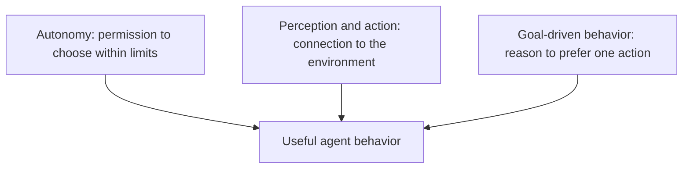
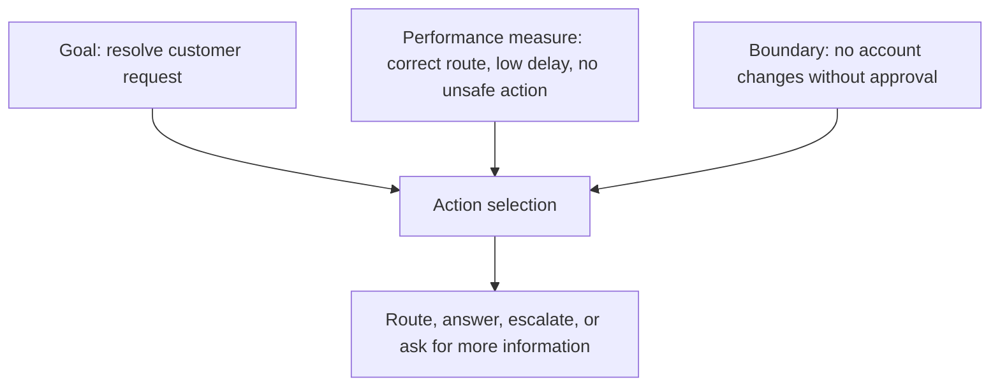
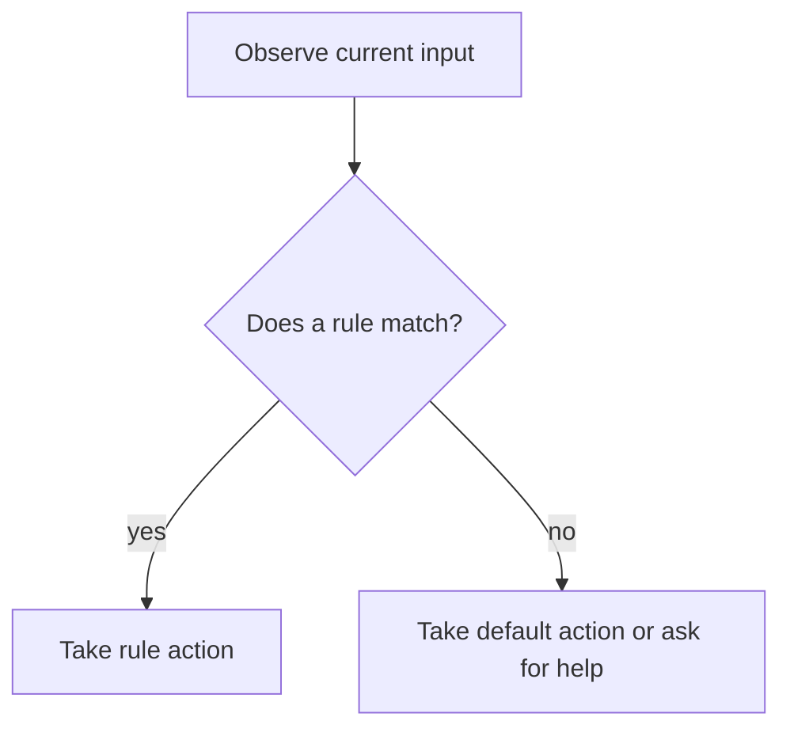
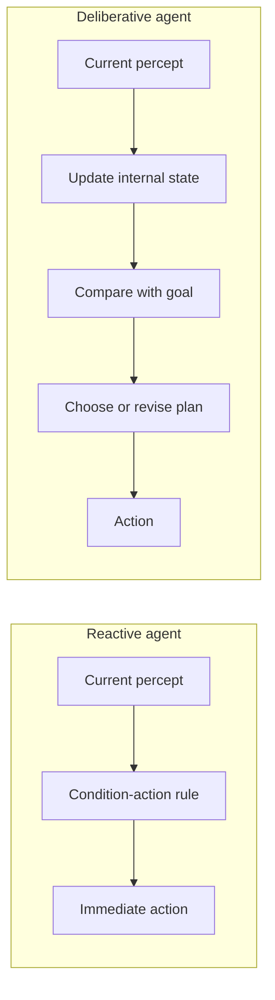

# Chapter 1. Understanding Agents: The Core Concept

A calendar reminder is useful because it remembers a time and displays a message. A production incident router is more interesting: it watches alerts, service ownership, recent deploys, and severity signals before deciding whether to page a team. A robot vacuum is more interesting still: it senses walls, cliffs, wheel motion, dirt, and battery state, then keeps acting until the room is cleaner than when it began.

This difference is the doorway into agents.

Most software waits. It receives a request, runs instructions, and returns a result. An agent does something closer to work: it observes a situation, chooses an action, acts on the world, observes what changed, and continues until some goal or stopping condition is reached. That loop is simple enough to fit on one page, but it is powerful enough to describe thermostats, trading systems, robot vacuums, fraud monitors, coding assistants, and modern AI agents built with LangChain and LangGraph.

The need for this concept is practical. If we describe every AI application as "a chatbot," we miss the engineering problem. A chatbot produces text. An agent must manage state, choose actions, call tools, recover from incomplete information, and remain bounded by safety constraints. Without the agent lens, teams often build systems that can answer questions but cannot reliably do work.

This chapter builds the lens. We will start with the classic definition of an agent, connect it to operational systems, contrast agents with traditional software, and then implement a small rule-based agent using current LangGraph 1.0 APIs. The point is not to build a production assistant yet. The point is to establish the architectural shape we will refine throughout the rest of the book.



## 1.1 What is an Agent?

The word "agent" is useful because it points to responsibility. An agent is not merely a function that transforms input into output. It is a system situated in an environment, with some ability to observe, decide, and act. This matters because real work happens in environments that change: inboxes receive new mail, factories report new sensor values, users revise their goals, and software systems fail in ways that were not present in the first prompt.

The classic artificial intelligence definition, popularized by Russell and Norvig, is concise: an agent is anything that can perceive its environment through sensors and act upon that environment through actuators. A software agent may not have cameras or wheels, but it still has inputs and outputs. It can read messages, files, API responses, database records, or logs. It can respond by sending a message, writing a file, calling a tool, updating a ticket, or asking a human for approval.

The essential pattern is not "AI." The essential pattern is a loop:

1. The agent receives a percept, meaning information from the environment at a given moment.
2. It interprets that percept in light of its goal and, when available, its prior state.
3. It selects an action.
4. The action changes the environment or the agent's own state.
5. The next percept arrives, and the loop continues.



This loop is the foundation for the rest of the book. As introduced in Chapter 2, "The Evolution from Basic Agents to AI Agents", modern AI agents add language models, planning, tool use, and feedback. But those additions do not replace the loop. They make the loop more capable.

### 1.1.1 Definition and Characteristics

Definitions matter here because "agent" is now used loosely in product names, research papers, and software frameworks. If the word means any AI feature, it stops helping professionals design, review, and govern systems. A useful definition must be broad enough to include simple software agents and precise enough to separate agents from ordinary scripts.

In this book, an agent is a system that perceives an environment, selects actions, and acts toward a goal.

That definition has four important characteristics.

First, an agent has an environment. The environment is the part of the world the agent operates in. For a robot vacuum, the environment is a physical floor plan with rooms, furniture, dirt, stairs, and a charging dock. For an email filter, the environment is a stream of messages, sender reputations, authentication results, headers, links, attachments, and user feedback.

Second, an agent has percepts. A percept is an input from the environment at a particular moment. A proximity reading, a temperature value, an incoming email, a user request, or a failed test log can all be percepts.

Third, an agent has actions. Actions are the ways the agent affects its environment. A robot vacuum can move, stop, turn, dock, and run suction. A software agent can classify, route, call an API, open a ticket, add a header, or reject a message.

Fourth, an agent has a goal or performance measure. The goal gives direction to the loop. Without a goal, the system may still react, but it has no principled way to prefer one action over another.



The mechanism can be expressed with one more distinction: the agent function and the agent program. The agent function is the ideal mapping from percept history to action. The agent program is the actual implementation. Engineering happens in the gap between the two. We cannot write an infinite table of every possible percept sequence, so we build rules, state machines, planners, models, tools, and evaluation loops that approximate useful behavior.

This distinction also prevents a common mistake. A language model by itself is not automatically an agent. A model call can be part of an agent, often the reasoning engine, but the agent includes the surrounding loop: state, tools, routing, stopping conditions, and constraints. LangChain 1.0 documentation makes this explicit by describing agents as systems that combine language models with tools and run in a loop until a stop condition is met.

### 1.1.2 Examples of Agents in Daily Life

Daily and operational examples are useful because they remove the mystery. Before an agent writes code, calls a database, or touches a business workflow, it must solve the same basic problem as familiar systems: observe enough of the world to choose the next useful action.

Consider a thermostat. Its environment is a room. Its sensor reads temperature. Its actuator controls heating or cooling. Its goal is to maintain a target range. A simple thermostat follows a direct rule: if the room is colder than the target, turn heating on; if the room reaches the target, turn heating off. It is not intelligent in the human sense, but it is agentic in the minimal sense: it observes, acts, and repeats.

A robot vacuum adds richer perception and action. The iRobot Create 3, a development platform based on Roomba hardware, includes proximity sensors, cliff sensors, wheel encoders, optical odometry, an inertial measurement unit, buttons, LEDs, wheels, and charging contacts. These are not just parts. In agent terms, they define what the robot can perceive and how it can act. The robot cannot reason about what it cannot sense, and it cannot choose an action that its actuators cannot execute.

Now consider email filtering. Rspamd, a production spam filtering system, analyzes messages using authentication checks, content analysis, statistical classification, reputation systems, fuzzy hashing, and machine learning. It then recommends actions such as no action, greylist, add header, rewrite subject, soft reject, or reject. This is a software agent example: the environment is the mail stream, the percepts are message features and reputation signals, and the actions influence delivery.

These systems differ in sophistication, but the same vocabulary applies:

| Example | Environment | Percepts | Actions | Goal |
|---|---|---|---|---|
| Thermostat | Room | Current temperature | Turn heat on or off | Maintain target temperature |
| Robot vacuum | Home floor | Obstacles, cliffs, odometry, battery | Move, turn, clean, dock | Clean safely and efficiently |
| Spam filter | Email stream | Headers, links, sender reputation, content | Deliver, flag, defer, reject | Reduce harmful mail while preserving legitimate mail |
| Coding agent | Codebase and developer request | Prompt, files, tests, errors | Suggest edits, run tools, ask questions | Help complete software work correctly |

The table also shows a design rule that will recur throughout the book: an agent is only as useful as the fit between its goal, its perception, and its actions. If the spam filter cannot observe sender reputation, it may over-rely on message text. If the robot vacuum cannot detect stairs, its cleaning goal becomes unsafe. If a coding agent can edit files but cannot run tests, it may produce plausible changes without evidence.

### 1.1.3 Agents vs. Traditional Software

This distinction matters because agents are often built inside traditional software systems. A web application may contain deterministic services, background jobs, data pipelines, and one or more agents. If we do not know where ordinary software ends and agentic behavior begins, we will test, monitor, and constrain the wrong things.

Traditional software usually follows a predetermined control path. A request arrives, the program validates input, runs business logic, queries storage, and returns a response. The path may branch, but the branches were explicitly designed. The program does not normally decide what kind of task it is doing or which external capability to use next.

Agentic software introduces action selection. It may still contain deterministic code, and in production it should contain a lot of deterministic code. But somewhere in the system there is a loop that asks, "Given what I have observed and what I am trying to accomplish, what should I do next?"



The practical differences are significant.

Traditional software is usually easier to reason about locally. If the input is the same and the code path is deterministic, the result should be the same. Agentic systems may depend on changing context, external tools, model outputs, timing, and accumulated state. This makes evaluation and monitoring more important, not less.

Traditional software usually exposes predefined operations. Agentic systems may decide which operation to call. That flexibility is valuable when tasks vary, but it also creates new failure modes: the agent may call the wrong tool, call a tool at the wrong time, stop too early, loop too long, or act on incomplete evidence.

Traditional software is often complete at the boundary of a function call. Agentic systems are often complete only at the boundary of a workflow. The unit of correctness becomes a trajectory: the sequence of observations, decisions, actions, and final result.

As introduced in Chapter 4, "Guardrails for Agentic AI", these differences are why safety and responsibility cannot be added as decoration. The more freedom an agent has to choose actions, the more clearly we must define boundaries, approvals, and monitoring.

## 1.2 Key Components of an Agent

An agent can be simple, but it cannot be shapeless. When an agent fails, the failure usually belongs to one of a few components: it lacked the right autonomy, perceived the wrong signal, chose an action poorly, or optimized the wrong goal. Naming these components gives us a diagnostic map.

The three components in this outline are autonomy, perception and action, and goal-driven behavior. They are deeply connected. Autonomy without a goal is random motion. Perception without action is observation. Goals without perception are wishes. A working agent needs all three in the right proportions.



### 1.2.1 Autonomy

Autonomy matters because it determines how much of the next step is chosen by the system rather than by a human or fixed script. This is the property that makes agents powerful, and it is also the property that makes them risky. A system that can choose from multiple actions can adapt to varied situations, but it can also choose badly.

Autonomy is not all-or-nothing. It is a design spectrum.

At the low end, a thermostat has narrow autonomy. It can turn heating on or off according to a rule. It cannot decide to open a window, order insulation, or text the building manager. That constraint is good. Its world is narrow, and its action space should be narrow too.

In the middle, an email filtering system may recommend several actions based on score thresholds. It can decide to greylist a suspicious message or mark another message as probable spam. Its autonomy is broader than a thermostat's but still bounded by policy and thresholds.

At the high end, a coding agent may inspect files, plan edits, call tools, run tests, and revise its own approach. This kind of autonomy can be valuable only when paired with safeguards: scoped permissions, review checkpoints, test execution, and human approval for sensitive operations.

The mechanism of autonomy is action selection under constraints. The agent needs:

- A set of possible actions.
- A way to choose among them.
- Boundaries that prevent unacceptable actions.
- A stopping condition.

LangChain 1.0's high-level agent API expresses this through a model, tools, and a loop. The model can decide which tool to call, but the developer decides which tools exist and what instructions govern their use.

This snippet demonstrates the minimal shape of a LangChain 1.0 agent with a deliberately small tool surface.

```python
from langchain.agents import create_agent
from langchain.tools import tool


@tool
def lookup_policy(topic: str) -> str:
    """Return a short internal policy summary for a topic."""
    # Keep the tool narrow so the agent can only retrieve approved policy text.
    return f"Policy summary for {topic}: escalate account changes to a human."


agent = create_agent(
    "openai:gpt-5.4-mini",
    tools=[lookup_policy],
    system_prompt=(
        "You help support staff answer policy questions. "
        "Use tools for policy facts and do not perform account changes."
    ),
)

result = agent.invoke(
    {"messages": [{"role": "user", "content": "Can I change a customer's address?"}]}
)
```

The key line is `tools=[lookup_policy]`. The agent is not free to do everything the model can describe. It can only call the tool the developer provides. The `system_prompt` further narrows the goal and action boundary. The `invoke` call passes a message list in the current LangChain 1.0 style documented for `create_agent`.

Autonomy should therefore be designed, not assumed. A good architecture review habit is to ask: "What decisions may this agent make by itself, and what decisions must remain outside the loop?"

### 1.2.2 Perception and Action

Perception and action matter because an agent cannot compensate for a broken connection to the environment. A brilliant planner with stale data can make poor decisions. A well-informed system without useful actions can only report problems. Agents become practical when they can both observe and affect the world in carefully defined ways.

Perception is not limited to raw sensory data. In software, perception often arrives through structured interfaces:

- A user message.
- A retrieved document.
- A database row.
- A failed unit test.
- A monitoring alert.
- A tool result.
- A human approval or rejection.

Action is similarly broad:

- Produce an answer.
- Call a tool.
- Update a state field.
- Route to another node.
- Create a ticket.
- Send a notification.
- Stop and ask for help.

LangGraph models this explicitly through state, nodes, and edges. State stores what the workflow knows. Nodes do work and return updates. Edges define where execution goes next. This makes LangGraph a natural teaching framework for agents because the perception-action loop becomes visible as graph structure.

This snippet demonstrates a simple rule-based agent as a LangGraph 1.0 `StateGraph`.

```python
from typing import Literal
from typing_extensions import TypedDict

from langgraph.graph import END, START, StateGraph


class TicketState(TypedDict):
    message: str
    category: Literal["billing", "technical", "general"]
    response: str


def classify_ticket(state: TicketState) -> dict:
    message = state["message"].lower()

    if "invoice" in message or "payment" in message:
        # The rule keeps classification predictable for a focused example.
        return {"category": "billing"}
    if "error" in message or "failed" in message:
        # A second rule shows that action can depend on observed content.
        return {"category": "technical"}
    return {"category": "general"}


def draft_response(state: TicketState) -> dict:
    category = state["category"]
    responses = {
        "billing": "I will route this to the billing team.",
        "technical": "I will ask for logs and route this to support engineering.",
        "general": "I will send this to the general support queue.",
    }
    # The node returns only the state update it is responsible for.
    return {"response": responses[category]}


builder = StateGraph(TicketState)
builder.add_node("classify_ticket", classify_ticket)
builder.add_node("draft_response", draft_response)
builder.add_edge(START, "classify_ticket")
builder.add_edge("classify_ticket", "draft_response")
builder.add_edge("draft_response", END)

ticket_agent = builder.compile()
result = ticket_agent.invoke(
    {
        "message": "My payment failed but I still received an invoice.",
        "category": "general",
        "response": "",
    }
)
```

The `TicketState` type defines what the graph can observe and update. `classify_ticket` reads the message and returns a partial state update. `draft_response` reads the category and produces the next action in text form. The edges make the control flow explicit, and `compile()` is required before `invoke()` because `StateGraph` is a builder, not the executable graph itself.

This example is intentionally rule-based. There is no language model in the graph. That is the point: agent structure does not require an LLM. The LLM becomes useful when the action selection or interpretation problem exceeds what simple rules can handle.

### 1.2.3 Goal-Driven Behavior

Goals matter because they turn activity into purposeful behavior. An agent that merely reacts to every signal may be busy without being useful. Goal-driven behavior gives the system a reason to prefer one action over another and a way to know when it should stop.

A goal can be explicit: "clean the floor," "keep the room at 22 C," "route the ticket correctly," or "answer the user's question with cited sources." A performance measure is the way we evaluate whether the goal is being met: cleanliness, temperature stability, routing accuracy, resolution time, customer satisfaction, safety incidents, or test pass rate.

For simple agents, the goal is often encoded directly in rules. A thermostat's target temperature is a goal represented as a threshold. A spam filter's thresholds represent a trade-off between blocking harmful messages and allowing legitimate ones. A support ticket router's categories represent a goal of getting work to the right team quickly.

For AI agents, goals are often represented through a combination of instructions, state, tools, evaluation criteria, and stopping conditions. This combination is fragile if it is vague. "Help the user" is a slogan, not a goal. "Draft a refund response using approved policy, then ask a human before changing account data" is closer to an agent design.



Goal-driven behavior also introduces trade-offs. A spam filter that rejects every uncertain message may reduce spam but harm legitimate communication. A robot vacuum that cleans aggressively may finish faster but collide with furniture. A coding agent that edits quickly may produce more code but miss design constraints. The goal must include enough context to avoid optimizing the wrong thing.

As introduced in Chapter 4, "Evaluating Agent Performance", agent quality is not just whether the final answer looks good. It is whether the sequence of actions was appropriate, bounded, recoverable, and aligned with the intended performance measure.

## 1.3 Simple Agentic Systems

Simple systems are worth studying because they expose the structure without the distraction of model behavior. Before a team debates memory, retrieval, multi-agent delegation, or model routing, it should be able to explain a thermostat, a rule-based ticket router, and a reactive spam filter in agent terms.

Simple agentic systems also teach humility. Many useful agents are not maximally autonomous. They are bounded systems that do a narrow job well. In production, narrow autonomy is often the difference between a reliable agent and a demo that fails outside the happy path.

### 1.3.1 Rule-Based Agents

Rule-based agents matter because they are the simplest form of action selection. They also remain useful inside sophisticated AI systems. A modern agent may use a language model to interpret requests, but deterministic rules often decide whether an action is allowed, whether a human must approve it, or whether the workflow should stop.

A rule-based agent uses condition-action rules:

> If this condition is true, take this action.

The condition may inspect the current percept, the agent's state, or both. The action may update state, call a tool, route a task, or stop. The strength of this design is predictability. The weakness is brittleness. Rules work well when the environment is observable and the number of situations is manageable. They struggle when meaning is ambiguous, context is incomplete, or the possible cases grow faster than the rule set.



The ticket-routing graph in Section 1.2.2 is a rule-based agent. Its rules are simple keyword checks. In real systems, rules may be more sophisticated: score thresholds, policy checks, regular expressions, feature flags, allowlists, denylists, or validation constraints.

Rspamd is a strong real-world example. It uses many layers of evidence to classify email and recommend actions. Some checks are rule-like, some are statistical, and some use machine learning. But the action layer still has explicit choices such as add header, greylist, and reject. This is common in production: learned components may inform the decision, while deterministic policies constrain the final action.

Rule-based agents are especially useful for:

- Safety boundaries.
- Compliance checks.
- Routing decisions with clear categories.
- Fast reactions to fully observable events.
- Fallback behavior when an AI model is uncertain or unavailable.

They are less suitable for:

- Open-ended language understanding.
- Tasks requiring long-horizon planning.
- Situations where the same input can mean different things in different contexts.
- Environments where important information is hidden.

This is why Chapter 2, "Adding Learning Capabilities", introduces AI-driven behavior as an extension rather than a replacement. Good agent design often combines rules and learned systems.

### 1.3.2 Reactive vs. Deliberative Agents

The reactive-deliberative distinction matters because it tells us where the agent's intelligence is located. Does the agent respond immediately to the current situation, or does it maintain a model of the world and reason about future consequences? Both patterns are useful. The wrong choice creates either sluggish over-engineering or reckless simplicity.

A reactive agent chooses actions based mainly on the current percept. A thermostat is reactive. A simple obstacle-avoidance robot is reactive. A keyword-based ticket router is reactive. Reactive systems are fast, explainable, and efficient when the environment is simple enough.

A deliberative agent reasons over internal state, goals, and possible futures. It may ask: What am I trying to accomplish? What do I know? What is missing? Which actions are available? What will likely happen if I choose each one? This is more expensive, but it becomes necessary when the task has multiple steps or incomplete information.



Neither type is automatically better. A factory safety system should not deliberate for several seconds before shutting down a dangerous machine. A research assistant should not react to the first search result as if it were complete truth. The design depends on the task environment.

For professional agent design, the question is:

> Does the agent have enough information right now to act safely and usefully, or must it gather, remember, compare, and plan?

If the answer is "act now," a reactive design may be enough. If the answer is "it depends on what happened earlier or what might happen next," the agent needs state or deliberation.

LangGraph supports both patterns. A direct edge from one node to another can express a predictable reactive path. Conditional edges and richer state can express deliberation, routing, retries, review steps, and human approval. This is explored in depth in Chapter 5, "Building Your First Agentic Project".

### 1.3.3 Simple Agent Examples in Software

Software examples matter because most readers of this book will build agents that live in applications, not robots. The same concepts apply, but the sensors and actuators are digital. The environment may be a code repository, a customer support queue, a CRM, a data warehouse, or a monitoring system.

Here are three simple software agents.

First, an email rule agent. It observes a message, checks sender, subject, authentication results, links, and user preferences, then chooses whether to deliver, flag, defer, or reject. It is agentic because it converts percepts into action under a goal: reduce harmful mail without blocking legitimate mail.

Second, an incident routing agent. It observes an alert, service metadata, severity, recent deploys, and ownership records. It chooses whether to page a team, create an incident, suppress a duplicate, or ask for human triage. Its goal is not merely to classify text; its goal is to reduce time to response without creating alert fatigue.

Third, a coding support agent. It observes a developer request, files, tests, linter messages, and command output. It chooses whether to inspect more context, edit code, run verification, or ask for clarification. Its goal is to make correct progress inside a software system.

The simplest version of these agents can be rule-based. The more advanced version may use an AI model and tools. LangChain 1.0's `create_agent` API is designed for that second case: connecting a model to tools inside an agent loop. LangGraph is the lower-level framework for custom workflows when the agent needs more explicit control over state and transitions.

This snippet demonstrates how a simple software-agent idea can evolve from rule-based routing toward a tool-using LangChain agent.

```python
from langchain.agents import create_agent
from langchain.tools import tool


@tool
def check_service_owner(service_name: str) -> str:
    """Look up the team that owns a service."""
    # Tool output gives the model grounded operational context.
    owners = {"checkout": "payments-oncall", "search": "discovery-oncall"}
    return owners.get(service_name, "general-platform-oncall")


@tool
def open_incident(summary: str, team: str) -> str:
    """Open an incident for the owning team."""
    # In a real system this would call an incident API, with approval if needed.
    return f"Incident opened for {team}: {summary}"


incident_agent = create_agent(
    "openai:gpt-5.4-mini",
    tools=[check_service_owner, open_incident],
    system_prompt=(
        "You triage production alerts. "
        "Look up ownership before opening an incident."
    ),
)

incident_agent.invoke(
    {
        "messages": [
            {
                "role": "user",
                "content": "checkout error rate is above 5 percent for 10 minutes",
            }
        ]
    }
)
```

The important design choice is the two-tool sequence. The agent should not open an incident before checking ownership. In LangChain, the model chooses tool calls inside the agent loop, but the developer still defines the tools and instructions. In a production version, Chapter 4, "Defining Agent Boundaries", would add approvals, rate limits, audit logs, and policy checks around `open_incident`.

This example also shows why "agent" is not a synonym for "model." The model interprets the alert and selects tools. The tools connect to the operational environment. The system prompt defines the role and ordering constraint. The agent loop ties these pieces together.

## Closing Recap

An agent is a system that perceives an environment, selects actions, and acts toward a goal. That structure appears in simple thermostats, robot vacuums, spam filters, support routers, incident tools, and modern AI agents.

The core vocabulary is now in place: environment, percept, action, state, autonomy, goal, rule, node, edge, and graph. Traditional software follows mostly predetermined paths; agentic software includes a loop that chooses what to do next based on observations and goals. Rule-based agents are the simplest version of that loop, while reactive and deliberative agents show how designs differ in speed, memory, and planning.

In Chapter 2, "The Evolution from Basic Agents to AI Agents", we will add learning, uncertainty, planning, self-correction, and tool use to this foundation. The loop will remain the same, but the agent's ability to interpret and act will become much more powerful.
