# Chapter 1. Understanding Agents: The Core Concept

A calendar reminder is useful because it remembers a time and displays a message. A production incident router is more interesting: it watches alerts, service ownership, recent deploys, and severity signals before deciding whether to page a team. A robot vacuum is more interesting still. It senses walls, cliffs, wheel motion, dirt, and battery state, and keeps acting until the room is cleaner than when it began.

That difference is the doorway into agents.

Most software waits. A request arrives, instructions run, a result returns. An agent does something closer to work. It observes a situation, picks an action, acts on the world, watches what changes, and continues until a goal or stopping condition is reached. The loop is simple enough to fit on one page, yet powerful enough to describe thermostats, trading systems, robot vacuums, fraud monitors, coding assistants, and modern AI agents assembled on visual platforms like Langflow.

There is a practical reason to insist on this concept. If every AI application is described as "a chatbot," the engineering problem gets lost. A chatbot produces text. An agent has to manage state, choose actions, call tools, recover from incomplete information, and stay inside safety constraints. Teams that skip the agent lens often end up with systems that can answer questions but cannot reliably do work.

This chapter builds the lens. We will start with the classic definition of an agent, connect it to operational systems, contrast agents with traditional software, and then build a small agent on the Langflow canvas using the Agent component, a Chat Input, a Chat Output, and a tool or two. The goal here is not a production assistant. It is to settle the architectural shape we will refine throughout the rest of the book. Working in Langflow keeps that shape visible: an agent is something you compose from components and connections, not something you have to hand-write before you can see it run.

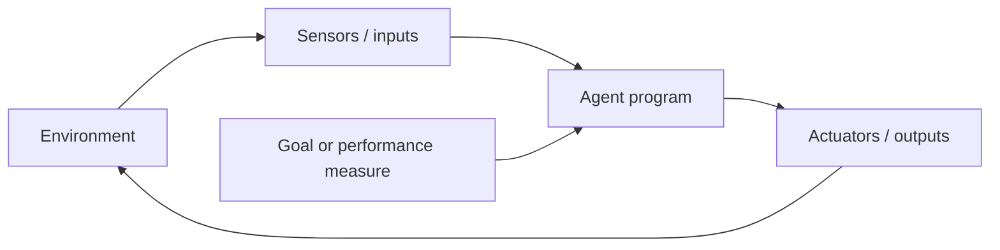

Langflow gives this loop a place to live. The visual editor is a canvas where you add components, set their parameters, and connect them into a flow. Before anything is built, the workspace is essentially empty, with a component menu on the left waiting to be dragged onto the canvas.

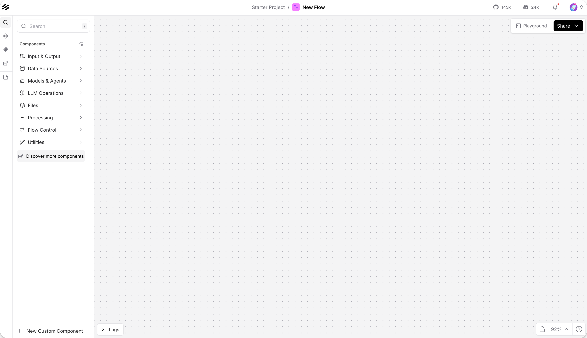
*Figure 1.1: The Langflow workspace, where agents are composed from components rather than written by hand. Source: Langflow documentation (docs.langflow.org).*

## 1.1 What is an Agent?

The word "agent" is useful because it points to responsibility. An agent is not merely a function that transforms input into output. It is a system situated in an environment, with some ability to observe, decide, and act. This matters because real work happens in environments that change: inboxes receive new mail, factories report new sensor values, users revise their goals, and software systems fail in ways that were not present in the first prompt.

The classic artificial intelligence definition, popularized by Russell and Norvig, is concise: an agent is anything that can perceive its environment through sensors and act upon that environment through actuators. A software agent may not have cameras or wheels, but it still has inputs and outputs. It can read messages, files, API responses, database records, or logs. It can respond by sending a message, writing a file, calling a tool, updating a ticket, or asking a human for approval.

The essential pattern is not "AI." The essential pattern is a loop:

1. The agent receives a percept, meaning information from the environment at a given moment.
2. It interprets that percept in light of its goal and, when available, its prior state.
3. It selects an action.
4. The action changes the environment or the agent's own state.
5. The next percept arrives, and the loop continues.

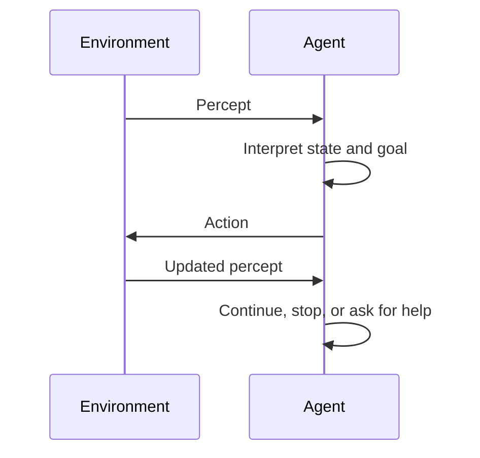

This loop is the foundation for the rest of the book. As introduced in Chapter 2, "The Evolution from Basic Agents to AI Agents", modern AI agents add language models, planning, tool use, and feedback. Those additions do not replace the loop; they enlarge what it can do. In Langflow, that same loop is what an Agent component runs internally: it reads its input, reasons about which tool to call, observes the result, and continues until it has an answer.

### 1.1.1 Definition and Characteristics

The word "agent" now appears in product names, research papers, and framework docs, often with little agreement on what it covers. When the term stretches to mean any AI feature, it stops helping us design, review, or govern real systems. A working definition needs to be broad enough to include modest software agents and precise enough to separate them from ordinary scripts.

In this book, an agent is a system that perceives an environment, selects actions, and acts toward a goal.

That definition has four important characteristics.

First, an agent has an environment. The environment is the part of the world the agent operates in. For a robot vacuum, the environment is a physical floor plan with rooms, furniture, dirt, stairs, and a charging dock. For an email filter, the environment is a stream of messages, sender reputations, authentication results, headers, links, attachments, and user feedback.

Second, an agent has percepts. A percept is an input from the environment at a particular moment. A proximity reading, a temperature value, an incoming email, a user request, or a failed test log can all be percepts.

Third, an agent has actions. Actions are the ways the agent affects its environment. A robot vacuum can move, stop, turn, dock, and run suction. A software agent can classify, route, call an API, open a ticket, add a header, or reject a message.

Fourth, an agent has a goal or performance measure. The goal gives direction to the loop. Without a goal, the system may still react, but it has no principled way to prefer one action over another.

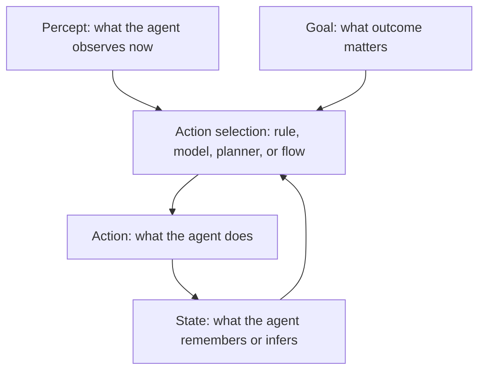

The mechanism can be expressed with one more distinction: the agent function and the agent program. The agent function is the ideal mapping from percept history to action. The agent program is the actual implementation. Engineering happens in the gap between the two. We cannot write an infinite table of every possible percept sequence, so we build rules, state, routing, models, tools, and evaluation loops that approximate useful behavior. In a low-code setting, that implementation takes the form of a flow: components wired together on a canvas, where each component handles one step and the connections carry data between them.

This distinction also prevents a common mistake. A language model by itself is not automatically an agent. A model call can be part of an agent, often the reasoning engine, but the agent includes the surrounding loop: state, tools, routing, stopping conditions, and constraints. Langflow's Agent component makes this explicit. It pairs a chosen model with custom instructions and a set of tools, then runs the agent loop until a stop condition is met. The model decides what to do next; the component supplies the structure that turns those decisions into repeatable, observable behavior.

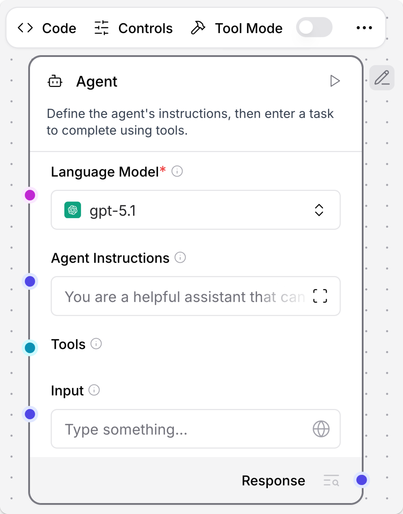
*Figure 1.2: A single Agent component carries the whole loop: a model to reason with, instructions that set the goal, a Tools port for actions, and an input. Source: Langflow documentation (docs.langflow.org).*

### 1.1.2 Examples of Agents in Daily Life

Daily and operational examples are useful because they remove the mystery. Before an agent writes code, calls a database, or touches a business workflow, it must solve the same basic problem as familiar systems: observe enough of the world to choose the next useful action.

Consider a thermostat. Its environment is a room. Its sensor reads temperature. Its actuator controls heating or cooling. Its goal is to maintain a target range. A simple thermostat follows a direct rule: if the room is colder than the target, turn heating on; if the room reaches the target, turn heating off. It is not intelligent in the human sense, but it is agentic in the minimal sense: it observes, acts, and repeats.

A robot vacuum adds richer perception and action. The iRobot Create 3, a development platform based on Roomba hardware, includes proximity sensors, cliff sensors, wheel encoders, optical odometry, an inertial measurement unit, buttons, LEDs, wheels, and charging contacts. These are not just parts. In agent terms, they define what the robot can perceive and how it can act. The robot cannot reason about what it cannot sense, and it cannot choose an action that its actuators cannot execute.

Now consider email filtering. Rspamd, a production spam filtering system, analyzes messages using authentication checks, content analysis, statistical classification, reputation systems, fuzzy hashing, and machine learning. It then recommends actions such as no action, greylist, add header, rewrite subject, soft reject, or reject. This is a software agent example: the environment is the mail stream, the percepts are message features and reputation signals, and the actions influence delivery.

These systems differ in sophistication, but the same vocabulary applies:

| Example      | Environment                    | Percepts                                   | Actions                                 | Goal                                                 |
| ------------ | ------------------------------ | ------------------------------------------ | --------------------------------------- | ---------------------------------------------------- |
| Thermostat   | Room                           | Current temperature                        | Turn heat on or off                     | Maintain target temperature                          |
| Robot vacuum | Home floor                     | Obstacles, cliffs, odometry, battery       | Move, turn, clean, dock                 | Clean safely and efficiently                         |
| Spam filter  | Email stream                   | Headers, links, sender reputation, content | Deliver, flag, defer, reject            | Reduce harmful mail while preserving legitimate mail |
| Coding agent | Codebase and developer request | Prompt, files, tests, errors               | Suggest edits, run tools, ask questions | Help complete software work correctly                |

The table also shows a design rule that will recur throughout the book: an agent is only as useful as the fit between its goal, its perception, and its actions. If the spam filter cannot observe sender reputation, it may over-rely on message text. If the robot vacuum cannot detect stairs, its cleaning goal becomes unsafe. If a coding agent can edit files but cannot run tests, it may produce plausible changes without evidence. The same rule decides how we wire an agent in Langflow: an Agent component can only take the actions exposed to it as tools, so the choice of which components to connect is the choice of what the agent can do.

### 1.1.3 Agents vs. Traditional Software

Most agents do not live alone. They sit inside ordinary applications, alongside deterministic services, background jobs, and data pipelines. Drawing the line between the conventional code and the agentic behavior is what lets a team know what to test, what to monitor, and what to constrain. Without that line, the wrong things get scrutinized.

Traditional software usually follows a predetermined control path. A request arrives, the program validates input, runs business logic, queries storage, and returns a response. The path may branch, but the branches were explicitly designed. The program does not normally decide what kind of task it is doing or which external capability to use next.

Agentic software introduces action selection. It may still contain deterministic logic, and in production it should contain a lot of deterministic logic. But somewhere in the system there is a loop that asks, "Given what I have observed and what I am trying to accomplish, what should I do next?" On the Langflow canvas, that distinction is visible at a glance: a fixed pipeline of components carries data straight through, while an Agent component sits at the point where the next step is decided at run time rather than wired in advance.

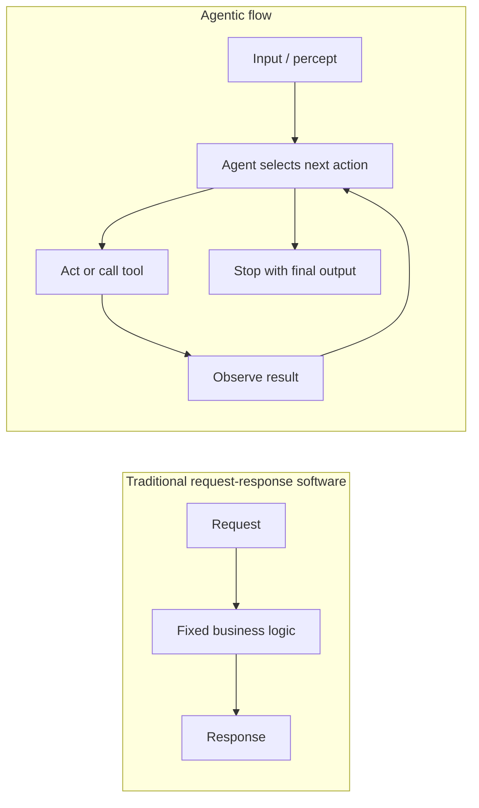

The practical differences are significant.

Traditional software is usually easier to reason about locally. If the input is the same and the path is deterministic, the result should be the same. Agentic systems may depend on changing context, external tools, model outputs, timing, and accumulated state. This makes evaluation and monitoring more important, not less. Langflow surfaces this directly through the Playground, which shows an agent's tool calls, inputs, and raw outputs so that a non-deterministic run can still be inspected step by step.

Traditional software usually exposes predefined operations. Agentic systems may decide which operation to call. That flexibility is valuable when tasks vary, but it also creates new failure modes: the agent may call the wrong tool, call a tool at the wrong time, stop too early, loop too long, or act on incomplete evidence.

Traditional software is often complete at the boundary of a function call. Agentic systems are often complete only at the boundary of a workflow. The unit of correctness becomes a trajectory: the sequence of observations, decisions, actions, and final result.

As introduced in Chapter 4, "Guardrails for Agentic AI", these differences are why safety and responsibility cannot be added as decoration. The more freedom an agent has to choose actions, the more clearly we must define boundaries, approvals, and monitoring.

## 1.2 Key Components of an Agent

An agent can be simple, but it cannot be shapeless. When one fails, the failure almost always belongs to one of a few components. The agent lacked the right autonomy, perceived the wrong signal, chose an action poorly, or optimized for the wrong goal. Naming those components gives us a diagnostic map.

This outline covers three: autonomy, perception and action, and goal-driven behavior. They are deeply connected. Autonomy without a goal is random motion. Perception without action is observation. Goals without perception are wishes. A working agent needs all three in roughly the right proportions.

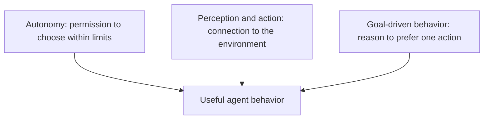

### 1.2.1 Autonomy

Autonomy is the share of the next step that the system, rather than a person or a fixed script, gets to pick. It is the source of an agent's usefulness and the source of its risk in equal measure. A system that can choose between several actions can adapt when situations shift, but it can also choose the wrong one.

Autonomy is not all-or-nothing. It is a design spectrum.

At the low end, a thermostat has narrow autonomy. It can turn heating on or off according to a rule. It cannot decide to open a window, order insulation, or text the building manager. That constraint is good. Its world is narrow, and its action space should be narrow too.

In the middle, an email filtering system may recommend several actions based on score thresholds. It can decide to greylist a suspicious message or mark another message as probable spam. Its autonomy is broader than a thermostat's but still bounded by policy and thresholds.

At the high end, a coding agent may inspect files, plan edits, call tools, run tests, and revise its own approach. This kind of autonomy can be valuable only when paired with safeguards: scoped permissions, review checkpoints, test execution, and human approval for sensitive operations.

The mechanism of autonomy is action selection under constraints. The agent needs:

- A set of possible actions.
- A way to choose among them.
- Boundaries that prevent unacceptable actions.
- A stopping condition.

In Langflow, the Agent component expresses exactly this shape. The model chooses what to do; the developer decides which tools exist and what instructions govern their use. The set of possible actions is precisely the set of components connected to the Agent's Tools port through Tool Mode. Nothing else is reachable, no matter what the model proposes.

To make this concrete, consider a small support assistant whose only privilege is to read approved policy text. The flow below demonstrates bounded autonomy: an Agent that can answer policy questions but cannot touch accounts, because the only action wired to it is a read-only fetch.

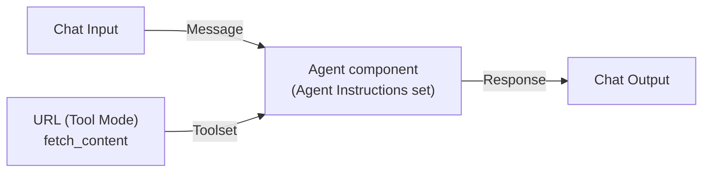

To build it on the canvas:

1. Add a **Chat Input** component so the assistant can be asked a question in the Playground.
2. Add an **Agent** component and choose a model provider for its Language Model parameter.
3. In **Agent Instructions**, state the role and the boundary: answer policy questions from approved sources only, and never perform account changes.
4. Add a **URL** component, enable **Tool Mode**, and point it at the approved internal policy page so its `fetch_content` action becomes a callable tool.
5. Connect the URL component's **Toolset** port to the Agent's **Tools** port, then connect **Chat Input** to the Agent and the Agent's **Response** to a **Chat Output**.

The parameters that carry the design intent are few:

| Component | Parameter | Purpose |
| --------- | --------- | ------- |
| Agent | Language Model (`agent_llm`) | Selects the provider and model that act as the reasoning engine. |
| Agent | Agent Instructions (`system_prompt`) | Fixes the role and the action boundary applied to every turn. |
| Agent | Tools (Tools port) | Defines the complete set of actions the agent may take. |
| URL | Tool Mode | Exposes the component's `fetch_content` action so the Agent can call it as a tool. |

The decisive design choice is what is, and is not, connected to the Tools port. The agent is not free to do everything the model can describe; it can only call the tools wired to it, and the instructions narrow the goal further. Autonomy should therefore be designed, not assumed. A good architecture review habit is to ask: "What decisions may this agent make by itself, and what decisions must remain outside the loop?" In Langflow that question has a literal answer you can point at on the canvas.

### 1.2.2 Perception and Action

An agent cannot recover from a broken connection to its environment. A brilliant planner working from stale data will reach poor conclusions. A well-informed system without useful actions can only file reports. Agents become practical when they can both observe and affect the world through carefully chosen channels.

Perception is not limited to raw sensory data. In software, perception often arrives through structured interfaces:

- A user message.
- A retrieved document.
- A database row.
- A failed unit test.
- A monitoring alert.
- A tool result.
- A human approval or rejection.

Action is similarly broad:

- Produce an answer.
- Call a tool.
- Update what the agent remembers.
- Hand off to another component or agent.
- Create a ticket.
- Send a notification.
- Stop and ask for help.

Langflow makes this perception-action loop visible as flow structure. Components do the work; typed ports carry data between them; edges define where that data goes next. Perception enters through a Chat Input as a Message, travels along an edge into the Agent, and the agent's chosen action leaves through its Response port to a Chat Output. Tools attach on the side, through the Tools port, as additional channels the agent can reach into.

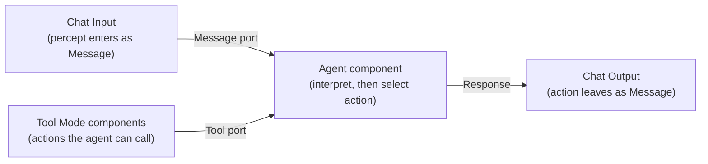

On the canvas, the simplest version of this is three components wired in a line: a Chat Input feeding an Agent, and the Agent's Response feeding a Chat Output. This is the smallest complete agent you can run and chat with.

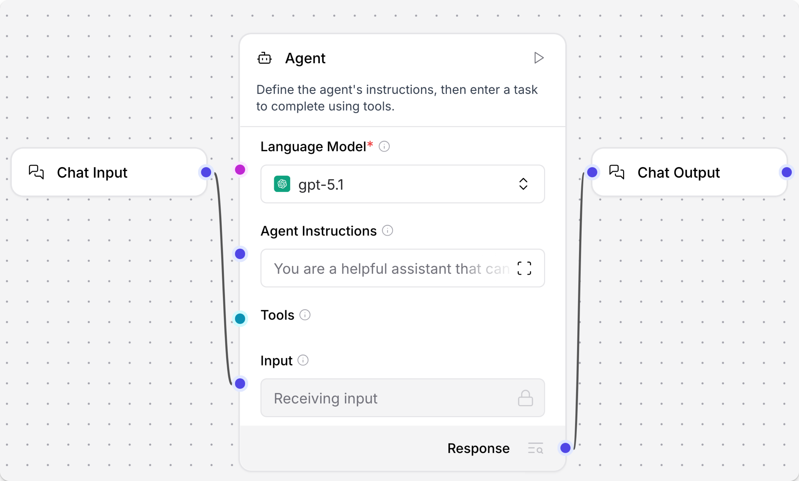
*Figure 1.3: The minimal perception-action path: a Chat Input (percept) into an Agent, and the Agent's Response (action) out to a Chat Output. Source: Langflow documentation (docs.langflow.org).*

Ports are typed, and the type is shown by color: Message ports are indigo, Tool ports are cyan, LanguageModel ports are fuchsia, and Memory ports are orange. An output port connects only to an input port of the same type, which is the canvas equivalent of a type check. When two useful components do not share a type, a Type Convert component bridges them. This is why wiring a flow is more than decoration: the connections encode what each component is allowed to receive and emit.

Consider a support ticket router built as a flow. It demonstrates the smallest useful perception-action path: read an incoming ticket, decide where it belongs, and emit a routing decision.

1. Add a **Chat Input** so a ticket message can enter the flow.
2. Add an **Agent** component and, in its instructions, describe the categories (for example billing, technical, general) and the routing rule for each.
3. Connect **Chat Input** (Message) to the Agent, and connect the Agent's **Response** to a **Chat Output** that carries the routing decision back out.

The Chat Input defines what the flow can observe; the Agent interprets that message against its instructions; the Chat Output carries the chosen action. The structure is identical whether the decision is made by a single keyword rule or by a model weighing several signals. That is the point worth keeping: agent structure does not require a language model. A flow built only from deterministic components is still a flow, with the same percept-to-action shape. The model earns its place when interpretation or action selection grows beyond what fixed rules can handle, and at that moment the Agent component is what you reach for.

### 1.2.3 Goal-Driven Behavior

A goal is what turns activity into purposeful behavior. An agent that reacts to every signal in front of it can stay very busy without being useful. Goals supply the reason to prefer one action over another, and the cue to stop once enough is done.

A goal can be explicit: "clean the floor," "keep the room at 22 C," "route the ticket correctly," or "answer the user's question with cited sources." A performance measure is the way we evaluate whether the goal is being met: cleanliness, temperature stability, routing accuracy, resolution time, customer satisfaction, safety incidents, or test pass rate.

For simple agents, the goal is often encoded directly in rules. A thermostat's target temperature is a goal represented as a threshold. A spam filter's thresholds represent a trade-off between blocking harmful messages and allowing legitimate ones. A support ticket router's categories represent a goal of getting work to the right team quickly.

For AI agents, goals are often represented through a combination of instructions, memory, tools, evaluation criteria, and stopping conditions. In Langflow, much of that combination lives in the Agent component: the Agent Instructions parameter states the objective and constraints, the connected tools define the means, and the built-in session memory keeps the agent's recent context grouped by session. This combination is fragile if it is vague. "Help the user" is a slogan, not a goal. "Draft a refund response using approved policy, then ask a human before changing account data" is closer to an agent design, and it translates directly into instructions plus a deliberately limited toolset.

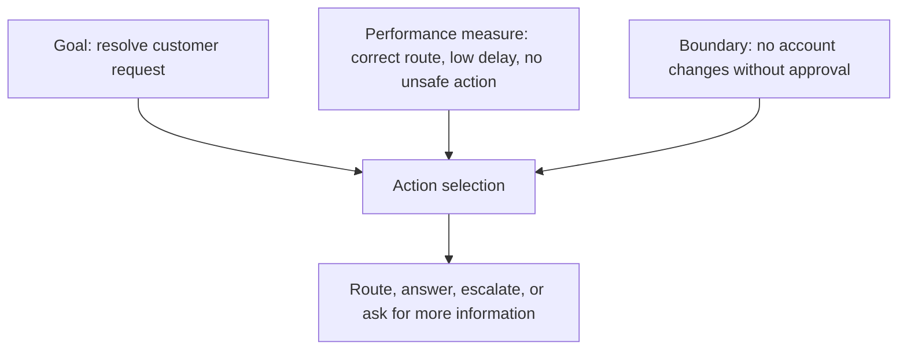

Goal-driven behavior also introduces trade-offs. A spam filter that rejects every uncertain message may reduce spam but harm legitimate communication. A robot vacuum that cleans aggressively may finish faster but collide with furniture. A coding agent that edits quickly may produce more code but miss design constraints. The goal must include enough context to avoid optimizing the wrong thing.

As introduced in Chapter 4, "Evaluating Agent Performance", agent quality is not just whether the final answer looks good. It is whether the sequence of actions was appropriate, bounded, recoverable, and aligned with the intended performance measure.

## 1.3 Simple Agentic Systems

Simple systems are worth studying because they expose the structure without the distraction of model behavior. Before a team debates memory, retrieval, multi-agent delegation, or model routing, it should be able to explain a thermostat, a rule-based ticket router, and a reactive spam filter in agent terms.

These systems also teach humility. Many useful agents are not maximally autonomous. They are bounded systems that do a narrow job well. In production, narrow autonomy is often the difference between a reliable agent and a demo that falls apart outside the happy path.

### 1.3.1 Rule-Based Agents

Condition-action rules are the simplest form of action selection an agent can use, and they have not been displaced by more sophisticated approaches. A modern agent often uses a language model to interpret a request while still relying on deterministic rules to decide whether an action is allowed, whether a human must approve it, or whether the workflow should stop.

A rule-based agent uses condition-action rules:

> If this condition is true, take this action.

The condition may inspect the current percept, the agent's state, or both. The action may update state, call a tool, route a task, or stop. The strength of this design is predictability. The weakness is brittleness. Rules work well when the environment is observable and the number of situations is manageable. They struggle when meaning is ambiguous, context is incomplete, or the possible cases grow faster than the rule set.

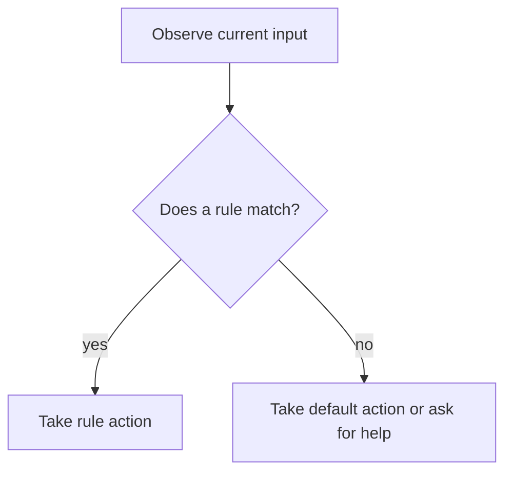

The ticket-routing flow in Section 1.2.2 is a rule-based agent when its instructions amount to fixed keyword checks. In real systems, rules may be more sophisticated: score thresholds, policy checks, regular expressions, feature flags, allowlists, denylists, or validation constraints. Langflow gives deterministic rules a low-code home in two ways. Routing components let a flow branch predictably on the canvas, and Policies compile natural-language business rules into deterministic guards around an agent's tools, so a forbidden action is blocked before it happens rather than caught afterward.

Rspamd is a strong real-world example. It uses many layers of evidence to classify email and recommend actions. Some checks are rule-like, some are statistical, and some use machine learning. But the action layer still has explicit choices such as add header, greylist, and reject. This is common in production: learned components may inform the decision, while deterministic policies constrain the final action.

Rule-based agents are especially useful for:

- Safety boundaries.
- Compliance checks.
- Routing decisions with clear categories.
- Fast reactions to fully observable events.
- Fallback behavior when an AI model is uncertain or unavailable.

They are less suitable for:

- Open-ended language understanding.
- Tasks requiring long-horizon planning.
- Situations where the same input can mean different things in different contexts.
- Environments where important information is hidden.

This is why Chapter 2, "Adding Learning Capabilities", introduces AI-driven behavior as an extension rather than a replacement. Good agent design often combines rules and learned systems, and Langflow lets both live in the same flow: a model-backed Agent for interpretation, deterministic routing and Policies for the actions that must stay predictable.

### 1.3.2 Reactive vs. Deliberative Agents

Where does an agent's intelligence sit? Does it respond directly to whatever is in front of it, or does it carry a model of the world and reason about what might happen next? The reactive-deliberative split tracks that question, and both patterns are useful in the right place. Pick the wrong one and the result is either sluggish over-engineering or reckless simplicity.

A reactive agent chooses actions based mainly on the current percept. A thermostat is reactive. A simple obstacle-avoidance robot is reactive. A keyword-based ticket router is reactive. Reactive systems are fast, explainable, and efficient when the environment is simple enough.

A deliberative agent reasons over internal state, goals, and possible futures. It may ask: What am I trying to accomplish? What do I know? What is missing? Which actions are available? What will likely happen if I choose each one? This is more expensive, but it becomes necessary when the task has multiple steps or incomplete information.

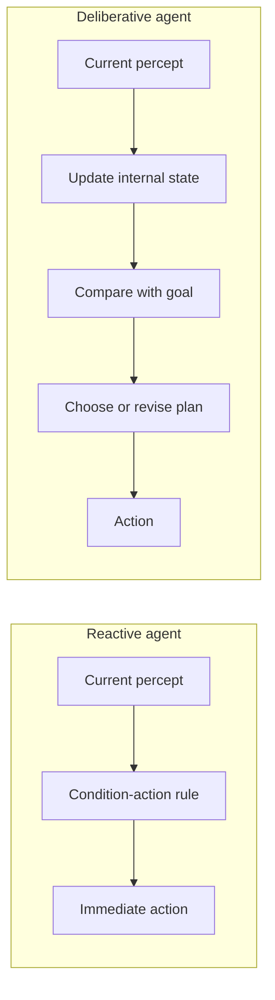

Neither type is automatically better. A factory safety system should not deliberate for several seconds before shutting down a dangerous machine. A research assistant should not react to the first search result as if it were complete truth. The design depends on the task environment.

For professional agent design, the question is:

> Does the agent have enough information right now to act safely and usefully, or must it gather, remember, compare, and plan?

If the answer is "act now," a reactive design may be enough. If the answer is "it depends on what happened earlier or what might happen next," the agent needs memory or deliberation.

Langflow supports both patterns. A direct edge from one component to the next expresses a predictable reactive path, where each step simply hands its output to the following component. An Agent component expresses deliberation: it can call tools, consult its session memory, and loop until its goal is met, deciding each step at run time rather than in advance. The same canvas holds both, so a flow can react quickly where the environment is simple and deliberate where it is not. This is explored in depth in Chapter 5, "Building Your First Agentic Project".

### 1.3.3 Simple Agent Examples in Software

Most readers of this book will build agents inside applications rather than inside robots, so the rest of the chapter stays close to that world. The concepts carry over without change; the sensors and actuators are simply digital. The environment may be a code repository, a support queue, a CRM, a data warehouse, or a monitoring system.

Here are three simple software agents.

First, an email rule agent. It observes a message, checks sender, subject, authentication results, links, and user preferences, then chooses whether to deliver, flag, defer, or reject. It is agentic because it converts percepts into action under a goal: reduce harmful mail without blocking legitimate mail.

Second, an incident routing agent. It observes an alert, service metadata, severity, recent deploys, and ownership records. It chooses whether to page a team, create an incident, suppress a duplicate, or ask for human triage. Its goal is not merely to classify text; its goal is to reduce time to response without creating alert fatigue.

Third, a coding support agent. It observes a developer request, files, tests, linter messages, and command output. It chooses whether to inspect more context, edit code, run verification, or ask for clarification. Its goal is to make correct progress inside a software system.

The simplest version of these agents can be rule-based. The more advanced version may use an AI model and tools, and Langflow's Agent component is built for that second case: it connects a model to tools inside an agent loop. The fastest way to see it is the Simple Agent template, the canonical first flow. It opens with an Agent already connected to a Chat Input, a Chat Output, a Calculator, and a URL component, so a working tool-using agent exists before any wiring is done by hand.

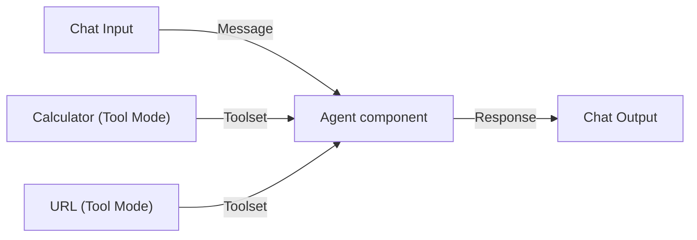

On the canvas, the Simple Agent template looks like the screenshot below: the Agent sits in the middle, the Calculator and URL components attach to its Tools port through their Toolset ports, and Chat Input and Chat Output complete the loop.

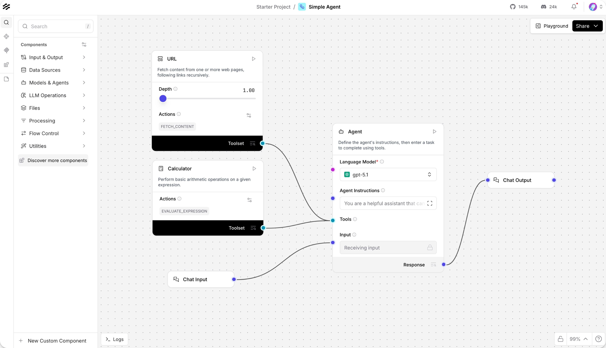
*Figure 1.4: The Simple Agent template, the canonical first flow. A working tool-using agent exists before any wiring is done by hand. Source: Langflow documentation (docs.langflow.org).*

Starting from that template, the incident routing agent is a short series of edits rather than a rebuild. It demonstrates the two-step discipline of looking up ownership before acting:

1. Create a **New Flow** from the **Simple Agent** template and set a model provider for the Agent's Language Model.
2. In **Agent Instructions**, describe the triage role and the ordering constraint: identify the owning team before recommending that an incident be opened.
3. Add a **Web Search** component in **Tool Mode** (with its Search Mode configured) so the agent can look up recent deploy or status information, and keep the **URL** component in Tool Mode for fetching an ownership or runbook page.
4. Connect each tool's **Toolset** port to the Agent's **Tools** port, leaving the Chat Input and Chat Output from the template in place.

The parameters that shape this agent are concentrated in one place:

| Component | Parameter | Purpose |
| --------- | --------- | ------- |
| Agent | Agent Instructions (`system_prompt`) | Encodes the role and the look-up-before-acting ordering rule. |
| Agent | Tools (Tools port) | Limits the agent to the search and fetch actions provided. |
| Web Search | Tool Mode | Exposes search as a callable action for recent operational context. |
| URL | Tool Mode | Exposes `fetch_content` so the agent can read ownership or runbook pages. |

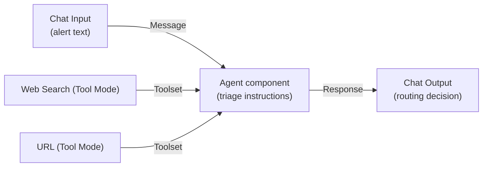

Adding several tools to an Agent looks the same on the canvas regardless of how many there are: each tool component exposes a Toolset port that fans into the Agent's single Tools port.

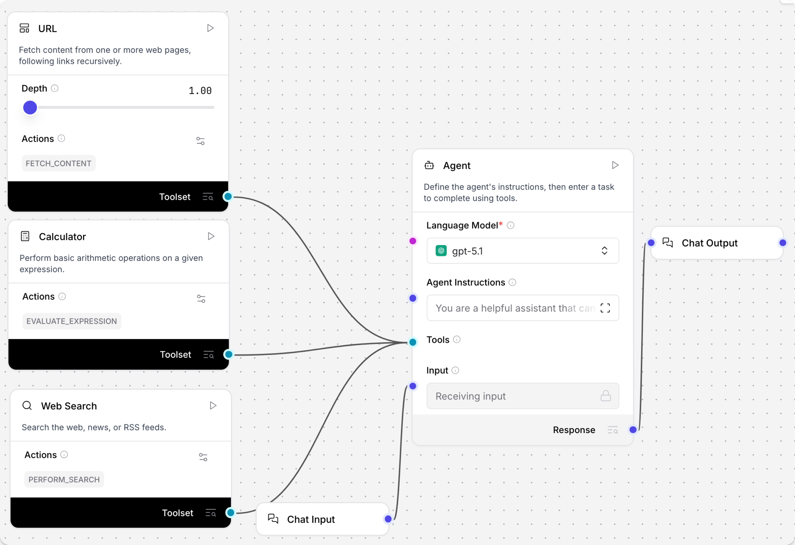
*Figure 1.5: Tools attach to the side of the Agent. The set of components wired to the Tools port is exactly the set of actions the agent can take. Source: Langflow documentation (docs.langflow.org).*

With the flow assembled, the Playground is where it is exercised. Sending an alert such as "checkout error rate is above 5 percent for 10 minutes" runs the agent, and the Playground shows each tool call, its inputs, and its raw output, so the ordering constraint can be verified rather than assumed.

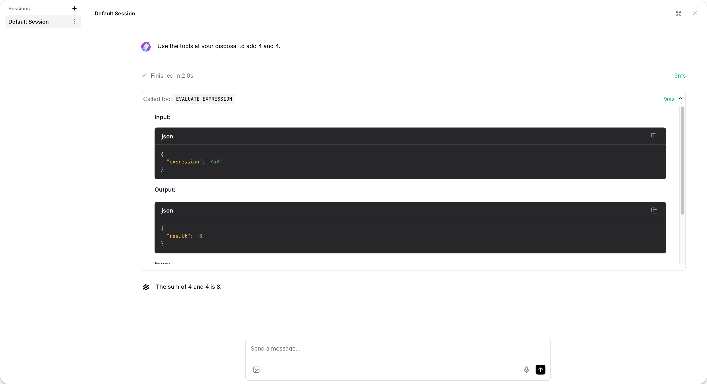
*Figure 1.6: The Playground runs a flow and exposes the agent's tool calls, inputs, and raw outputs, so a non-deterministic run can still be inspected step by step. Source: Langflow documentation (docs.langflow.org).*

A production version would add the controls discussed in Chapter 4, "Defining Agent Boundaries": approvals, rate limits, audit logs, and policy checks around any action that actually opens an incident.

A flow that works in the Playground is also an application. The same agent can be called from other systems through Langflow's `/run` endpoint, which is the single small piece of code this chapter needs. The snippet below shows how a built flow is invoked over HTTP once it runs on a server.

```bash
curl -X POST "http://LANGFLOW_SERVER_ADDRESS/api/v1/run/FLOW_ID" \
  -H "Content-Type: application/json" \
  -H "x-api-key: $LANGFLOW_API_KEY" \
  -d '{
    "output_type": "chat",
    "input_type": "chat",
    "input_value": "checkout error rate is above 5 percent for 10 minutes"
  }'
```

The request targets a specific flow by its ID, authenticates with an API key, and passes the alert as `input_value`; the response is a structured object from which a production caller extracts the agent's message. The takeaway is that building and shipping are the same activity here: the flow you tested visually is the service you call.

This example also shows why "agent" is not a synonym for "model." The Agent component interprets the alert and selects which tool to call. The tools connect the agent to its operational environment. The Agent Instructions define the role and the ordering constraint. The agent loop ties these pieces together, and the canvas keeps each part in view.

## Closing Recap

An agent is a system that perceives an environment, selects actions, and acts toward a goal. The same structure shows up in simple thermostats, robot vacuums, spam filters, support routers, incident tools, and modern AI agents built as Langflow flows.

The core vocabulary is now in place: environment, percept, action, state, autonomy, goal, and rule, alongside the Langflow building blocks that make them concrete, component, port, edge, flow, the Agent component, Tool Mode, and the Playground. Traditional software follows mostly predetermined paths. Agentic software adds a loop that chooses what to do next based on what it sees and what it is trying to achieve, and in Langflow that loop is the Agent component sitting inside a flow you can see and test. Rule-based agents are the simplest version of that loop. Reactive and deliberative agents show how designs diverge along speed, memory, and planning.

Chapter 2, "The Evolution from Basic Agents to AI Agents", adds learning, uncertainty, planning, self-correction, and tool use to this foundation. The loop stays the same. The agent's ability to interpret and act inside it becomes much more powerful.
