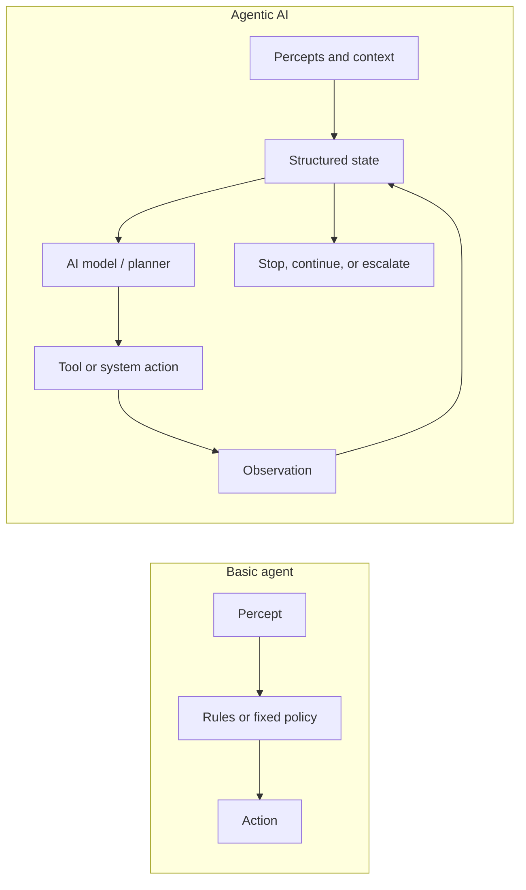
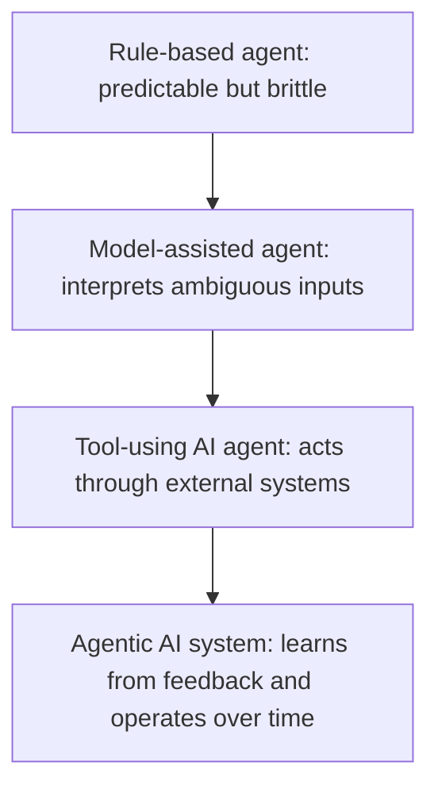
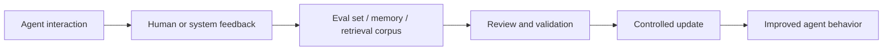
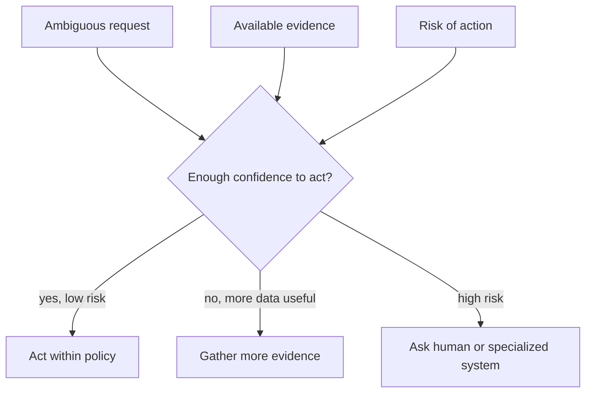
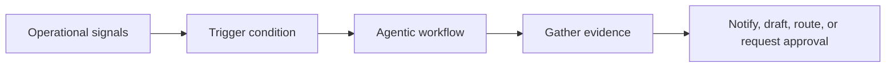
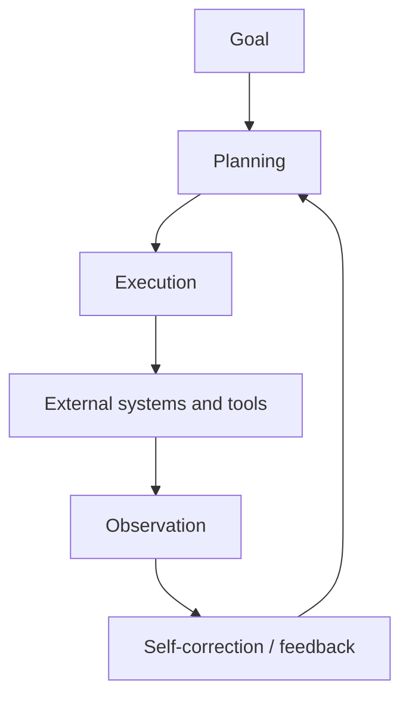
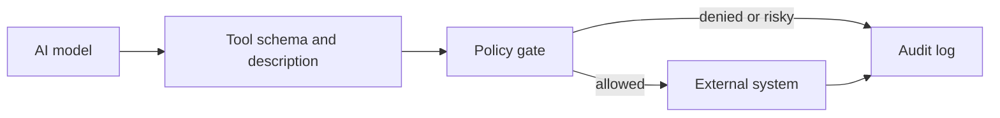
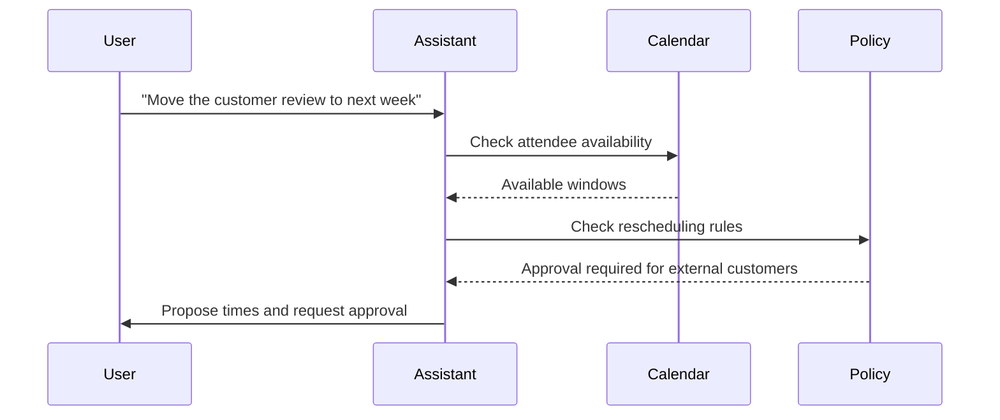
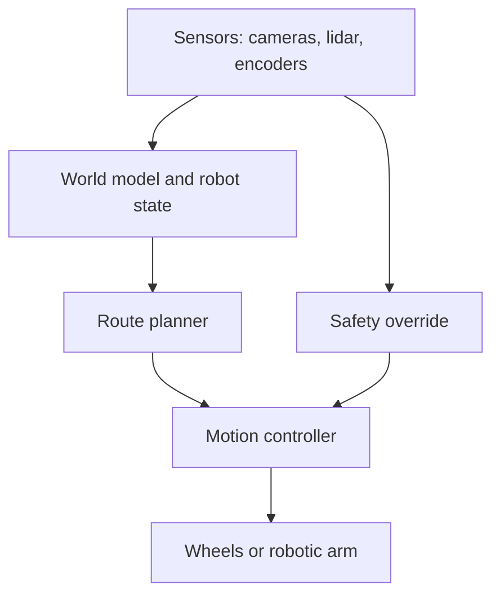

# Chapter 2. From Agents to Agentic AI

An alert router can match "checkout latency high" to the payments on-call team. That is useful, but it is narrow. A more capable incident assistant would inspect the service graph, compare the alert with recent deployments, query logs, summarize conflicting evidence, ask for human approval before paging broadly, and update its plan when the first hypothesis fails.

That transition is the move from agents to agentic AI.

The core loop from Chapter 1 still applies: perceive, decide, act, observe, and continue. The difference is that the decision policy is no longer only a fixed table of rules. It may include a language model, learned ranking, retrieval, planning, tool use, memory, evaluation, and feedback. For professionals, this distinction is operationally important. An AI agent is not simply "a smarter chatbot." It is a system whose reasoning component can interpret ambiguity and choose actions, which means the architecture must also handle uncertainty, observability, cost, safety, and recovery.

This chapter explains what changes when AI enters the agent loop. We will examine learning capabilities, decision-making under uncertainty, proactive behavior, planning and execution, self-correction, system interaction, and real-world examples. The goal is to give professionals a durable mental model: agentic AI is not magic autonomy. It is goal-directed AI embedded inside a controlled action loop.



## 2.1 The Evolution from Basic Agents to AI Agents

The evolution matters because teams often carry assumptions from traditional automation into AI systems. A rule engine is expected to be deterministic. A machine learning model is expected to generalize from examples. A language-model agent is expected to reason over context, choose tools, and adapt to intermediate results. These are different operating modes, and confusing them leads to fragile systems.

A basic agent can be effective when the environment is stable and observable. A thermostat, a spam rule, and a deterministic ticket router can perform useful work because their action rules are explicit. The limitation appears when the environment contains ambiguity: vague language, incomplete evidence, new cases, contradictory signals, or goals that require several dependent steps.

AI agents address that limitation by adding learned interpretation and flexible action selection. They can classify intent, summarize evidence, generate plans, call tools, compare outputs, and revise the path when a tool result changes the situation. But flexibility is not free. It shifts part of the system from deterministic logic into probabilistic inference, so professional design must add evaluation, constraints, and traceability.



As introduced in Chapter 1, "Definition and Characteristics", an agent function maps percept history to action. In an AI agent, part of that mapping is learned or model-mediated. The professional question is not whether that is impressive. The question is whether the learned part is placed where it adds value and surrounded by controls where it can cause harm.

### 2.1.1 Adding Learning Capabilities

Learning matters because real environments do not stay still. Users change vocabulary, attackers change tactics, product catalogs evolve, documents become stale, and operational patterns drift. A purely fixed agent can keep working only if the world remains close to the assumptions encoded in its rules.

In agentic AI, "learning" can mean several things. It does not always mean that the production model rewrites its own weights while serving a user. In professional systems, learning is usually more controlled:

- Updating a retrieval index as new documents are approved.
- Capturing human corrections and turning them into evaluation cases.
- Adjusting prompts, policies, or tool descriptions after failures.
- Fine-tuning or retraining a model through an offline pipeline.
- Updating a recommendation model from aggregated behavior.
- Recording successful tool-use traces as examples for future evaluation.

This distinction is important. Live, uncontrolled learning can make behavior difficult to audit. Controlled learning loops preserve accountability: the system observes errors, stores evidence, evaluates changes, and deploys improvements through a governed process.



Consider a customer-support agent. A rule-based version routes tickets by keywords. A model-assisted version classifies intent from natural language. A learning version captures when agents, supervisors, or customers correct the classification. Those corrections become evaluation examples, retrieval improvements, or policy changes. The learning is valuable because it closes the gap between the system's assumptions and the organization's real work.

For professionals, the core design principle is: make learning inspectable. Store what changed, why it changed, who approved it, and how the change was evaluated.

### 2.1.2 Decision-Making Under Uncertainty

Uncertainty matters because AI agents rarely operate with complete information. A user may provide an ambiguous request. A tool may return stale data. Two sources may disagree. A model may be confident for the wrong reason. A planned action may have side effects that are difficult to reverse.

In Chapter 1, we used the classic rational-agent framing: choose actions expected to improve the performance measure given the available evidence. Agentic AI keeps that framing but adds probabilistic interpretation. The agent must often decide whether to act, gather more evidence, ask a human, or stop.

There are several common sources of uncertainty:

- Input uncertainty: the request is vague, incomplete, or contradictory.
- State uncertainty: the agent does not know whether its internal view is current.
- Tool uncertainty: external systems fail, time out, or disagree.
- Model uncertainty: the model's output may be plausible but wrong.
- Outcome uncertainty: the effect of an action may be delayed or irreversible.



Recent research treats uncertainty as more than a problem to hide. For example, uncertainty-aware reward methods for LLM agents explore how confidence signals can shape learning from both successful and failed trajectories. Production systems should be cautious about adopting research techniques directly, but the architectural lesson is practical: uncertainty can become a routing signal. Low confidence can trigger retrieval, a second check, a narrower tool set, a human review, or a refusal to act.

The professional failure mode is pretending uncertainty does not exist. A useful agent makes uncertainty visible in its state, traces, and decisions.

### 2.1.3 Agentic AI and Proactive Behavior

Proactive behavior matters because many valuable workflows do not begin with a neatly formed user question. Incidents emerge from telemetry. Fraud patterns appear across transactions. Inventory shortages develop before a customer complains. A project risk becomes visible before a deadline is missed.

A reactive AI system waits for a prompt. A proactive agentic system monitors signals, compares them with goals and policies, and initiates an appropriate workflow when conditions warrant action. This does not mean the agent should act without boundaries. It means the trigger can come from the environment, not only from a human message.

Proactive behavior has three parts:

1. A monitored condition.
2. A goal or policy that defines why the condition matters.
3. A bounded action the agent may initiate.

An enterprise finance agent might monitor invoices for anomalies, gather supporting records, and prepare a review packet. A software operations agent might notice rising latency after a deployment, collect logs, and draft an incident summary. A customer success agent might detect usage drop-off and suggest outreach to an account manager.



The professional boundary is critical: proactive does not mean unconstrained. The safest pattern is often "proactive preparation, human-approved execution." The agent can monitor, investigate, summarize, and recommend; irreversible or high-risk actions require stronger controls. This is explored in depth in Chapter 4, "Guardrails for Agentic AI".

## 2.2 Agentic AI: Core Capabilities

Core capabilities matter because agentic AI is often described in broad language: "it plans," "it learns," "it acts." Those claims are not enough for architecture. A professional needs to know which capability is present, where it lives, how it is evaluated, and what happens when it fails.

The three capabilities in this section are planning and execution, self-correction and feedback loops, and interaction with other systems. Together, they separate a model-only application from an agentic system.



### 2.2.1 Planning and Execution

Planning matters because many professional tasks are not single-step transformations. "Investigate this outage," "prepare a market brief," "migrate this API," and "resolve this customer escalation" require decomposition, ordering, evidence gathering, and revision.

Planning and execution are related but distinct.

Planning creates an intended path: what needs to happen, in what order, with what dependencies, and under what constraints. Execution performs the work: calling tools, reading outputs, updating state, and deciding whether the plan still fits reality.

A weak agent mixes these together without visibility. It thinks a little, acts a little, forgets why, and repeats. A stronger professional design makes the plan inspectable enough to evaluate and the execution trace detailed enough to debug.

LangChain 1.0's `create_agent` is the high-level entry point for model-and-tool agent loops. It is appropriate when the default loop is enough: the model receives messages, decides whether to call tools, observes tool results, and stops when it no longer emits tool calls.

This snippet demonstrates a LangChain 1.0 agent that can plan a small investigation by choosing from a narrow set of tools.

```python
from langchain.agents import create_agent
from langchain.tools import tool


@tool
def fetch_recent_deploys(service: str) -> str:
    """Return recent deploy information for a service."""
    # The tool grounds the model in operational evidence instead of speculation.
    return f"{service}: version 2.8 deployed 12 minutes before the alert."


@tool
def fetch_error_summary(service: str) -> str:
    """Return a short error summary for a service."""
    # Keep the output concise so the next model step can compare evidence.
    return f"{service}: 5xx errors increased from 0.2% to 6.1%."


incident_agent = create_agent(
    "openai:gpt-5.4-mini",
    tools=[fetch_recent_deploys, fetch_error_summary],
    system_prompt=(
        "You investigate production alerts. "
        "Gather evidence before recommending an action."
    ),
)

incident_agent.invoke(
    {
        "messages": [
            {
                "role": "user",
                "content": "Investigate elevated checkout errors.",
            }
        ]
    }
)
```

The tools define the agent's action space. The system prompt defines the planning norm: gather evidence before recommending action. The `invoke` call uses the documented LangChain 1.0 message format. This is not a complete incident system; it is the smallest useful illustration of planning through tool-mediated evidence.

For workflows that require explicit control over state, branches, approvals, retries, or durable recovery, LangGraph is the lower-level framework. LangChain agents are built on LangGraph, but professionals should know when to move down a level: when the control flow itself is part of the product's reliability.

### 2.2.2 Self-Correction and Feedback Loops

Self-correction matters because first attempts are often incomplete. A model may answer before checking evidence. A tool call may fail. A retrieval result may be irrelevant. A generated plan may omit a constraint. Without feedback, the agent's first trajectory becomes its final trajectory.

Feedback loops come in several forms:

- Tool feedback: the agent observes the result of an action.
- Evaluator feedback: another component checks the output against criteria.
- Human feedback: a reviewer approves, edits, rejects, or corrects.
- Operational feedback: telemetry and evals reveal recurring failure modes.
- Memory feedback: durable state records what has already happened.

Self-correction should be bounded. An agent that "reflects" indefinitely can burn budget and still fail. Professional systems need stopping conditions, cost budgets, retry limits, and escalation paths.

LangGraph's persistence layer supports feedback loops by checkpointing state. Checkpoints make it possible to resume workflows, inspect state, and build long-running processes that do not lose context after each step.

This snippet demonstrates a stateful LangGraph workflow with checkpointing for a simple draft-review loop.

```python
from typing_extensions import TypedDict

from langgraph.checkpoint.memory import InMemorySaver
from langgraph.graph import END, START, StateGraph


class ReviewState(TypedDict):
    request: str
    draft: str
    critique: str
    approved: bool


def draft_answer(state: ReviewState) -> dict:
    # The first pass is explicit so a later node can inspect it.
    return {"draft": f"Draft response for: {state['request']}"}


def critique_answer(state: ReviewState) -> dict:
    draft = state["draft"]
    # A production evaluator would use tests, policy checks, or a model.
    if "evidence" not in draft.lower():
        return {"critique": "Missing supporting evidence.", "approved": False}
    return {"critique": "Ready to send.", "approved": True}


builder = StateGraph(ReviewState)
builder.add_node("draft_answer", draft_answer)
builder.add_node("critique_answer", critique_answer)
builder.add_edge(START, "draft_answer")
builder.add_edge("draft_answer", "critique_answer")
builder.add_edge("critique_answer", END)

checkpointer = InMemorySaver()
review_graph = builder.compile(checkpointer=checkpointer)

config = {"configurable": {"thread_id": "review-001"}}
result = review_graph.invoke(
    {"request": "Explain the deployment risk.", "draft": "", "critique": "", "approved": False},
    config=config,
)
```

The `InMemorySaver` checkpointer is appropriate for local development and illustration, not durable production storage. The important concept is the `thread_id`: LangGraph uses it to organize checkpoints for a workflow instance. The draft and critique are stored as structured state, making the feedback loop inspectable instead of hidden inside a transcript.

As introduced in Chapter 4, "Evaluating Agent Performance", self-correction should be evaluated by outcomes, not vibes. Did the loop catch real errors? Did it reduce harmful actions? Did it improve task completion without unacceptable latency or cost?

### 2.2.3 Interaction with Other Systems

Interaction matters because an AI agent becomes operationally meaningful only when it can affect something beyond the model's text output. Tools connect agents to search, databases, ticketing systems, code repositories, calendars, payment systems, warehouses, and robotic controllers.

This is also where risk increases. A model response can be wrong; a tool call can be wrong and consequential. The professional stance is to treat tools as production API contracts, not casual helper functions.

A tool should have:

- A narrow purpose.
- Typed inputs and outputs where possible.
- Clear permission boundaries.
- Validation before side effects.
- Idempotency for create/update actions.
- Logging and traceability.
- A human approval path for sensitive operations.



Interaction also changes testing. It is not enough to ask whether the final text is reasonable. We must ask whether the agent called the right tool, with the right arguments, at the right time, under the right permissions. This is why production teams trace agent trajectories: model input, tool choice, arguments, tool result, next decision, and final output.

LangChain's official documentation describes tools as the mechanism that lets agents take actions, including multiple tool calls, dynamic tool selection, retry logic, and state persistence across tool calls. The architectural lesson is broader than any one framework: the tool layer is where agent reasoning becomes operational behavior.

## 2.3 Real-World Agentic AI Examples

Real examples matter because they show the difference between a conceptual loop and a system that survives contact with users, latency, cost, failures, and organizational constraints. They also prevent a common misconception: agentic AI is not one product category. It appears in assistants, recommendation systems, robotics, enterprise workflows, research tools, software development, and operations.

This section uses three examples from the outline and one production case study from current research and engineering practice.

Anthropic's multi-agent research system illustrates several Chapter 2 themes in one architecture. A lead research agent analyzes the user query, creates a plan, stores that plan in memory, spawns specialized subagents, receives findings, decides whether more research is needed, and passes results to a citation agent. The system demonstrates planning, tool use, parallel work, state management, iteration, and evaluation. It also shows why agentic AI requires engineering: coordination, reliability, cost, and result quality become system-level concerns.

### 2.3.1 Virtual Assistants as Agents

Virtual assistants matter because they are the most familiar interface for AI agents, but familiarity can be misleading. A simple assistant answers a question. An agentic assistant interprets intent, uses context, calls tools, tracks state, and takes bounded action.

Consider a workplace scheduling assistant. A non-agentic version might answer, "Your next meeting is at 2 PM." An agentic version might inspect calendars, identify attendees, detect conflicts, propose times, draft an agenda, and ask for approval before sending invitations. The value is not the conversational interface. The value is the assistant's ability to connect language, context, tools, and workflow.



The professional design question is not "Can the model understand the sentence?" It is "What state and tools does the assistant need, and which actions require approval?" That is why virtual assistants are an entry point into agentic AI rather than the whole field.

### 2.3.2 Recommendation Agents

Recommendation agents matter because they show learning and uncertainty at scale. A recommendation system observes behavior, predicts preferences, ranks options, and acts by changing what a user sees next. It may recommend products, articles, videos, routes, support articles, or next-best actions for a sales team.

Unlike a thermostat, a recommendation agent rarely knows the correct answer. It operates under uncertainty. A click may signal interest, curiosity, confusion, or accident. A purchase may reflect preference, urgency, price, or availability. The agent must learn from patterns while avoiding overfitting, feedback loops, and unfair outcomes.

In professional systems, recommendation agents often combine:

- Behavioral signals.
- Content features.
- User or account context.
- Business constraints.
- Exploration strategies.
- Feedback from outcomes.

The agentic pattern is visible: observe behavior, update state or model inputs, rank possible actions, present an option, observe the result, and improve future decisions. The governance challenge is equally visible. Recommendations shape user behavior, so evaluation must include accuracy, diversity, fairness, business impact, and user trust.

This is explored in depth in Chapter 6, "The ROI of Agentic AI", where business impact and measurement become central.

### 2.3.3 Autonomous Agents in Robotics

Robotics matters because it makes the cost of action concrete. A software agent can send a bad message; a robot can collide with a shelf, block a hallway, or damage equipment. Physical agents reveal why perception, planning, uncertainty, and safety cannot be separated.

An autonomous warehouse robot must localize itself, perceive obstacles, plan a route, execute movement, recover from blocked paths, and coordinate with other systems. It has reactive needs, such as stopping when an obstacle appears, and deliberative needs, such as choosing an efficient route through a changing environment.



The lesson for software professionals is direct. Even when the environment is digital, agentic AI needs a comparable separation of concerns. Perception should be explicit. State should be structured. Planning should be inspectable. Execution should be constrained. Safety should not depend on the model remembering a sentence in the prompt.

As introduced in Chapter 3, "What Are Multi-Agent Systems?", robotics also leads naturally into collaboration. Fleets of robots, swarms, and distributed simulations require agents to coordinate with other agents, not merely with tools.

## Closing Recap

The move from agents to agentic AI happens when learned models, language understanding, planning, tools, feedback, and stateful operation enter the agent loop. This makes agents more capable, but it also introduces uncertainty, cost, observability needs, and governance requirements.

For professionals, the central lesson is architectural: AI belongs inside a controlled loop. Learning should be inspectable, uncertainty should influence routing and escalation, planning should be separated from execution when tasks become complex, feedback loops should be bounded, and tools should be treated as production interfaces.

Chapter 3, "Multi-Agent Systems and Collaboration", builds on this foundation by asking what happens when one agent is not enough. We will move from a single agent loop to systems where multiple agents communicate, coordinate, negotiate, and divide work.
