# Chapter 2. From Agents to Agentic AI

An alert router can match "checkout latency high" to the payments on-call team. Useful, but narrow. A more capable incident assistant would inspect the service graph, compare the alert with recent deployments, query logs, summarize conflicting evidence, ask for human approval before paging broadly, and update its plan when the first hypothesis fails.

That shift is the move from agents to agentic AI.

The core loop from Chapter 1 still applies: perceive, decide, act, observe, continue. What changes is the decision policy. It is no longer just a fixed table of rules. It may include a language model, retrieval, planning, tool use, memory, evaluation, and feedback. The operational implication is real. An AI agent is not "a smarter chatbot." It is a system whose reasoning component can interpret ambiguity and choose actions, which means the architecture also has to handle uncertainty, observability, cost, safety, and recovery.

In a low-code setting, the encouraging part is that these pieces are not abstractions you have to assemble from raw code. In Langflow, the reasoning component is the Agent component, the action space is a set of Tool Mode components and MCP connections wired into its Tools port, the feedback surface is the Playground and Traces, and the memory is session state keyed by `session_id`. The concepts are the same ones that have always defined agents; Langflow simply turns them into components you place and connect on a canvas.

This chapter walks through what changes when AI enters the agent loop: learning capabilities, decision-making under uncertainty, proactive behavior, planning and execution, self-correction, system interaction, and a few real-world examples. The aim is a durable mental model. Agentic AI is not magic autonomy. It is goal-directed AI embedded inside a controlled action loop.

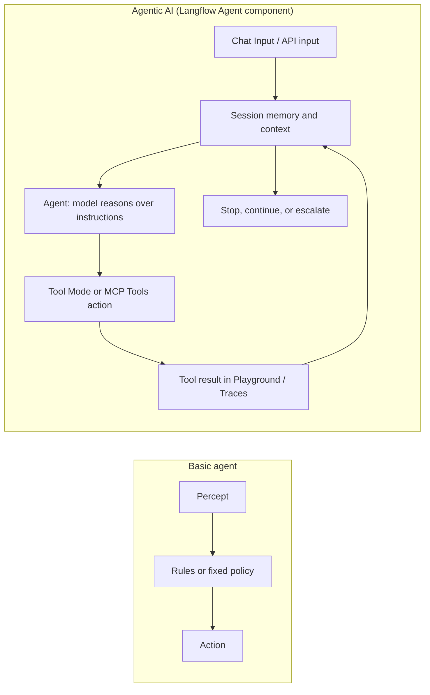

## 2.1 The Evolution from Basic Agents to AI Agents

Teams often carry assumptions from traditional automation straight into AI systems, and that is where the trouble starts. A rule engine is expected to be deterministic. A machine learning model is expected to generalize from examples. A language-model agent is expected to reason over context, choose tools, and adapt to intermediate results. These are three different operating modes, and confusing them produces fragile systems.

A basic agent can be effective when the environment is stable and observable. A thermostat, a spam rule, and a deterministic ticket router can perform useful work because their action rules are explicit. The limitation appears when the environment contains ambiguity: vague language, incomplete evidence, new cases, contradictory signals, or goals that require several dependent steps.

AI agents address that limitation by adding learned interpretation and flexible action selection. They can classify intent, summarize evidence, generate plans, call tools, compare outputs, and revise the path when a tool result changes the situation. But flexibility is not free. It shifts part of the system from deterministic logic into probabilistic inference, so professional design must add evaluation, constraints, and traceability. In Langflow, that flexible core arrives as a single Agent component, while the surrounding controls arrive as deterministic flow structure, Policies, and the observability you get from the Playground and Traces.

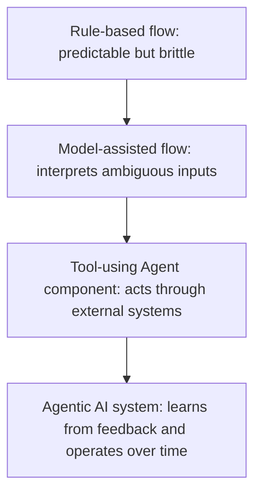

As introduced in Chapter 1, "Definition and Characteristics", an agent function maps percept history to action. In an AI agent, part of that mapping is learned or model-mediated. The professional question is not whether that is impressive. The question is whether the learned part is placed where it adds value and surrounded by controls where it can cause harm.

The progression is visible on the canvas. A basic flow can be just a Chat Input and Chat Output wired to a Language Model component, with no agency at all: text in, text out. Turning that into an agent means replacing the bare model with an Agent component and giving it tools to act through.

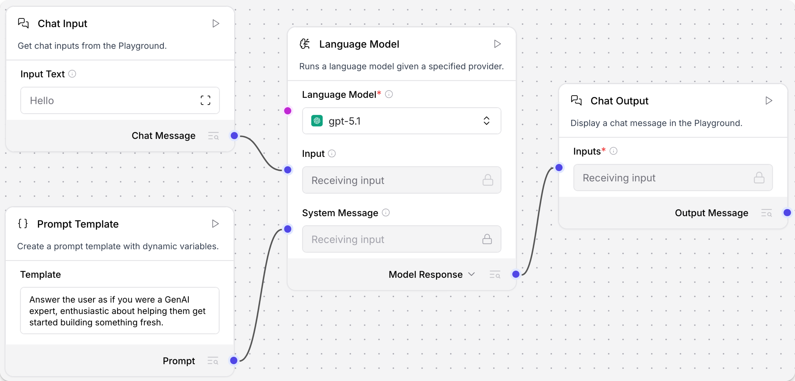
*Figure 2.1: A model-only flow. It answers, but it cannot act. Adding an Agent component and tools is what moves it up the ladder from basic to agentic. Source: Langflow documentation (docs.langflow.org).*

### 2.1.1 Adding Learning Capabilities

Real environments do not stay still. Users change vocabulary, attackers change tactics, product catalogs evolve, documents go stale, and operational patterns drift. A purely fixed agent only keeps working as long as the world stays close to the assumptions baked into its rules. Learning is how an agent stops being a snapshot.

In agentic AI, "learning" can mean several things. It does not always mean that the production model rewrites its own weights while serving a user. In professional systems, learning is usually more controlled:

- Updating a retrieval corpus or knowledge base as new documents are approved.
- Capturing human corrections and turning them into evaluation cases.
- Adjusting Agent Instructions, Policies, or tool descriptions after failures.
- Fine-tuning or retraining an underlying model through an offline pipeline.
- Updating a recommendation model from aggregated behavior.
- Recording successful tool-use traces, visible in the Playground and Traces, as examples for future evaluation.

This distinction is important. Live, uncontrolled learning can make behavior difficult to audit. Controlled learning loops preserve accountability: the system observes errors, stores evidence, evaluates changes, and deploys improvements through a governed process.

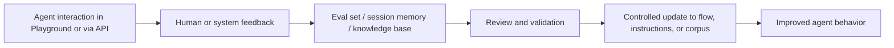

Consider a customer-support agent. A rule-based version routes tickets by keywords. A model-assisted version classifies intent from natural language. A learning version captures when agents, supervisors, or customers correct the classification. In Langflow those corrections do not retrain anything on the spot; they accumulate into evaluation examples, into documents added to a knowledge base the agent retrieves from, or into refined Agent Instructions and Policies. The learning is valuable because it closes the gap between the system's assumptions and the organization's real work, and it stays inspectable because each change passes through a person and a deliberate edit to the flow.

For professionals, the core design principle is: make learning inspectable. Store what changed, why it changed, who approved it, and how the change was evaluated.

### 2.1.2 Decision-Making Under Uncertainty

AI agents almost never run on complete information. Requests are ambiguous. Tools return stale data. Sources disagree. The model can be confident for the wrong reason. A planned action may have side effects that are hard to undo. Uncertainty is not a corner case in agent design; it is the default condition.

In Chapter 1, we used the classic rational-agent framing: choose actions expected to improve the performance measure given the available evidence. Agentic AI keeps that framing but adds probabilistic interpretation. The agent must often decide whether to act, gather more evidence, ask a human, or stop.

There are several common sources of uncertainty:

- Input uncertainty: the request is vague, incomplete, or contradictory.
- State uncertainty: the agent does not know whether its internal view is current.
- Tool uncertainty: external systems fail, time out, or disagree.
- Model uncertainty: the model's output may be plausible but wrong.
- Outcome uncertainty: the effect of an action may be delayed or irreversible.

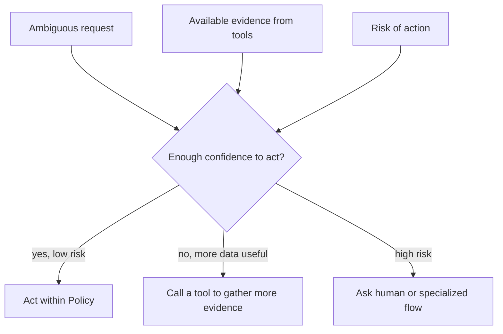

Recent research treats uncertainty as more than a problem to hide. Uncertainty-aware methods for language-model agents explore how confidence signals can shape learning from both successful and failed trajectories. Production systems should be cautious about adopting research techniques directly, but the architectural lesson is practical: uncertainty can become a routing signal. Low confidence can trigger an extra tool call, a second check, a narrower tool set, a human review, or a refusal to act. In Langflow, you express that by giving the agent retrieval and verification tools to reach for when evidence is thin, by writing Agent Instructions that tell it to gather evidence before recommending action, and by wrapping risky tools in Policies so a low-confidence path cannot quietly cause harm.

The professional failure mode is pretending uncertainty does not exist. A useful agent makes uncertainty visible in its instructions, its tool choices, and the traces the Playground records for every run.

### 2.1.3 Agentic AI and Proactive Behavior

Many of the most valuable workflows do not start with a neatly formed user question. Incidents emerge from telemetry. Fraud patterns appear across transactions. Inventory shortages develop before any customer notices. A project risk becomes visible before a deadline is missed. Proactive agents exist to meet those signals where they actually arise.

A reactive AI system waits for a prompt. A proactive agentic system monitors signals, compares them with goals and policies, and initiates an appropriate workflow when conditions warrant action. This does not mean the agent should act without boundaries. It means the trigger can come from the environment, not only from a human message.

Proactive behavior has three parts:

1. A monitored condition.
2. A goal or policy that defines why the condition matters.
3. A bounded action the agent may initiate.

A Langflow flow is not limited to a person typing in the Playground. The same flow that you test interactively can be invoked from outside through the Langflow API `/run` endpoint, so an external monitor, scheduler, or webhook can start it when a condition is met. An enterprise finance agent might be triggered to inspect an invoice anomaly, gather supporting records through its tools, and prepare a review packet. A software operations agent might be triggered after a deployment to collect logs and draft an incident summary. A customer success agent might run when usage drop-off is detected and suggest outreach to an account manager.

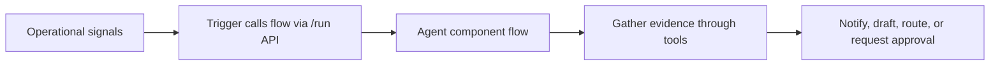

The professional boundary is critical: proactive does not mean unconstrained. The safest pattern is often "proactive preparation, human-approved execution." The agent can monitor, investigate, summarize, and recommend; irreversible or high-risk actions require stronger controls. This is explored in depth in Chapter 4, "Guardrails for Agentic AI".

## 2.2 Agentic AI: Core Capabilities

Agentic AI tends to get described in sweeping language: "it plans," "it learns," "it acts." Those slogans are not enough to design a system. A working architecture needs to identify which capability is actually present, where it lives in the flow, how it is evaluated, and what happens when it breaks.

Three capabilities matter most here: planning and execution, self-correction and feedback loops, and interaction with other systems. Together, they separate a model-only application from an agentic system. In Langflow, all three converge on one component pattern: an Agent component that reasons over its instructions, selects from the tools on its Tools port, and exposes every step in the Playground.

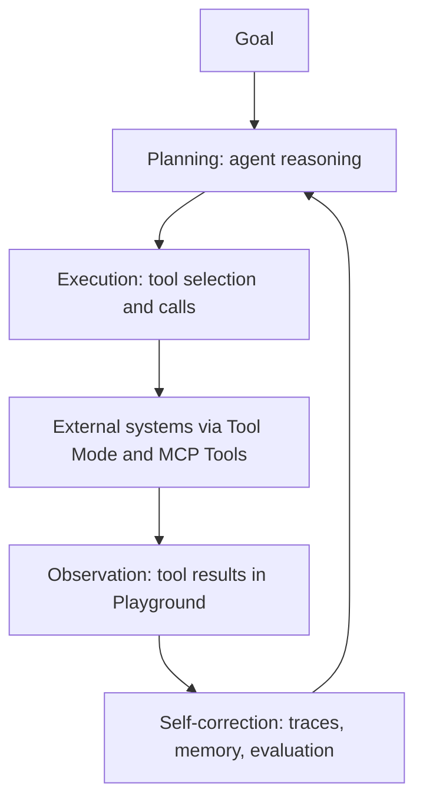

### 2.2.1 Planning and Execution

Most professional tasks are not single-step transformations. "Investigate this outage," "prepare a market brief," "migrate this API," and "resolve this customer escalation" all require decomposition, ordering, evidence gathering, and revision along the way. Planning is what gives an agent a shot at handling them.

Planning and execution are related but distinct.

Planning creates an intended path: what needs to happen, in what order, with what dependencies, and under what constraints. Execution performs the work: calling tools, reading outputs, updating state, and deciding whether the plan still fits reality.

A weak agent mixes these together without visibility. It thinks a little, acts a little, forgets why, and repeats. A stronger professional design makes the reasoning inspectable enough to evaluate and the execution trace detailed enough to debug. This is exactly what the Langflow Agent component plus the Playground provide. The Agent component pairs a language model with custom instructions and a set of tools, then runs the agent loop: the model reads the input and instructions, decides whether to call a tool, observes the tool result, and continues until it has an answer. The Playground then shows that loop step by step, including each tool call, its inputs, and its raw output.

The fastest way to see this is the Simple Agent template, the canonical first flow. It wires an Agent component to a Chat Input and Chat Output, and gives the agent two tools to choose from: a Calculator and a URL component. The agent does no hard-coded routing. Faced with "What is 12.5% of last quarter's revenue listed on this page?" it plans: fetch the page with the URL tool, then compute with the Calculator. That ordering is the plan, and it is the model's decision, not a branch you drew.

To build the planning-capable agent as a flow:

1. Create a new flow from the Simple Agent template (or add an Agent component to a blank canvas).
2. Select the Agent component and set its Language Model to a configured provider and model.
3. Write Agent Instructions that establish the planning norm, for example: "You investigate production alerts. Gather evidence with your tools before recommending an action."
4. Add the tools the agent may use, enable Tool Mode on each, and connect their Toolset ports to the Agent's Tools port.
5. Connect a Chat Input to the Agent's Input and the Agent's Response to a Chat Output.
6. Open the Playground and ask the agent to investigate, then read the tool calls it chooses and in what order.

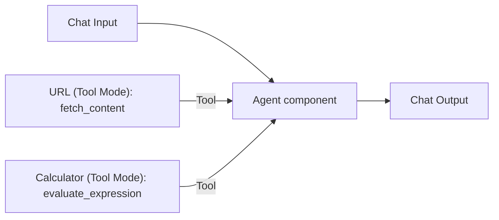

The components and the parameters that shape planning behavior:

| Component | Parameter | Purpose |
| --- | --- | --- |
| Agent | Language Model | Selects the provider/model used as the reasoning engine that plans and chooses tools. |
| Agent | Agent Instructions | Sets the planning norm and constraints applied every conversation (for example, gather evidence first). |
| Agent | Tools (port) | Defines the action space: which Tool Mode components the agent may select during execution. |
| Agent | Current Date | Optional built-in tool that grounds time-sensitive reasoning. |
| URL | Tool Mode | Exposes `fetch_content` so the agent can retrieve a page as a planned step. |
| Calculator | Tool Mode | Exposes `evaluate_expression` for arithmetic the model should not do in its head. |

The tools define the agent's action space. The Agent Instructions define the planning norm. The model decides the order in which to call tools, and the Playground makes that order visible so you can judge whether the plan was sound. This is not a complete incident system; it is the smallest useful illustration of planning expressed as tool-mediated evidence gathering. When the control flow itself becomes part of the product's reliability, with explicit branches, approvals, and retries, you move from a single Agent component toward a larger flow with routing components and, where needed, multiple agents. That progression is where Langflow's visual structure starts to earn its place.

### 2.2.2 Self-Correction and Feedback Loops

First attempts are often incomplete. A model answers before checking evidence. A tool call fails. A retrieval result turns out to be irrelevant. A generated plan quietly skips a constraint. Without feedback, that first trajectory becomes the final trajectory.

Feedback loops come in several forms:

- Tool feedback: the agent observes the result of an action and adjusts.
- Evaluator feedback: another component or flow checks the output against criteria.
- Human feedback: a reviewer approves, edits, rejects, or corrects.
- Operational feedback: traces and evaluations reveal recurring failure modes.
- Memory feedback: durable session state records what has already happened.

Self-correction should be bounded. An agent that "reflects" indefinitely can burn budget and still fail. Professional systems need stopping conditions, cost budgets, retry limits, and escalation paths.

Two Langflow surfaces carry most of this weight. The first is the Playground, which shows the agent's tool calls, inputs, and raw outputs for every run. When an answer is wrong, you do not guess; you read the trajectory and see whether the agent skipped a tool, called it with bad arguments, or misread the result. That inspection is the raw material for correction, whether the fix is a sharper instruction, a better tool description, or an added Policy. The second is session memory. The Agent component keeps chat memory on by default, grouped by `session_id`, so a conversation accumulates context instead of starting fresh on every turn. A correction a user makes in one turn stays available in the next.

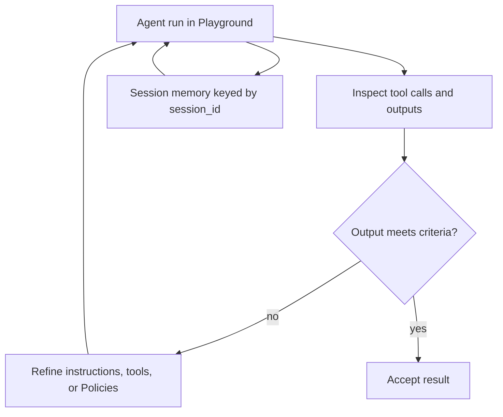

When the agent runs, the Playground shows the finished answer next to the trajectory that produced it, so a wrong result becomes a readable sequence of steps rather than a mystery.

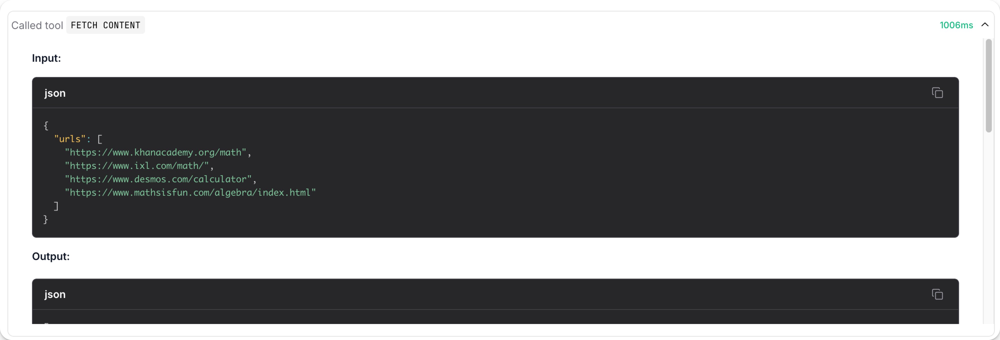
*Figure 2.2: The Playground pairs the agent's answer with the steps behind it. This trajectory is the raw material for self-correction. Source: Langflow documentation (docs.langflow.org).*

The components and parameters that support feedback:

| Component | Parameter | Purpose |
| --- | --- | --- |
| Agent | session_id | Groups chat memory so corrections and prior turns persist within a session. |
| Agent | Number of Chat History Messages | Bounds how much prior context the agent carries, controlling cost and drift. |
| Agent | Handle Parse Errors | Lets the loop recover from malformed tool output instead of failing hard. |
| Playground | Traces / Inspection Panel | Surfaces the trajectory (tool choice, arguments, results) for debugging and evaluation. |

Memory keyed by `session_id` is the low-code analog of a per-conversation thread: it is how Langflow keeps one user's evolving context separate from another's, and it is what lets a draft-then-revise interaction work across turns. For longer-running or higher-stakes loops, you can connect an external memory store through a Message History component, or run a separate evaluation flow that scores outputs before they are accepted. The point is to keep the correction visible and bounded, not buried inside a single opaque model response.

As introduced in Chapter 4, "Evaluating Agent Performance", self-correction should be evaluated by outcomes, not vibes. Did the loop catch real errors? Did it reduce harmful actions? Did it improve task completion without unacceptable latency or cost? The Playground shows you a single trajectory; disciplined evaluation tells you whether the loop helps across many.

### 2.2.3 Interaction with Other Systems

An AI agent only becomes operationally meaningful when it can affect something beyond the model's text output. Tools are how it gets there. They connect agents to search, databases, ticketing systems, code repositories, calendars, payment systems, warehouses, and other services.

That is also where risk sharpens. A model response can be wrong; a tool call can be wrong and consequential. Treat tools as production interface contracts, not casual helpers.

A tool should have:

- A narrow purpose.
- Clear, named actions and well-described inputs.
- Clear permission boundaries.
- Validation before side effects.
- Idempotency for create/update actions.
- Logging and traceability.
- A human approval path for sensitive operations.

Langflow gives an agent two complementary ways to reach other systems. The first is Tool Mode: switching a component into Tool Mode exposes its actions to the agent and adds a Toolset port you connect to the Agent's Tools port. Core components and Bundles, such as Web Search, URL, and Calculator, become callable actions this way. The second is the MCP Tools component, which lets the agent act as a Model Context Protocol client and call tools served by an external or Langflow MCP server. With MCP, the agent can reach systems you have not wrapped as native components at all, as long as those systems are exposed through an MCP server.

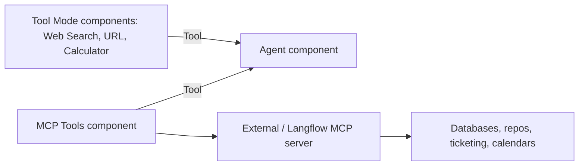

The two integration paths and when each fits:

| Mechanism | How it connects | Best for |
| --- | --- | --- |
| Tool Mode | Enable Tool Mode on a component; connect its Toolset port to the Agent's Tools port. | Built-in capabilities and Bundles (search, fetch, compute) available as Langflow components. |
| MCP Tools | Add the MCP Tools component, point it at an MCP server, enable Tool Mode, connect to Tools port. | External systems and other teams' flows exposed over MCP; standardized cross-system access. |
| Langflow as MCP server | Publish a project's flows as MCP tools (via the MCP Server tab / Share menu). | Letting other agents or IDEs call your flow as a tool, with clear tool names and descriptions. |

Interaction also changes testing. It is not enough to ask whether the final text is reasonable. We must ask whether the agent called the right tool, with the right arguments, at the right time, under the right permissions. This is why the Playground records trajectories: input, tool choice, arguments, tool result, next decision, and final output.

Most of this stays low-code. Code appears at one natural seam: when another application needs to call your flow. The Langflow API exposes each flow through a `/run` endpoint, so an external service can invoke the agent the same way a person would in the Playground. The snippet below shows that call.

```bash
# Call a deployed Langflow flow from an external application.
curl -X POST "http://LANGFLOW_SERVER_ADDRESS/api/v1/run/FLOW_ID" \
  -H "Content-Type: application/json" \
  -H "x-api-key: $LANGFLOW_API_KEY" \
  -d '{
        "input_type": "chat",
        "output_type": "chat",
        "input_value": "Investigate elevated checkout errors."
      }'
```

The `FLOW_ID` identifies which flow to run, and the `x-api-key` header carries a Langflow API key created in settings. The body sends a chat input and asks for chat output; the response is a structured object that includes the `session_id`, the outputs, and the agent's steps, from which a production caller extracts the relevant message. The same endpoint accepts a `tweaks` object to override a parameter for a single run, such as switching the Agent's model, without changing the saved flow. The architectural lesson is broader than any one mechanism: the tool layer, whether a Tool Mode component, an MCP connection, or the `/run` API at the edge, is where agent reasoning becomes operational behavior.

## 2.3 Real-World Agentic AI Examples

Examples are where the conceptual loop has to meet reality: users, latency, cost, failures, organizational constraints. They also push back against a common misconception. Agentic AI is not a single product category. The same patterns show up in assistants, recommendation systems, robotics, enterprise workflows, research tools, software development, and operations.

This section uses three examples from the outline, plus grounded cases from current Langflow practice.

A compact, real example comes from Langflow's own use of the Model Context Protocol: an agent connected through an MCP Tools component to a Git MCP server can read repository activity and draft commit messages. It is a small flow, but it exercises the whole loop this chapter describes: the agent plans which repository actions to call, executes them through MCP, observes the results, and produces a drafted output a developer can review. Multi-agent research systems show the same pattern at larger scale, where a lead agent plans, spawns specialized helpers, gathers their findings, and decides whether more work is needed. Langflow expresses that composition directly, because an Agent component can itself be used as a tool for another Agent, so a coordinating agent can call specialist agents the same way it calls any other tool.

### 2.3.1 Virtual Assistants as Agents

Virtual assistants are the most familiar surface for AI agents, and familiarity can be misleading. A simple assistant answers a question. An agentic assistant interprets intent, uses context, calls tools, tracks state, and takes bounded action.

Consider a workplace scheduling assistant. A non-agentic version might answer, "Your next meeting is at 2 PM." An agentic version might inspect calendars, identify attendees, detect conflicts, propose times, draft an agenda, and ask for approval before sending invitations. As a Langflow flow, this is an Agent component whose Tools port carries calendar access, most naturally through an MCP Tools connection to a calendar system, and whose Agent Instructions encode the rule that external customer reschedules require approval. The value is not the conversational interface. The value is the assistant's ability to connect language, context, tools, and workflow.

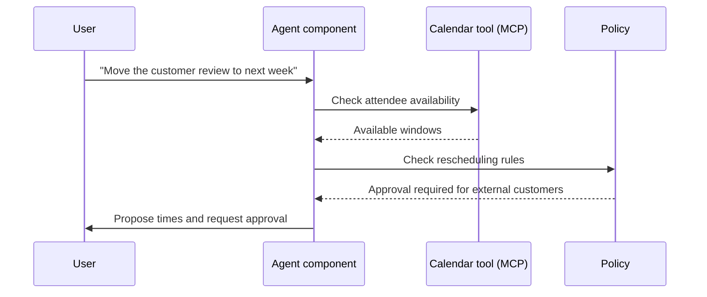

The professional design question is not "Can the model understand the sentence?" It is "What session state and tools does the assistant need, and which actions require approval?" That is why virtual assistants are an entry point into agentic AI rather than the whole field.

### 2.3.2 Recommendation Agents

Recommendation systems are where learning and uncertainty appear at scale. A recommender observes behavior, predicts preferences, ranks options, and acts by changing what a user sees next. It may surface products, articles, videos, routes, support content, or next-best actions for a sales team.

Unlike a thermostat, a recommendation agent rarely knows the correct answer. It operates under uncertainty. A click may signal interest, curiosity, confusion, or accident. A purchase may reflect preference, urgency, price, or availability. The agent must learn from patterns while avoiding overfitting, runaway feedback loops, and unfair outcomes.

In professional systems, recommendation agents often combine:

- Behavioral signals.
- Content features.
- User or account context.
- Business constraints.
- Exploration strategies.
- Feedback from outcomes.

The agentic pattern is visible: observe behavior, update state or model inputs, rank possible actions, present an option, observe the result, and improve future decisions. A Langflow recommendation flow would typically let an Agent component reason over retrieved candidates and business constraints, while a ranking model and feature store sit behind tools the agent calls rather than inside the model itself. The governance challenge is equally visible. Recommendations shape user behavior, so evaluation must include accuracy, diversity, fairness, business impact, and user trust.

This is explored in depth in Chapter 6, "The ROI of Agentic AI", where business impact and measurement become central.

### 2.3.3 Autonomous Agents in Robotics

Robotics makes the cost of action concrete. A software agent can send a bad message; a robot can collide with a shelf, block a hallway, or damage equipment. Physical agents are a useful reference point precisely because they make it impossible to separate perception, planning, uncertainty, and safety.

An autonomous warehouse robot must localize itself, perceive obstacles, plan a route, execute movement, recover from blocked paths, and coordinate with other systems. It has reactive needs, such as stopping when an obstacle appears, and deliberative needs, such as choosing an efficient route through a changing environment.

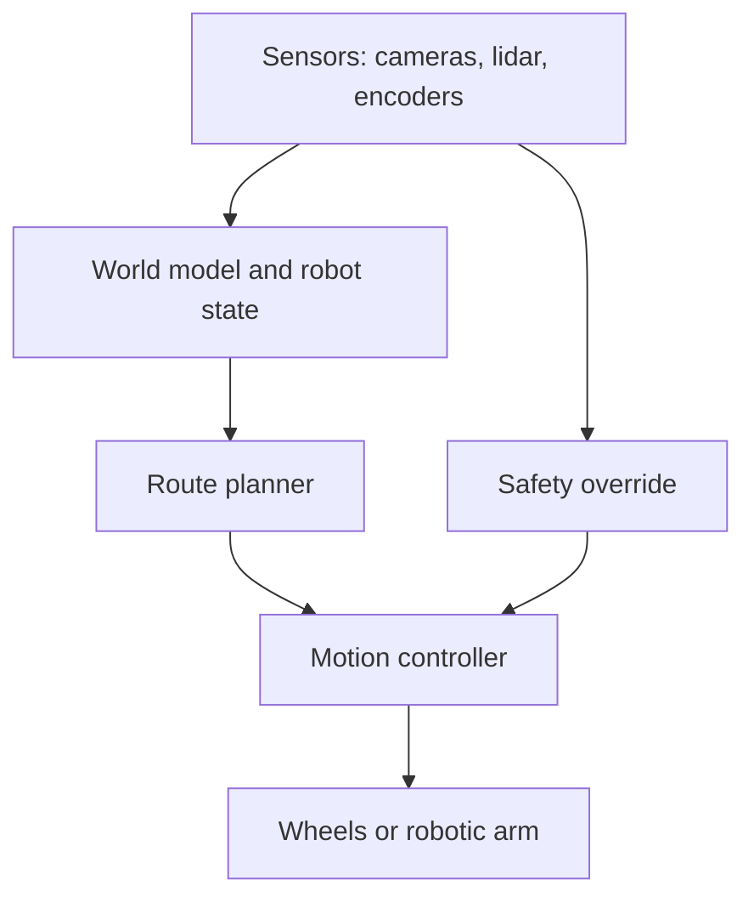

The lesson for software professionals is direct. Even when the environment is digital, agentic AI needs a comparable separation of concerns. Perception should be explicit. State should be structured. Planning should be inspectable, which in Langflow means readable in the Playground. Execution should be constrained by the tools and Policies you attach. Safety should not depend on the model remembering a sentence in the prompt; it should live in deterministic guards around the tools.

As introduced in Chapter 3, "What Are Multi-Agent Systems?", robotics also leads naturally into collaboration. Fleets of robots, swarms, and distributed simulations require agents to coordinate with other agents, not merely with tools.

## Closing Recap

The move from agents to agentic AI happens when learned models, language understanding, planning, tools, feedback, and stateful operation enter the agent loop. Capability goes up, and so does the work around it: uncertainty, cost, observability, governance.

In Langflow, that loop has a concrete shape. The Agent component is the reasoning engine, configured with a Language Model and Agent Instructions. Its Tools port defines the action space, filled by Tool Mode components and MCP Tools connections. The Playground and Traces make planning and execution inspectable, session memory keyed by `session_id` carries context across turns, and Policies plus human approval keep risky actions bounded. The same flow you build and test interactively can be called from another application through the `/run` API.

The central lesson is architectural. AI belongs inside a controlled loop. Learning should be inspectable. Uncertainty should influence routing and escalation. Planning should be visible enough to evaluate. Feedback loops should be bounded. Tools should be treated as production interfaces.

Chapter 3, "Multi-Agent Systems and Collaboration", picks up from here by asking what happens when one agent is not enough. We move from a single agent loop to systems where multiple agents, including agents used as tools for other agents, communicate, coordinate, negotiate, and divide work.
