# Chapter 3. Multi-Agent Systems and Collaboration

A single incident agent can inspect logs, read deployment history, query metrics, check ownership, draft a summary, notify stakeholders, and propose a rollback. It can also crumble under its own weight. The instructions grow. The list of tools wired to its Tools port gets crowded. The model confuses similar actions. A security-sensitive tool sits one click away from a harmless lookup. Debugging turns into a reconstruction exercise: why did one Agent component, carrying every responsibility, choose that path?

Multi-agent systems take pressure off that single agent by dividing work among several with clearer roles.

The motivation is not novelty. A multi-agent architecture earns its place when the work itself spans multiple domains, juggles conflicting constraints, can run subtasks in parallel, or crosses organizational boundaries. A research workflow may want a search agent, a synthesis agent, and a citation agent. A benefits workflow may need document extraction, policy checking, fraud review, and human escalation. A robot fleet may need local navigation agents plus a shared coordination layer.

In Langflow, this division of labor has a concrete shape. An Agent component can be placed in Tool Mode and connected to another Agent's Tools port, so one agent becomes a tool another agent can call. Whole flows can be exposed across project boundaries through the Model Context Protocol (MCP). The right question, then, is not "How many agents can we add to the canvas?" It is "Which coordination structure removes more complexity than it introduces?"

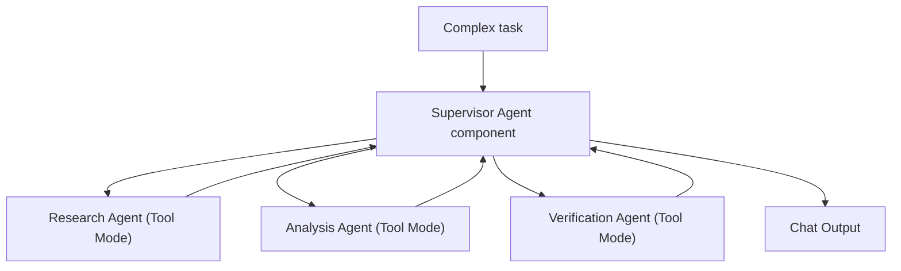

> As introduced in Chapter 2, "Interaction with Other Systems", tools connect agents to operational capabilities. In a multi-agent system, other agents may themselves become tools, collaborators, or handoff targets. In Langflow, that shift is literal: a worker Agent in Tool Mode appears on the supervisor's Tools port like any other tool. That gives us specialization and parallelism, but it also introduces coordination, conflict resolution, observability, and governance challenges.

## 3.1 What Are Multi-Agent Systems?

"Multi-agent" is now applied to almost anything that calls a model more than once, and the term has lost most of its precision. A useful definition is narrower. A multi-agent system is a coordination architecture in which multiple agents interact within a shared task environment. The agents may cooperate, specialize, negotiate, compete for resources, or hand work to one another.

Coordination is the load-bearing word. Without it, multiple agents become multiple failure sources. They duplicate work, contradict each other, overwrite shared state, call tools in the wrong order, or add more latency than value. With coordination, a multi-agent system can solve tasks that would be brittle, expensive, or unmanageable for a single agent.

In Langflow terms, the "shared task environment" is expressed through flow structure, sessions, and project boundaries. A coordination protocol is not an abstract idea you bolt on later; it is the way you wire components, name tools, route control, and group flows into projects.

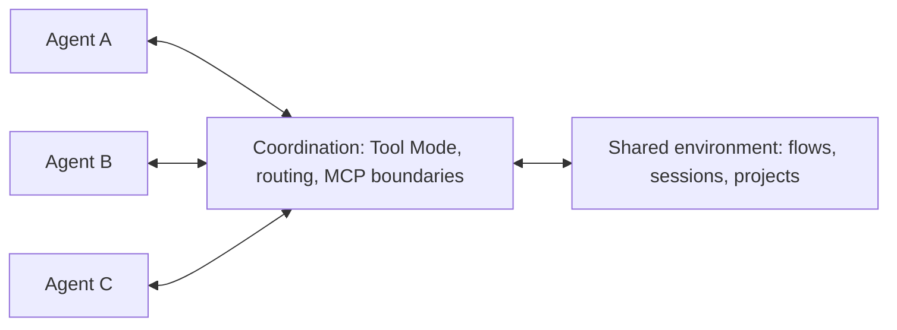

A useful professional definition is:

> A multi-agent system is a set of agents that coordinate decisions or actions within a shared environment to improve system-level performance.

The system-level phrase is essential. A single agent can optimize its own local task while harming the overall workflow. A research subagent may gather many sources but exceed the latency budget. A support subagent may answer quickly but skip compliance review. A robot may choose its shortest path but block a loading zone. Multi-agent design is the discipline of making local behavior serve the larger objective, and on the Langflow canvas it is the discipline of making that objective visible in how flows are composed.

### 3.1.1 Multiple Agents, Multiple Goals

Specialization is both the appeal and the danger of a multi-agent system. Each agent carries a local objective, set through its Agent Instructions. The system as a whole carries a broader one. The architecture's job is to keep the two aligned.

In a professional research system, one agent might optimize for breadth, another for factual verification, and another for concise synthesis. In an enterprise workflow, a sales agent may optimize for responsiveness, a compliance agent for policy adherence, and a finance agent for contractual accuracy. None of these goals is wrong. The challenge is that they can conflict.

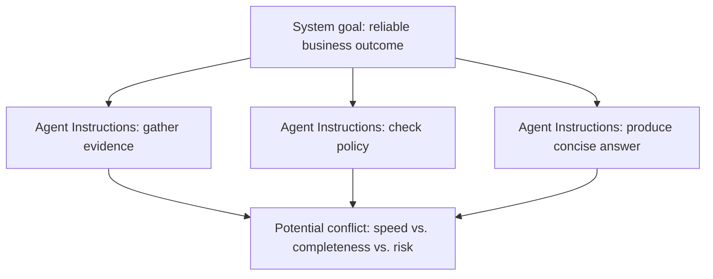

This is why Agent Instructions alone are not enough. If a verification agent and a synthesis agent disagree, the system needs a rule for what happens next. If two agents request the same scarce resource, the system needs allocation logic. If a worker agent produces low-confidence output, the supervisor must know whether to retry, escalate, or continue with a caveat. Some of that lives in the supervisor's instructions, but the durable controls live in flow structure and, where actions carry risk, in Policies that guard the underlying tools.

The design principle is simple: local goals must be explicit in each agent's instructions, and system goals must have priority when trade-offs appear. The supervisor Agent is the natural place to encode that priority.

### 3.1.2 Communication Between Agents

Agents cannot coordinate around information they cannot exchange. In a human organization, coordination happens through meetings, tickets, status updates, handoffs, and approvals. In Langflow, the equivalent is the typed connections between ports: a worker Agent's response flows back into the supervisor through the Tools port, a Chat Input carries the original request, and message data passes between components along edges of the same type.

Agent communication in a Langflow build can take several forms:

- A supervisor Agent calls a worker Agent that is in Tool Mode and receives its Response as a tool result.
- A flow routes control from one branch to another based on a condition.
- An Agent calls a flow in another project through the MCP Tools component, crossing a server boundary.
- Session memory, keyed by `session_id`, carries shared conversational context across turns.
- A human reviewer injects a decision into the workflow before a sensitive action proceeds.

The professional standard should be structured communication whenever the result matters. Because a worker Agent in Tool Mode is exposed to the supervisor through a named action with a description, those names and descriptions are the message schema. A vague description ("does research") invites the supervisor to call the wrong worker; a precise one ("gathers operational facts about an incident and cites uncertainty") makes selection reliable.

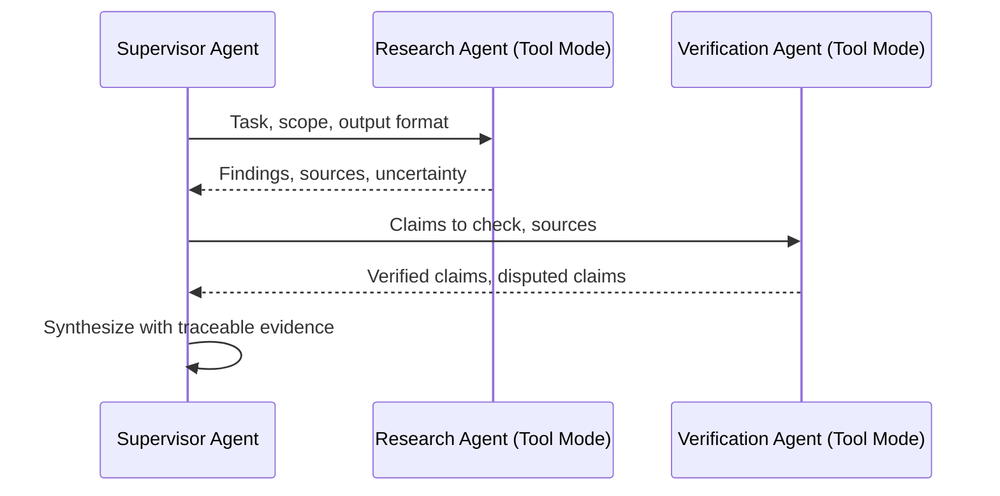

> As introduced in Chapter 1, "Perception and Action", an agent's action space defines what it can do. In a multi-agent system, communication is part of the action space. In Langflow, the action space of a supervisor is literally the set of components on its Tools port. Calling the right collaborator with the wrong context is still a poor action, and the Playground will show it.

### 3.1.3 Coordination and Cooperation

Several agents on a canvas do not automatically become a team. Cooperation means agents contribute toward a shared goal. Coordination means their actions are organized so they do not get in each other's way. Both have to be designed in deliberately.

A group can cooperate poorly. Three research agents may all fetch the same source through the URL component. Two support agents may draft conflicting responses. A robot fleet may send two robots into a narrow aisle from opposite ends. Everyone may be "trying to help," yet the system performs worse than a single well-designed flow.

Coordination mechanisms, expressed in Langflow, include:

- Task assignment through supervisor routing and clear tool descriptions.
- Shared context through session memory keyed by `session_id`.
- Priority and ownership rules stated in the supervisor's Agent Instructions.
- Deterministic routing through flow structure rather than model improvisation.
- Guarded actions through Policies that constrain which tools may fire and when.
- Human arbitration wired in before high-impact actions.

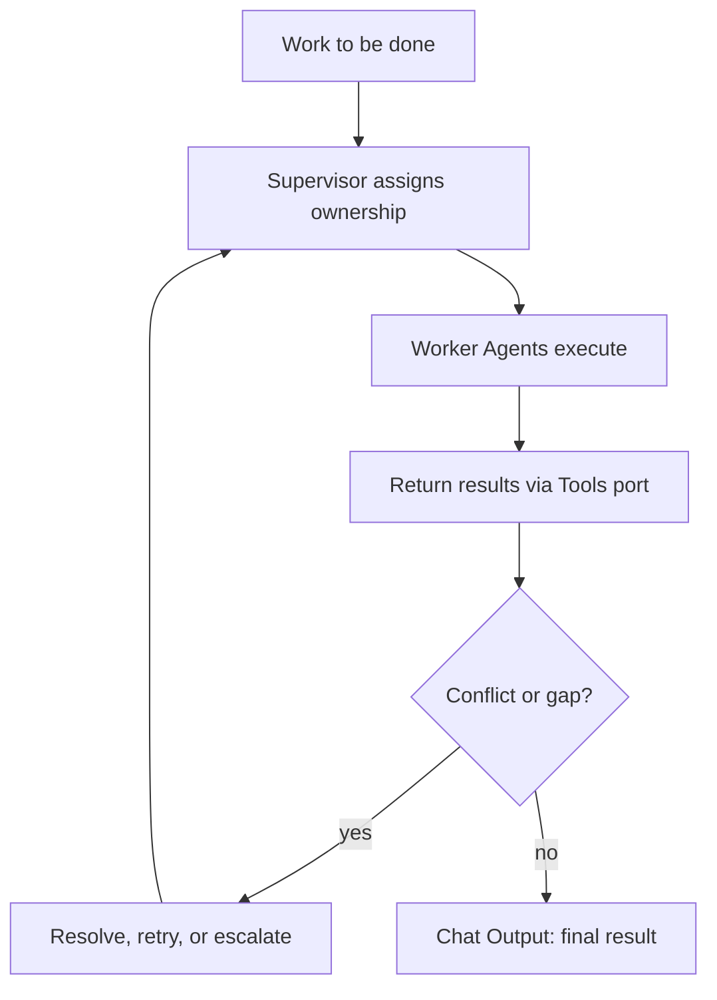

Professional teams should evaluate multi-agent systems at the coordination level, not only the agent level. A worker Agent can perform well in isolation and still harm the system if its outputs arrive too late, lack provenance, or force the supervisor to spend extra turns reconciling ambiguity. Langflow's Traces and Inspection Panel make this measurable: they show which worker was called, what it returned, and how the supervisor used the result.

## 3.2 Designing Multi-Agent Architectures

There is no single best multi-agent pattern. A supervisor is not automatically better than a pipeline. A decentralized swarm is not automatically more intelligent. Each pattern encodes assumptions about control, trust, latency, visibility, and failure. Picking one means picking which trade-offs you can live with, and in Langflow it means choosing how flows, Tool Mode connections, and project boundaries are arranged.

The design starts with the shape of the work:

- Is the next step predictable or dynamic?
- Are domains clearly separable?
- Must one component own final synthesis?
- Can tasks run in parallel?
- Are some actions higher risk than others?
- Does the system need to call work that lives in another project or service?

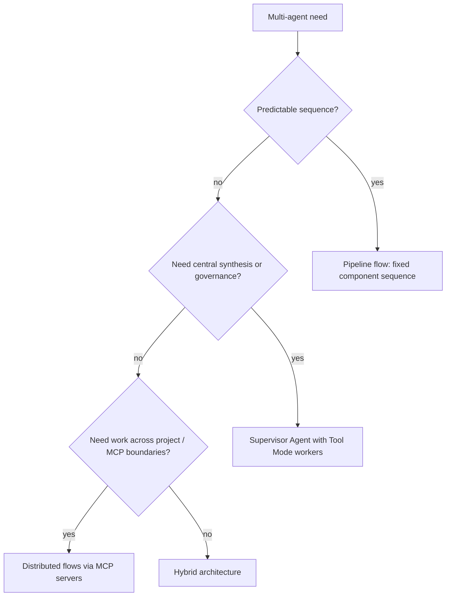

### 3.2.1 Centralized vs. Decentralized Control

Control structure decides who chooses what happens next. Centralized systems route those decisions through a coordinator. Decentralized systems let agents pass work to each other directly, or make local decisions against a shared protocol.

In a centralized supervisor architecture, a main agent coordinates specialized agents. This fits professional workflows where one component must maintain context, enforce policy, and synthesize final output. Langflow supports this pattern directly through its "use an agent as a tool" capability: a worker Agent component is switched into Tool Mode, which exposes its actions through a Toolset port, and that port connects to the supervisor Agent's Tools port. The worker returns its Response to the supervisor rather than speaking to the user.

The flow below shows that supervisor pattern for incident work. It uses one supervisor Agent and two worker Agents, each in Tool Mode, plus a Chat Input and Chat Output so the flow can be tested in the Playground.

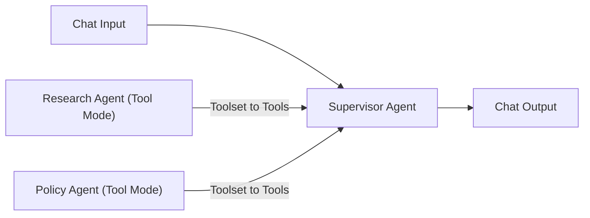

The components and the settings that matter:

| Component | Key setting | Purpose |
| --- | --- | --- |
| Supervisor Agent | Agent Instructions, Tools port | Coordinates the work; receives the request and decides which worker to call |
| Research Agent | Tool Mode enabled | Gathers concise operational facts and cites uncertainty; exposed as a tool |
| Policy Agent | Tool Mode enabled | Checks whether a proposed action is allowed; exposed as a tool |
| Chat Input | — | Carries the incident question into the supervisor |
| Chat Output | — | Returns the supervisor's synthesized response |

An ordered build on the canvas looks like this:

1. Add an Agent component, choose a model provider, and set its Agent Instructions to describe the coordinator's job: "Coordinate incident work. Use the research tool for facts, check policy before recommending risky actions, and synthesize briefly." This is the supervisor.
2. Add a second Agent component. Set its instructions to "Gather concise operational facts and cite uncertainty," then enable Tool Mode from its header menu. A Toolset port appears.
3. Add a third Agent component. Set its instructions to "Check proposed actions against internal policy," then enable Tool Mode.
4. Connect the research Agent's Toolset port to the supervisor's Tools port. Do the same for the policy Agent. Both workers now appear to the supervisor as callable tools.
5. Give each worker a clear tool name and description. The supervisor selects tools by these names, so "research_incident" and "check_policy" are better than "agent_2" and "agent_3."
6. Connect a Chat Input to the supervisor's input and the supervisor's Response to a Chat Output.
7. Open the Playground, send an incident question, and watch the supervisor's tool calls. Use Traces to confirm which worker was invoked, with what input, and what it returned.

This design carries three architectural layers, just as the equivalent code would. The worker Agents own focused instructions. Tool Mode defines how the supervisor delegates. The supervisor sees a small set of high-level capabilities rather than every low-level tool, which reduces tool confusion and creates a clear place to enforce workflow policy.

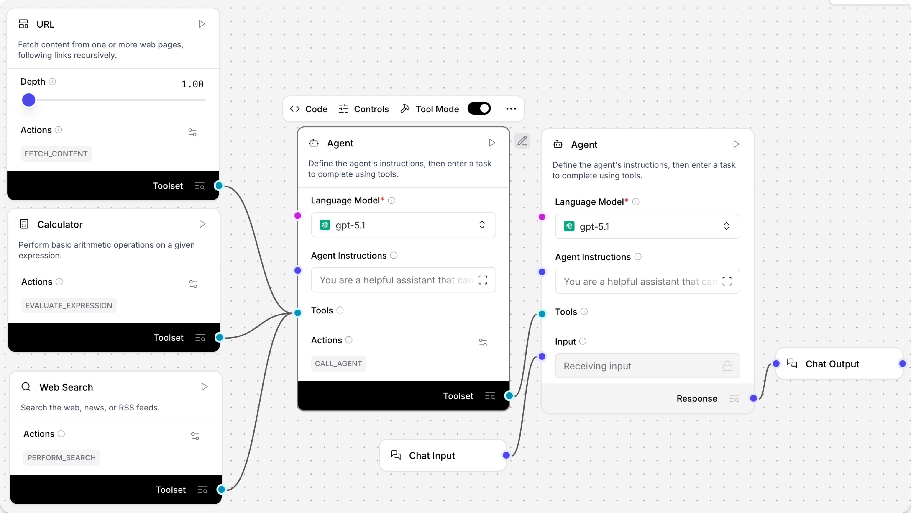
*Figure 3.1: "Use an agent as a tool." A worker Agent in Tool Mode connects its Toolset port to a supervisor Agent's Tools port, turning one agent into a callable capability for another. Source: Langflow documentation (docs.langflow.org).*

Decentralized architectures are different. Rather than one supervisor holding the Tools port, work is distributed across separately deployed flows. In Langflow, this is natural because every project runs an MCP server that exposes its flows as tools. An agent in one project reaches work in another by registering that project's MCP server and connecting an MCP Tools component, in Tool Mode, to its Tools port. Control can then pass across boundaries without a single canvas owning everything.

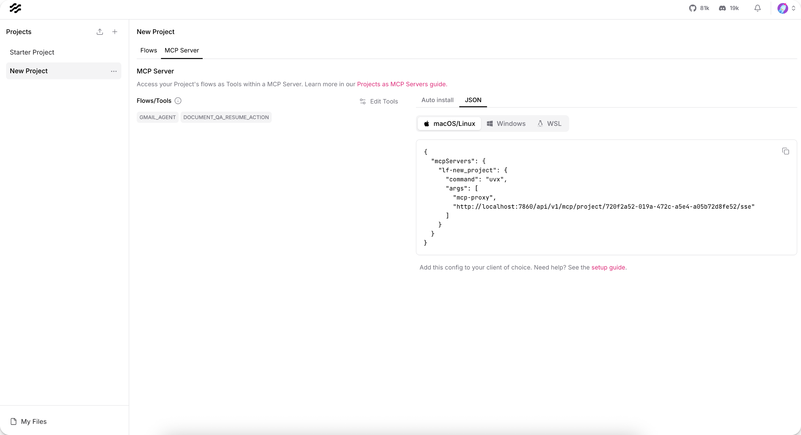
*Figure 3.2: Every Langflow project runs an MCP server that publishes its flows as tools. This is how work crosses boundaries between independently deployed flows. Source: Langflow documentation (docs.langflow.org).*

A minimal MCP server registration, the kind stored in Settings > MCP Servers so an MCP Tools component can reach another Langflow project, looks like this:

```json
{
  "mcpServers": {
    "incident-workers": {
      "url": "http://localhost:7860/api/v1/mcp/project/PROJECT_ID/streamable",
      "headers": {
        "x-api-key": "${LANGFLOW_API_KEY}"
      }
    }
  }
}
```

The entry points an MCP client at a Langflow project's streamable HTTP endpoint and authenticates with an API key supplied as a header. Once registered, the flows in that project appear as named tools the consuming agent can call. The trade-off of decentralization is governance: distributed flows require stronger protocols and clear tool naming because no single supervisor is naturally preserving context and accountability.

Pipeline architectures sit between these extremes. They use a fixed sequence of components on one canvas: extract, validate, enrich, summarize. The order is wired deterministically rather than chosen by a model each turn, which makes the flow less flexible but far easier to test and often better for regulated document workflows.

The professional pattern is to choose the simplest control structure that matches the work. Centralize with a supervisor Agent when governance and synthesis matter. Decentralize across projects and MCP servers when local autonomy or independent deployment matters. Use a fixed pipeline flow when the process is predictable.

### 3.2.2 Conflict Resolution and Negotiation

Even when every agent behaves reasonably, they can still disagree. One prioritizes speed, another prioritizes accuracy. Two claim ownership of the same task. A planner proposes an action that a policy agent rejects. A robot picks a path that another robot also wants. Conflict is not an exception in multi-agent systems. It is a design condition.

Common conflict types include:

- Resource conflict: two agents need the same tool, lock, file, time slot, or physical space.
- Goal conflict: local objectives pull in different directions.
- Evidence conflict: agents interpret sources differently.
- Action conflict: one action would invalidate another.
- Authority conflict: agents disagree on who may decide.

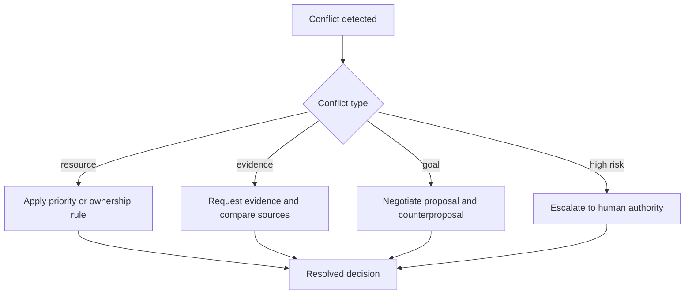

Resolution can be deterministic or deliberative. In Langflow, deterministic mechanisms live in flow structure: routing components that direct control down one branch, the supervisor's instructions that name a priority order, and Policies that simply refuse a tool call when a rule is violated. Deliberative mechanisms live in the agent loop: the supervisor can ask a worker for evidence, weigh competing results, or route to a human. The higher the risk, the less the system should rely on unconstrained model conversation and the more it should rely on deterministic guards.

Negotiation is useful when agents have partial views or competing preferences. A scheduling agent might propose a meeting time, a travel agent might reject it because it conflicts with transit time, and the supervisor Agent might choose the best compromise from the two tool results. In professional systems, negotiation should have a protocol: tool descriptions and instructions should require proposals to include constraints, confidence, alternatives, and escalation conditions, so the supervisor is comparing structured results rather than free-form opinions.

> As introduced in Chapter 4, "Defining Agent Boundaries", conflict resolution also has a safety dimension. If a Policy or a policy-checking agent rejects an action, the supervisor should not simply call another tool until it gets a more convenient answer. Encoding the rejection as a hard guard, not a negotiable suggestion, is what keeps that boundary intact.

### 3.2.3 Scaling Multi-Agent Systems

Multi-agent architectures multiply both capability and overhead. Every additional agent brings more model calls, tool calls, state transitions, latency, cost, and failure modes. A flow that reads cleanly on the canvas can be too slow or too expensive in production.

The main scaling dimensions are:

- Task scale: more subtasks or more complex decomposition.
- Agent scale: more worker Agents, specialists, or whole projects.
- Context scale: more documents, messages, session memory, and traces.
- Tool scale: more Tool Mode components and MCP servers wired in.
- Operational scale: more users, sessions, tenants, and compliance boundaries.

As the number of flows grows, projects become the unit of organization. The Projects page collects related flows together, and because each project is also an MCP server boundary, it doubles as the seam along which work is partitioned and shared.

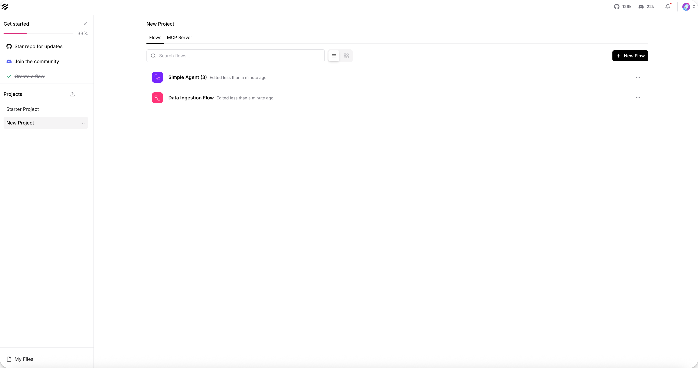
*Figure 3.3: Projects group related flows and define MCP server boundaries, giving multi-agent systems a structure that scales beyond a single canvas. Source: Langflow documentation (docs.langflow.org).*

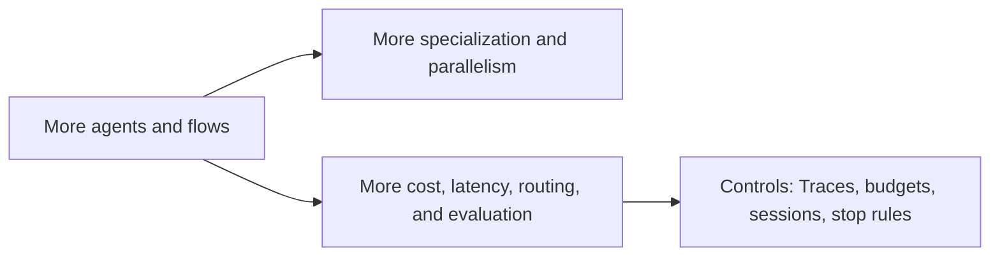

Scaling requires explicit controls, and Langflow gives each one a home.

Set termination conditions. A supervisor needs to know when to stop delegating and produce the final result. The supervisor's Agent Instructions should state when to stop calling workers and write the answer to the Chat Output, so the loop does not cycle through specialists indefinitely.

Budget the workflow. Multi-agent systems can expand token use and tool calls quickly. Route routine subtasks to cheaper models by configuring each worker Agent's model independently, and use per-run tweaks to switch a model or provider for a single `/run` call without changing the saved flow.

Trace every handoff. Langflow's Traces and Inspection Panel show which worker was called, with what input, which tools it used, what it returned, and how the supervisor used the result. This is the production analog of reading a transcript, and it is where coordination problems surface first.

Isolate context. Worker Agents are valuable partly because each invocation can operate in a focused context. Keep session scope deliberate: passing the entire conversation into every worker defeats the benefit of specialization. Sessions keyed by `session_id` let you decide what shared memory each agent actually needs.

Evaluate coordination. Measure routing accuracy, duplicate work, unresolved conflicts, latency, cost per task, human escalation rate, and final outcome quality. The Playground is the place to reproduce a case; Traces are the place to see why it went the way it did.

Scaling multi-agent systems is therefore less about adding more agents to the canvas and more about maintaining system coherence as complexity grows.

## 3.3 Real-World Multi-Agent Applications

Multi-agent systems are easiest to understand when the work itself is visibly distributed. Some environments are inherently multi-agent: robot fleets, traffic systems, supply chains, enterprise workflows, simulations, research teams. The architecture ends up mirroring the world it operates in, and the Langflow flow ends up mirroring the architecture.

The examples below show three different professional uses: physical coordination, simulated coordination, and enterprise workflow coordination.

### 3.3.1 Swarms and Distributed Robotics

Swarms and robotics make coordination concrete. If two robots head for the same narrow corridor, the conflict is physical. If a drone swarm loses communication, local decision-making becomes the thing that holds the system together. If a central scheduler has global insight but cannot compute fast enough, local refinement becomes valuable.

Large robotic systems often blend centralized and decentralized control. A central coordinator may allocate tasks globally, while individual robots adapt locally to battery state, obstacles, and nearby agents. Recent swarm scheduling research illustrates this hybrid pattern: global allocation can provide coherence, while distributed local refinement improves scalability and energy-aware execution.

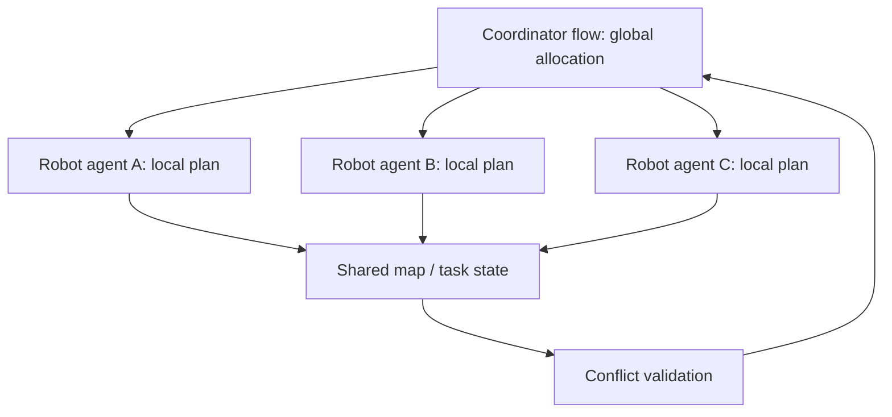

The software lesson is direct, and it maps onto Langflow cleanly. A supervisor Agent can decide global task allocation, while worker Agents apply local domain expertise through their own tools. When the robots themselves run as independently deployed services, each can be reached as an MCP server, so the coordinator calls them through MCP Tools rather than holding every behavior on one canvas. The coordinator should validate results before committing a final action, especially when outputs interact, and Policies are the right place to make that validation non-negotiable.

### 3.3.2 Multi-Agent Simulations

Simulations let teams study coordination before pushing it into expensive or risky environments. A multi-agent simulation models many agents interacting under rules: vehicles in traffic, traders in markets, users on a platform, robots in a warehouse, or departments in an enterprise process.

The value is not only prediction. Simulations expose emergent behavior. Individual agents may follow reasonable local rules, but the group can still create congestion, unfair allocation, oscillation, or instability. These are precisely the patterns multi-agent designers need to see before production.

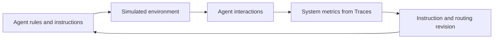

For AI professionals, simulations built as flows can support:

- Testing routing policies before they touch real users.
- Estimating cost and latency under load by replaying sessions.
- Discovering deadlocks and loops where agents keep handing work back and forth.
- Comparing a centralized supervisor against distributed, MCP-connected flows.
- Evaluating escalation thresholds.
- Training or evaluating multi-agent reinforcement learning systems built elsewhere.

The important caveat is that simulation quality depends on assumptions. A simulation does not prove production safety, but it can reveal coordination failures that a single-agent test in the Playground would miss. Running many sessions and reading their Traces is how those failures become visible.

### 3.3.3 Enterprise Workflows with Multiple Agents

Enterprise workflows are where many readers will first run into multi-agent systems for real. Work in large organizations is already divided by expertise: legal, finance, support, engineering, compliance, sales, operations. Multi-agent architectures can mirror those boundaries when a single agent would be too broad, or too risky, to do the whole job.

Consider a contract review workflow built as a supervisor flow with specialized worker Agents:

1. An extraction Agent identifies parties, dates, obligations, and unusual clauses.
2. A policy Agent checks internal requirements.
3. A risk Agent flags legal and financial exposure.
4. A negotiation Agent drafts proposed changes.
5. The supervisor Agent synthesizes the result and routes it for human review before anything is sent.

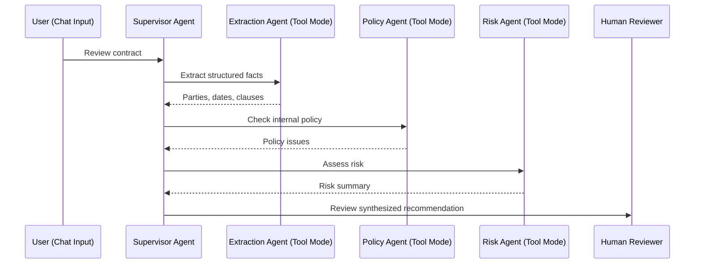

In Langflow, each specialist is an Agent component in Tool Mode connected to the supervisor's Tools port, and each can carry its own tools: a documents bundle for extraction, an internal policy source for the policy check, a calculator or finance lookup for risk. This architecture is valuable when each domain has its own tools, criteria, and risk boundaries. It also makes governance clearer. The policy agent can be evaluated against policy outcomes, the extraction agent against labeled documents, and the supervisor against routing and synthesis quality, each through its own Traces.

Anthropic's multi-agent research system provides a public example of this pattern in an information-work setting. A lead agent plans the research process, delegates to specialized subagents, synthesizes findings, decides whether more work is needed, and passes results to a citation agent. The design uses specialization, parallelism, memory, and final verification to solve a task that would strain one long-running agent. The same shape is reproducible on the canvas: a supervisor Agent, several workers in Tool Mode, session memory for continuity, and a final synthesis step before output.

The professional takeaway is that multi-agent enterprise workflows should be designed like distributed systems. Define ownership in instructions and tool names. Structure messages through clear tool descriptions. Trace handoffs through the Inspection Panel. Bound risky actions with Policies. Evaluate the workflow, not just the individual agents.

## Closing Recap

Multi-agent systems are coordination architectures. They earn their keep when specialization, parallelism, tool partitioning, context isolation, or governance boundaries make a single-agent design unwieldy. They turn into a liability when coordination is left implicit. In Langflow, that coordination is something you can see and connect: worker Agents in Tool Mode on a supervisor's Tools port, flows exposed across project boundaries as MCP servers, deterministic routing in flow structure, and shared context carried by sessions.

The core design choices are centralized versus decentralized control, predictable pipelines versus dynamic supervision, and deterministic conflict rules versus negotiated resolution. Scaling adds cost, latency, state, observability, and evaluation challenges, which is why termination conditions, budgets, Traces, session isolation, and coordination metrics matter as much as the agents themselves. The pattern repeats across robotics, simulation, research, and enterprise workflows: multiple agents only create system-level value when their coordination is explicit.

Chapter 4, "Ensuring Safe and Responsible Agentic AI", builds directly on this foundation. Once agents can collaborate and act through tools, guardrails, Policies, evaluations, monitoring, and red teaming become architectural requirements, not optional finishing touches.
