# Chapter 3. Multi-Agent Systems and Collaboration

A single incident agent can inspect logs, read deployment history, query metrics, check ownership, draft a summary, notify stakeholders, and propose a rollback. It can also become overloaded. The prompt grows. The tool list becomes crowded. The model confuses similar APIs. A security-sensitive action sits next to a harmless lookup. Debugging becomes a reconstruction exercise: why did one agent, carrying every responsibility, choose that path?

Multi-agent systems address this pressure by dividing work among agents with clearer roles.

The motivation is not novelty. A multi-agent architecture is useful when the work itself has multiple domains, conflicting constraints, parallel subtasks, or organizational boundaries. A research workflow may need a search agent, a synthesis agent, and a citation agent. A benefits workflow may need document extraction, policy checking, fraud review, and human escalation. A robot fleet may need local navigation agents plus a shared coordination layer.

The professional question is not "How many agents can we add?" It is "Which coordination structure reduces complexity without creating more than it removes?"

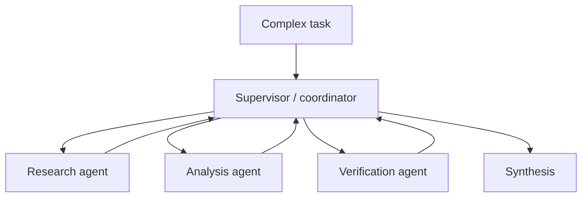

As introduced in Chapter 2, "Interaction with Other Systems", tools connect agents to operational capabilities. In a multi-agent system, other agents may themselves become tools, collaborators, or handoff targets. That shift gives us specialization and parallelism, but it also introduces coordination, conflict resolution, observability, and governance challenges.

## 3.1 What Are Multi-Agent Systems?

Definitions matter because "multi-agent" is often used for anything that calls a model more than once. That is not enough. A multi-agent system is a coordination architecture in which multiple agents interact within a shared task environment. The agents may cooperate, specialize, negotiate, compete for resources, or hand work to one another.

The important word is coordination. Without coordination, multiple agents become multiple failure sources. They may duplicate work, contradict each other, overwrite shared state, call tools in the wrong order, or create more latency than value. With coordination, a multi-agent system can solve tasks that would be brittle, expensive, or unmanageable for a single agent.

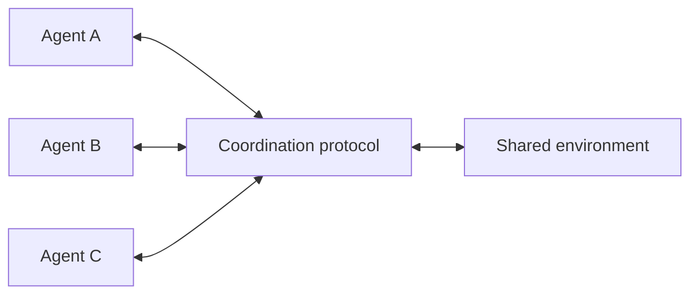

A useful professional definition is:

> A multi-agent system is a set of agents that coordinate decisions or actions within a shared environment to improve system-level performance.

The system-level phrase is essential. A single agent can optimize its own local task while harming the overall workflow. A research subagent may gather many sources but exceed the latency budget. A support subagent may answer quickly but skip compliance review. A robot may choose its shortest path but block a loading zone. Multi-agent design is the discipline of making local behavior serve the larger objective.

### 3.1.1 Multiple Agents, Multiple Goals

Multiple goals matter because specialization is both the benefit and the risk of multi-agent systems. Each agent may have a local objective, but the system has a broader objective. The architecture must align the two.

In a professional research system, one agent might optimize for breadth, another for factual verification, and another for concise synthesis. In an enterprise workflow, a sales agent may optimize for responsiveness, a compliance agent for policy adherence, and a finance agent for contractual accuracy. None of these goals is wrong. The challenge is that they can conflict.

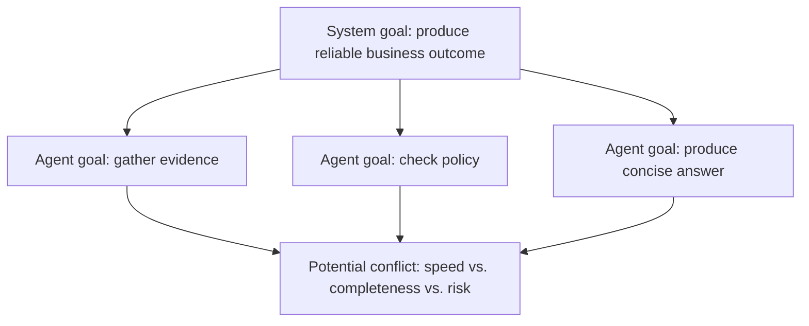

This is why agent prompts alone are not enough. If a verification agent and a synthesis agent disagree, the system needs a rule for what happens next. If two agents request the same scarce resource, the system needs allocation logic. If a worker agent produces low-confidence output, the supervisor must know whether to retry, escalate, or continue with a caveat.

The design principle is simple: local goals must be explicit, and system goals must have priority when trade-offs appear.

### 3.1.2 Communication Between Agents

Communication matters because agents cannot coordinate around information they cannot exchange. In human organizations, coordination happens through meetings, tickets, status updates, handoffs, and approvals. In multi-agent systems, the equivalent is structured messages, shared state, tool results, task descriptions, and control-flow transitions.

Agent communication can take several forms:

- A supervisor calls a subagent as a tool and receives a result.
- One agent writes to shared state that another agent reads.
- A workflow routes control from one agent node to another.
- Agents exchange proposals and counterproposals.
- A human reviewer injects a decision into the workflow.

The professional standard should be structured communication whenever the result matters. Natural language is useful, but it is not sufficient for every boundary. A handoff should include the task, relevant context, expected output format, constraints, and confidence or risk signals. Otherwise, the receiving agent must infer too much.

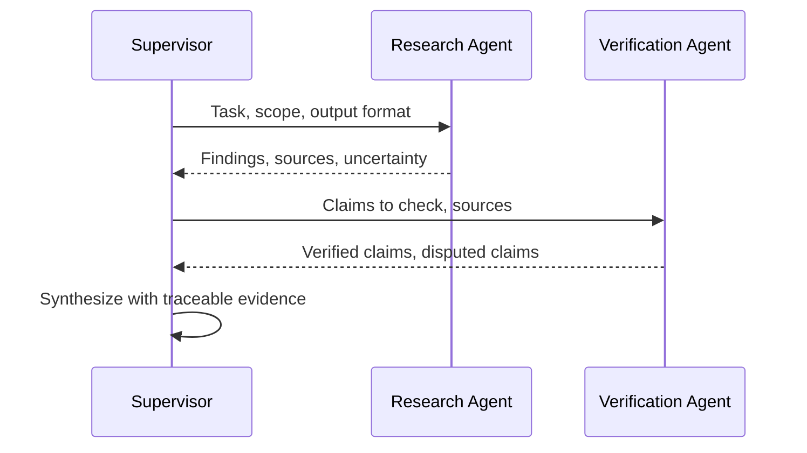

As introduced in Chapter 1, "Perception and Action", an agent's action space defines what it can do. In a multi-agent system, communication is part of the action space. Calling the right collaborator with the wrong context is still a poor action.

### 3.1.3 Coordination and Cooperation

Coordination and cooperation matter because multiple agents do not automatically become a team. Cooperation means agents contribute toward a shared goal. Coordination means their actions are organized so they do not interfere with one another.

A group can cooperate poorly. Three research agents may all search the same source. Two support agents may draft conflicting responses. A robot fleet may send two robots into a narrow aisle from opposite ends. Everyone may be "trying to help," yet the system performs worse than a single well-designed agent.

Coordination mechanisms include:

- Task assignment.
- Shared state.
- Priority rules.
- Locks or leases for scarce resources.
- Message schemas.
- Supervisor routing.
- Consensus or voting.
- Human arbitration for high-impact disagreement.

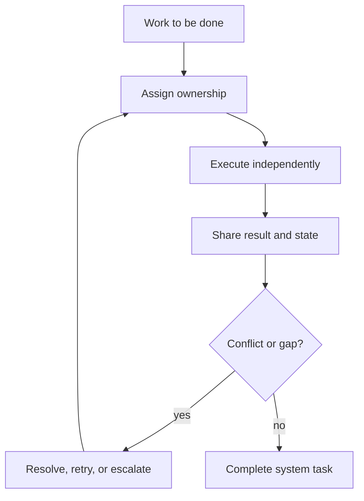

Professional teams should evaluate multi-agent systems at the coordination level, not only the agent level. A worker agent can perform well in isolation and still harm the system if its outputs arrive too late, lack provenance, or force the supervisor to spend extra turns reconciling ambiguity.

## 3.2 Designing Multi-Agent Architectures

Architecture matters because there is no single best multi-agent pattern. A supervisor pattern is not automatically better than a pipeline. A decentralized swarm is not automatically more intelligent. Each pattern encodes assumptions about control, trust, latency, visibility, and failure.

The design starts with the shape of the work:

- Is the next step predictable or dynamic?
- Are domains clearly separable?
- Must one component own final synthesis?
- Can tasks run in parallel?
- Are some actions higher risk than others?
- Does the system need direct agent-to-agent handoff?

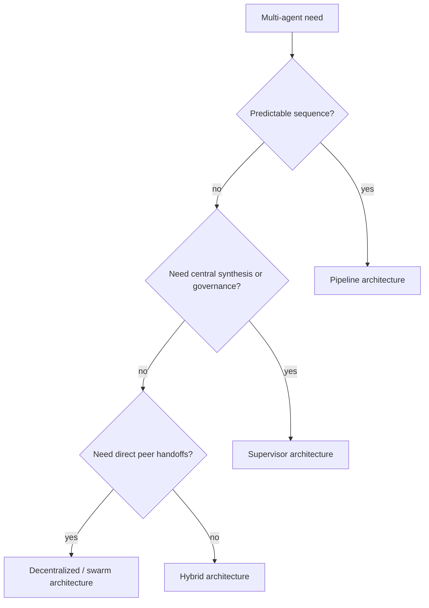

### 3.2.1 Centralized vs. Decentralized Control

Control structure matters because it determines who decides what happens next. Centralized systems route decisions through a coordinator. Decentralized systems allow agents to hand work directly to each other or make local decisions based on shared protocols.

In a centralized supervisor architecture, a main agent coordinates specialized agents. This fits professional workflows where one component must maintain context, enforce policy, and synthesize final output. LangChain's official subagents documentation describes this pattern directly: a central main agent coordinates subagents by calling them as tools. The subagents return results to the main agent rather than speaking directly to the user.

This snippet demonstrates the current LangChain 1.0 supervisor pattern by wrapping subagents as tools.

```python
from langchain.agents import create_agent
from langchain.tools import tool


research_agent = create_agent(
    model="openai:gpt-5.4-mini",
    tools=[],
    system_prompt="You gather concise operational facts and cite uncertainty.",
)

policy_agent = create_agent(
    model="openai:gpt-5.4-mini",
    tools=[],
    system_prompt="You check proposed actions against internal policy.",
)


@tool("research_incident", description="Gather facts about an incident question.")
def call_research_agent(query: str) -> str:
    result = research_agent.invoke(
        {"messages": [{"role": "user", "content": query}]}
    )
    # Return only the final subagent message to keep supervisor context focused.
    return result["messages"][-1].content


@tool("check_policy", description="Check whether a proposed action is allowed.")
def call_policy_agent(query: str) -> str:
    result = policy_agent.invoke(
        {"messages": [{"role": "user", "content": query}]}
    )
    # The supervisor receives a policy result, not the subagent's full trace.
    return result["messages"][-1].content


supervisor = create_agent(
    model="openai:gpt-5.4-mini",
    tools=[call_research_agent, call_policy_agent],
    system_prompt=(
        "You coordinate incident work. Use research_incident for facts, "
        "check_policy before recommending risky actions, and synthesize briefly."
    ),
)
```

The code illustrates three architectural layers. The worker agents own focused instructions. The wrapper tools define how the supervisor delegates. The supervisor sees high-level capabilities rather than every low-level tool. This reduces tool confusion and creates a clearer place to enforce workflow policy.

Decentralized architectures are different. In a swarm or peer-to-peer handoff system, agents can transfer control directly based on capability or state. This can fit support routing, distributed robotics, or environments where no single coordinator has enough local knowledge. The trade-off is governance. Decentralized systems require stronger protocols because there is no single supervisor naturally preserving context and accountability.

Pipeline architectures sit between these extremes. They use a fixed sequence: extract, validate, enrich, summarize. They are less flexible, but they are easier to test and often better for regulated document workflows.

The professional pattern is to choose the simplest control structure that matches the work. Centralize when governance and synthesis matter. Decentralize when local autonomy and direct handoff matter. Use pipelines when the process is predictable.

### 3.2.2 Conflict Resolution and Negotiation

Conflict resolution matters because agents can disagree even when each one behaves reasonably. One agent may prioritize speed while another prioritizes accuracy. Two agents may claim ownership of the same task. A planner may propose an action that a policy agent rejects. A robot may select a path that conflicts with another robot's path.

Conflict is not an exception in multi-agent systems. It is a design condition.

Common conflict types include:

- Resource conflict: two agents need the same tool, lock, file, time slot, or physical space.
- Goal conflict: local objectives pull in different directions.
- Evidence conflict: agents interpret sources differently.
- Action conflict: one action would invalidate another.
- Authority conflict: agents disagree on who may decide.

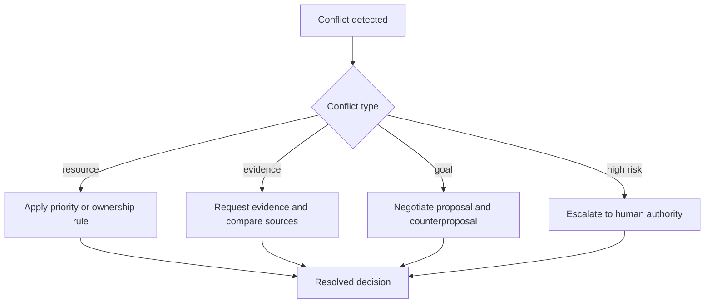

Resolution can be deterministic or deliberative. Deterministic mechanisms include priority rules, locks, ownership maps, and thresholds. Deliberative mechanisms include negotiation, voting, debate, or human arbitration. The higher the risk, the less the system should rely on unconstrained model conversation.

Negotiation is useful when agents have partial views or competing preferences. A scheduling agent might propose a meeting time, a travel agent might reject it because it conflicts with transit time, and a supervisor might choose the best compromise. In professional systems, negotiation should have a protocol: proposals must include constraints, confidence, alternatives, and escalation conditions.

As introduced in Chapter 4, "Defining Agent Boundaries", conflict resolution also has a safety dimension. If the policy agent rejects an action, the supervisor should not simply ask another agent until it gets a more convenient answer.

### 3.2.3 Scaling Multi-Agent Systems

Scaling matters because multi-agent architectures multiply both capability and overhead. Every additional agent can add model calls, tool calls, state transitions, latency, cost, and failure modes. A design that looks elegant in a diagram may be too slow or expensive in production.

The main scaling dimensions are:

- Task scale: more subtasks or more complex decomposition.
- Agent scale: more workers, specialists, or teams.
- Context scale: more documents, messages, memory, and traces.
- Tool scale: more external APIs and side effects.
- Operational scale: more users, sessions, tenants, and compliance boundaries.

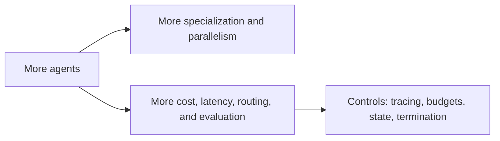

Scaling requires explicit controls.

First, set termination conditions. A supervisor needs to know when to stop delegating and produce the final result. Without a stop rule, multi-agent systems can loop through specialists indefinitely.

Second, budget the workflow. Multi-agent systems can expand token use and tool calls quickly. Use cost budgets, recursion limits, timeouts, and model routing so routine subtasks do not use premium resources unnecessarily.

Third, trace every handoff. A production trace should show which agent was called, with what input, which tools it used, what it returned, and how the supervisor used the result.

Fourth, isolate context. Subagents are valuable partly because each invocation can operate in a focused context window. Passing the entire conversation to every agent defeats that benefit.

Fifth, evaluate coordination. Measure routing accuracy, duplicate work, unresolved conflicts, latency, cost per task, human escalation rate, and final outcome quality.

Scaling multi-agent systems is therefore less about adding more agents and more about maintaining system coherence as complexity grows.

## 3.3 Real-World Multi-Agent Applications

Real applications matter because multi-agent systems are easiest to understand when the work is visibly distributed. Some environments are naturally multi-agent: robot fleets, traffic systems, supply chains, enterprise workflows, simulations, and research teams. The architecture mirrors the world it operates in.

The examples below show three different professional uses: physical coordination, simulated coordination, and enterprise workflow coordination.

### 3.3.1 Swarms and Distributed Robotics

Swarm and robotics examples matter because they make coordination concrete. If two robots choose the same narrow corridor, the conflict is physical. If a drone swarm loses communication, local decision-making matters. If a central scheduler has global insight but cannot compute fast enough, local refinement becomes valuable.

Large robotic systems often blend centralized and decentralized control. A central coordinator may allocate tasks globally, while individual robots adapt locally to battery state, obstacles, and nearby agents. Recent swarm scheduling research illustrates this hybrid pattern: global allocation can provide coherence, while distributed local refinement improves scalability and energy-aware execution.

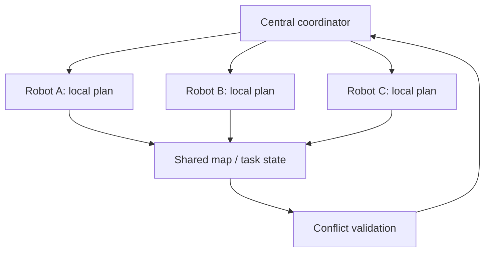

The software lesson is direct. Enterprise agents also need hybrid control. A supervisor may decide global task allocation, while worker agents apply local domain expertise. The supervisor should validate results before final action, especially when outputs interact.

### 3.3.2 Multi-Agent Simulations

Simulations matter because they let professionals study coordination before deploying it into expensive or risky environments. Multi-agent simulations model many agents interacting under rules: vehicles in traffic, traders in markets, users in a platform, robots in a warehouse, or departments in an enterprise process.

The value is not only prediction. Simulations expose emergent behavior. Individual agents may follow reasonable local rules, but the group can still create congestion, unfair allocation, oscillation, or instability. These are precisely the patterns multi-agent designers need to see before production.

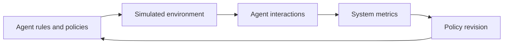

For AI professionals, simulations can support:

- Testing routing policies.
- Estimating cost and latency under load.
- Discovering deadlocks and loops.
- Comparing centralized and decentralized control.
- Evaluating escalation thresholds.
- Training or evaluating multi-agent reinforcement learning systems.

The important caveat is that simulation quality depends on assumptions. A simulation does not prove production safety, but it can reveal coordination failures that a single-agent test suite would miss.

### 3.3.3 Enterprise Workflows with Multiple Agents

Enterprise workflows matter because they are where many professionals will first encounter multi-agent systems. Work in large organizations is already divided by expertise: legal, finance, support, engineering, compliance, sales, operations. Multi-agent architectures can mirror those boundaries when a single agent would become too broad or too risky.

Consider a contract review workflow:

1. An extraction agent identifies parties, dates, obligations, and unusual clauses.
2. A policy agent checks internal requirements.
3. A risk agent flags legal and financial exposure.
4. A negotiation agent drafts proposed changes.
5. A supervisor synthesizes the result and asks for human review.

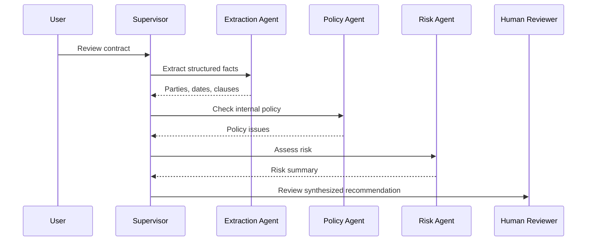

This architecture is valuable when each domain has its own tools, criteria, and risk boundaries. It also makes governance clearer. The policy agent can be evaluated against policy outcomes. The extraction agent can be evaluated against labeled documents. The supervisor can be evaluated against routing and synthesis quality.

Anthropic's multi-agent research system provides a public example of this pattern in an information-work setting. A lead agent plans the research process, delegates to specialized subagents, synthesizes findings, decides whether more work is needed, and passes results to a citation agent. The design uses specialization, parallelism, memory, and final verification to solve a task that would strain one long-running agent.

The professional takeaway is that multi-agent enterprise workflows should be designed like distributed systems. Define ownership. Structure messages. Trace handoffs. Bound actions. Evaluate the workflow, not just the individual agents.

## Closing Recap

Multi-agent systems are coordination architectures. They become useful when specialization, parallelism, tool partitioning, context isolation, or governance boundaries make a single-agent design unwieldy. They become dangerous when coordination is left implicit.

The core design choices are centralized versus decentralized control, predictable pipelines versus dynamic supervision, and deterministic conflict rules versus negotiated resolution. Scaling adds cost, latency, state, observability, and evaluation challenges. Real-world systems in robotics, simulation, research, and enterprise workflows show the same lesson: multiple agents require explicit coordination to create system-level value.

Chapter 4, "Ensuring Safe and Responsible Agentic AI", builds directly on this foundation. Once agents can collaborate and act through tools, guardrails, evaluations, monitoring, and red teaming become architectural requirements rather than optional finishing touches.
