# Chapter 4. Ensuring Safe and Responsible Agentic AI

An agent that summarizes a support ticket can be wrong and still be recoverable. An agent that emails a customer, updates an account, deletes records, or triggers a production rollback is a different kind of system. The moment an agent can act through tools, safety stops being a content-moderation feature and turns into a systems engineering problem.

The central challenge is agency itself. The same property that makes agents valuable, the ability to choose actions over time, also expands the failure surface. A model can misunderstand a goal. A tool can be called with the wrong arguments. A retrieved document can carry an indirect prompt injection. A subagent can pass along a false assumption. A human can approve an action without seeing the relevant context.

Safe and responsible agentic AI takes controls across the entire loop: what the agent may perceive, what state it may retain, what tools it may call, when it must ask for approval, how its behavior is evaluated, and how failures get caught before they become incidents. Working in a low-code platform does not remove that responsibility. It changes where the controls live: instead of hand-written middleware classes, the controls become Policies, Tool Mode boundaries, Credentials, and Traces that sit around a flow on the Langflow canvas.

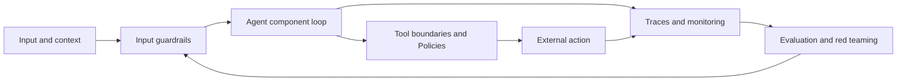

As introduced in Chapter 3, "Coordination and Cooperation", multiple agents require explicit coordination to create system-level value. Chapter 4 adds a second requirement: the system must remain bounded, observable, and accountable even when agents cooperate, fail, or encounter adversarial inputs.

## 4.1 Guardrails for Agentic AI

Prompts are not boundaries. The Agent Instructions field can express a policy, but it cannot reliably enforce permissions, validate tool arguments, prevent every leak, or guarantee that a model will stop at the right moment. Guardrails are the controls that sit around and inside the agent loop to reduce specific risks.

The phrase to underline is "specific risks." A guardrail does not make an agent safe in some absolute sense. It blocks, redirects, reviews, or records a particular class of behavior. Designing guardrails should start from a risk model: What can this agent do? What can go wrong? Which controls reduce the likelihood or the impact of that failure?

Guardrails generally come in two forms, and strong systems layer both. Deterministic guardrails are rules, schemas, and permission checks that behave the same way every time: a refund tool that rejects amounts above a threshold, a connection that simply never reaches a sensitive tool. Model-based guardrails use an LLM to judge something semantic, such as whether a response leaks confidential context or whether a request matches a prohibited intent. Determinism gives reliability; model judgment gives coverage of fuzzy cases.

Langflow gives this a low-code home through **Policies**. A Policy compiles natural-language business rules into deterministic guards around an agent's tools, so that a violation is caught *before* the action happens rather than discovered afterward in a log. Instead of writing a middleware class, a designer states the rule in plain language ("never issue a refund over $100 without approval," "do not send email to addresses outside the company domain") and Langflow turns it into an enforced check at the tool boundary. This is the central guardrail mechanism we lean on throughout this chapter.

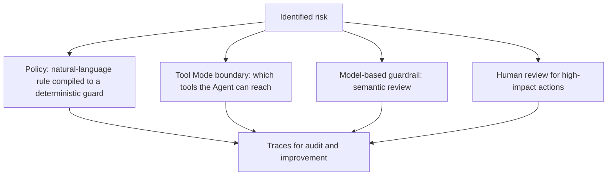

> Policies are an evolving Langflow capability. Treat the descriptions here at the capability level, and confirm exact configuration against current Langflow documentation before relying on a specific option.

### 4.1.1 Defining Agent Boundaries

Agentic systems fail most dangerously when they can do more than the task requires. The OWASP agentic guidance captures this with the idea of least agency: avoid unnecessary autonomy because every extra permission expands the attack surface. It is the agentic version of least privilege.

An agent boundary should answer five questions:

1. What data may the agent read?
2. What state may the agent retain?
3. What tools may the agent call?
4. What actions require human approval?
5. What conditions force the agent to stop or escalate?

In regulated workflows, those questions must be mapped to the governing framework. GDPR requires personal data to be processed lawfully, fairly, transparently, for specified purposes, with minimization, storage limitation, and appropriate security. India's Digital Personal Data Protection Act, 2023, often abbreviated as the DPDP Act or DPDPA, focuses on digital personal data processing, data fiduciary obligations, reasonable safeguards, breach notification, and erasure when the purpose no longer applies. HIPAA adds privacy and security obligations for protected health information, especially electronic protected health information. PCI DSS applies when an agent touches systems that store, process, or transmit payment account data. The agent design must therefore answer not only "Can this tool work?" but "Is this data, purpose, retention period, and action allowed under the applicable regime?"

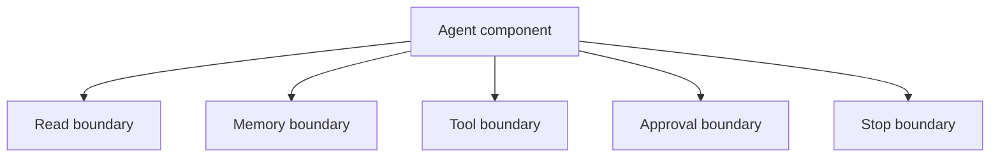

The decisive move in Langflow is that most of these boundaries are *design decisions on the canvas*, not sentences in a prompt. A boundary that exists only in Agent Instructions is advice; a boundary built into the flow is enforced. The table below maps each boundary question to the Langflow mechanism that enforces it.

| Boundary | Question it answers | Langflow mechanism |
| --- | --- | --- |
| Read | What data may the agent read? | Which components feed the Agent; scoped retrieval sources; Credentials for protected systems |
| Memory | What state may it retain? | Session memory keyed by `session_id`; "Number of Chat History Messages"; deliberate session scoping |
| Tools | What tools may it call? | Only the components placed in Tool Mode and wired to the Tools port; nothing else is reachable |
| Approval | What needs human sign-off? | A Policy that requires approval, plus a human review step before the side-effecting tool runs |
| Stop | When must it halt or escalate? | Policy violations that block the action; safe-failure routing instead of silent bypass |

Consider a customer-support agent. The wrong instinct is to tell the model, "Do not refund more than $100." The reliable design is to build the limit into the flow: the refund capability is exposed as a Tool Mode component, a Policy states the refund rule in natural language and compiles it into a deterministic guard, and any request above the threshold is interrupted for human review before the refund tool ever executes. The following diagram shows that wiring for a support flow.

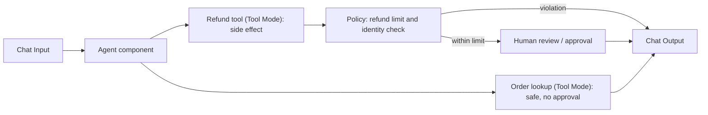

A few design choices in that flow carry most of the safety weight. The order-lookup capability is a read-only Tool Mode component, so it can run freely. The refund capability is a side-effecting tool, so it is governed: the Policy enforces the amount limit and any identity or entitlement check deterministically, and approval is required before execution. Crucially, the Agent can only reach the two tools wired to its Tools port; the tool boundary is the set of components the designer chose to connect, not whatever the model can name.

Two further boundaries belong in the same picture. Secrets such as API keys for the refund or email systems live in Langflow global variables and Credentials, referenced by name rather than pasted into a component, and the flow itself is reached only through an authenticated Langflow API key. Boundaries that handle regulated data deserve a Policy of their own: a rule that blocks a tool call when the requested purpose, retention, or data scope falls outside what GDPR, the DPDP Act, HIPAA, or PCI DSS allow.

The professional lesson is that boundaries should be visible in the architecture. If a reviewer opens the flow and cannot tell which tools are safe, which are governed by a Policy, and which require human approval, the agent is not ready for operational use.

### 4.1.2 Ethical Considerations in Decision-Making

Agentic systems do not only produce outputs; they mediate decisions. They prioritize cases, recommend actions, escalate users, classify risk, allocate attention, and automate communications. Those decisions reach customers, employees, patients, citizens, and business partners.

Responsible decision-making begins before deployment. It requires clarity about who is affected, what data is used, what errors are most harmful, and who can appeal or override the system. The question is not only "Can the agent complete the task?" but "Should the agent be allowed to make or recommend this decision under these conditions?"

Ethical agent design should include:

- Purpose limitation: the agent is used only for the intended workflow.
- Data minimization: the agent sees only the data required for the task.
- Fairness checks: outcomes are examined across affected groups where relevant.
- Transparency: users and operators know when an agent is involved.
- Contestability: humans can challenge or override decisions.
- Accountability: ownership is assigned for policy, operation, and incidents.

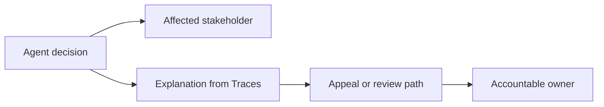

Several of these principles have direct Langflow expressions. Purpose limitation and data minimization show up as deliberate choices about which components feed the Agent and which Policies gate regulated data. Transparency and contestability depend on having a record to point to: Langflow Traces capture the inputs, tool calls, and decisions behind an outcome, which is what makes an explanation and an appeal path possible in the first place. Accountability is organizational, but the flow makes it tractable by keeping the decision boundary in one inspectable place.

Professional ethics also includes refusing attractive automation when the context is wrong. A hiring-screening agent, healthcare triage agent, or credit-risk agent requires deeper validation, domain oversight, bias evaluation, and regulatory review than an internal documentation assistant. The more consequential the decision, the more the system should favor assistance, evidence preparation, and human review over autonomous final action.

As introduced in Chapter 2, "Decision-Making Under Uncertainty", uncertainty can become a routing signal. In responsible systems, low confidence or high impact should trigger caution: gather more evidence, narrow the action, ask for human review, or decline to proceed.

### 4.1.3 Building Trustworthy Agents

Professional users do not trust an agent because it sounds fluent. They trust it when its behavior is bounded, inspectable, consistent, and correct enough for the risk level of the task. Trust here is earned through evidence, not language.

A trustworthy agent has several properties:

- It knows what it is allowed to do.
- It exposes why it acted.
- It cites or records important evidence.
- It fails safely when context is missing.
- It asks for approval before high-impact actions.
- It can be evaluated and monitored.
- It improves through controlled feedback loops.

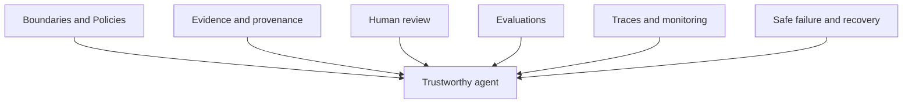

Trustworthiness also requires safe failure states. If a Policy check cannot be evaluated, the agent should not silently bypass the rule and act anyway. If a tool result conflicts with another source, the agent should not hide the conflict. If a human approval times out, the agent should not assume approval. Safe failure often means stopping with a clear reason and preserving session state for review. In Langflow, that means designing the flow so a blocked Policy or a missing approval routes to a clear stop, not to the side-effecting tool.

The architecture should make this normal. Agents should not be punished for asking for clarification, escalating, or refusing unsafe actions. In professional systems, the ability to stop correctly is a core capability.

Trustworthiness also depends on compliance evidence. A healthcare agent should be able to show how protected health information was accessed, minimized, safeguarded, and disclosed under HIPAA-aligned controls. A payment workflow should show that cardholder data was never exposed to a model unless explicitly allowed and protected under PCI DSS controls. A customer-data workflow should show GDPR or DPDP Act purpose, retention, erasure, and access decisions. The evidence does not have to live in the model; it lives in Traces, Policy decisions, tool logs, and approval records that an auditor can read after the fact.

## 4.2 Evaluating Agent Performance

Agent behavior cannot be inferred from a few impressive demos. Agents pick their paths at runtime. The same agent may succeed on one workflow, call the wrong tool on another, and loop unnecessarily on a third. Without evaluation, teams end up optimizing anecdotes.

Agent evaluation must cover both final outcomes and trajectories. The final answer may be correct even if the agent used an unsafe path. The final answer may be wrong because one early tool call retrieved stale data. A professional evaluation framework must therefore inspect what happened, not only what was returned. Langflow makes the trajectory visible in two complementary surfaces: the Playground shows an agent's tool calls, inputs, and raw outputs as a flow runs, and Traces record that detail for runs over time so they can be reviewed and scored.

A useful distinction, independent of any one tool, separates offline evaluation from online evaluation. Offline evaluation tests before release against curated example sets, so regressions are caught before users see them. Online evaluation watches real production interactions, so new failure modes are caught after deployment. Both feed the same loop: failing runs become new examples, and the example set grows to reflect reality.

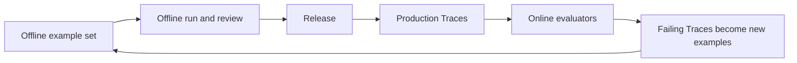

> Traces and the Inspection Panel are recent, evolving Langflow capabilities. Use them for trajectory inspection and as the source record for evaluation, and pair them with general evaluation practice rather than assuming a fixed built-in scoring framework.

### 4.2.1 Metrics for Agentic Systems

"Quality" is too vague to operate on. An agentic system has several dimensions of performance, and optimizing one can damage another. A faster agent may be less accurate. A more autonomous agent may shrink human workload but grow policy risk. A more cautious agent may be safer but less useful. Metrics are how the trade-offs get made visible.

Useful metrics include:

- Task success rate: Did the agent accomplish the intended task?
- Tool-call correctness: Did it call the right tools with valid arguments?
- Policy adherence: Did it stay within boundaries?
- Escalation quality: Did it ask for help when appropriate?
- Recovery rate: Did it recover from tool failures or contradictory evidence?
- Latency: How long did the workflow take?
- Cost: How many model calls, tokens, and tool calls were required?
- Human override rate: How often did reviewers reject or edit actions?
- Safety incident rate: How often did unsafe or noncompliant behavior occur?

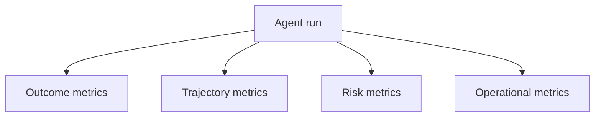

Professional teams should define metrics by workflow. A research agent needs source coverage, citation correctness, and claim verification. A support agent needs resolution accuracy, escalation appropriateness, customer tone, and policy compliance. An incident agent needs evidence quality, time to triage, false escalation rate, and safe action selection. Several of these map cleanly onto signals already present in Langflow Traces, such as which tools were called, how many model calls a run took, and whether a Policy blocked an action.

Metrics should also include negative capability: when should the agent not act? A low refusal rate may look productive but indicate unsafe overreach. A high escalation rate may indicate either caution or poor capability. Metrics need interpretation in context.

### 4.2.2 Continuous Monitoring and Feedback

Production inputs never match test inputs for long. Users phrase requests differently, documents change, tools fail, and adversaries adapt. A one-time evaluation cannot guarantee ongoing safety, which is what makes continuous monitoring a structural requirement.

Monitoring should capture the full picture of a run: user input, retrieved context, model calls, tool calls, tool arguments, tool outputs, Policy decisions, human approvals, final outputs, latency, cost, and errors. For agentic AI, this record is not a luxury. It is often the only complete account of what the agent did and why. In Langflow, that record is what Traces are for, with the Playground giving an immediate, interactive view of the same reasoning and tool calls during testing.

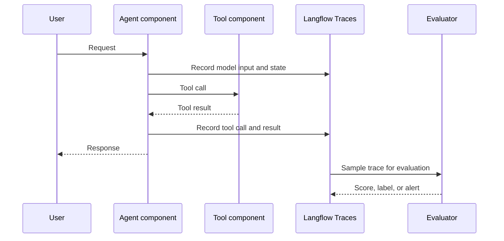

Feedback loops turn monitoring into improvement. A failed trace can become a regression example. A human correction can become an evaluation case. A repeated tool misuse can become a new Policy. A latency pattern can trigger a change to the flow's structure.

The important operational pattern is:

1. Observe production Traces.
2. Identify failure patterns.
3. Convert failures into example sets or Policies.
4. Test fixes offline.
5. Redeploy with monitoring.

This loop mirrors Chapter 2, "Self-Correction and Feedback Loops", but at the system level. The agent may correct itself during a run, while the organization corrects the agent system over time.

### 4.2.3 Evaluations in Production Systems

Real behavior only emerges under real load, real users, real data, and real tool failures. Production evaluation still has to be designed with care, though. Running every trace through an expensive LLM judge can be cost-prohibitive. Logging every byte without privacy controls can create new risk.

A practical production evaluation stack uses layers:

- Code evaluators for deterministic checks, such as JSON validity, required fields, Policy flags, and tool argument schemas.
- Heuristic evaluators for latency, cost, retry count, and loop length.
- LLM-as-judge evaluators for semantic quality, safety, groundedness, or tone.
- Human review for high-risk, ambiguous, or sampled traces.
- Pairwise evaluation when comparing two agent versions.
- A/B testing or shadow testing when comparing production behavior under controlled exposure.

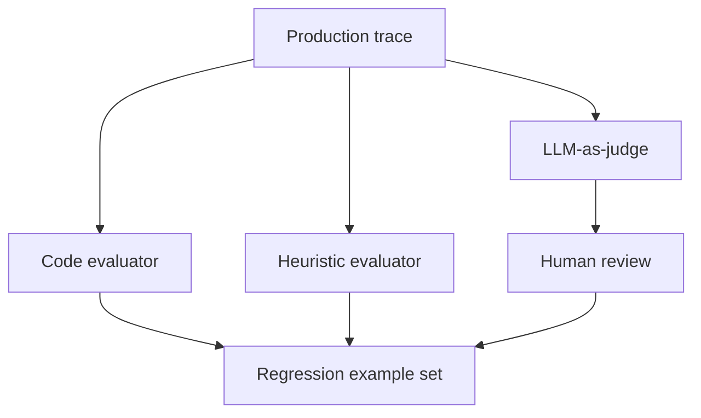

Sampling is a professional necessity. Teams can evaluate all high-risk actions, all rejected human approvals, all tool errors, and a percentage of routine successful runs. This balances cost with coverage, and Langflow Traces give a consistent place to draw those samples from.

Production evaluation should also compare versions. Pairwise evaluation is useful when humans or LLM judges can reliably choose which of two outputs is better. A/B testing is useful when the question is behavioral: does version B reduce handling time, increase safe completions, or lower escalation errors on live traffic? For high-risk or regulated workflows, run the comparison in offline replay or shadow mode before exposing users. In Langflow, two flow versions can be compared by running them against the same inputs and reading their Traces side by side. If a new prompt reduces latency but increases unsafe tool attempts, the system has regressed. If a new model improves answer quality but doubles cost and tool retries, the decision may depend on business context. Evaluation gives teams evidence instead of preference.

## 4.3 Red Teaming for Agentic AI

Ordinary tests assume the user wants the system to succeed. Adversarial tests assume someone will try to make it fail, leak data, misuse tools, bypass policy, poison memory, or exploit agent coordination. Agentic AI needs this mindset because agents connect language interfaces directly to actions.

Modern guidance from OWASP and NIST emphasizes that agentic systems introduce risks beyond model-only applications. Persistent memory can be manipulated. Tool permissions can be abused. Retrieved documents can carry indirect instructions. Multi-agent handoffs can amplify false assumptions. Autonomous planning can create recursive loops or unsafe side effects.

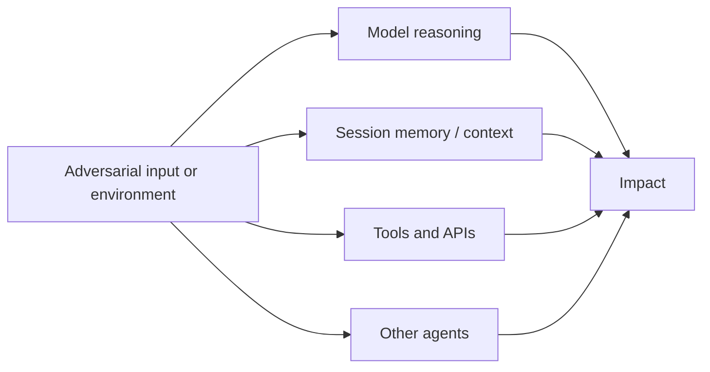

### 4.3.1 What is Red Teaming?

Red teaming replaces vague concern with structured evidence. In agentic AI, it is a disciplined attempt to discover how an agent system can be made to violate its intended boundaries, fail its task, or produce harmful outcomes.

This is broader than prompt injection testing. A professional red team examines the whole system:

- The model and instructions.
- Tool schemas and Tool Mode permissions.
- Retrieval and session memory.
- Human approval flows.
- Multi-agent handoffs.
- Traces and audit records.
- Failure recovery.
- Deployment and identity boundaries.

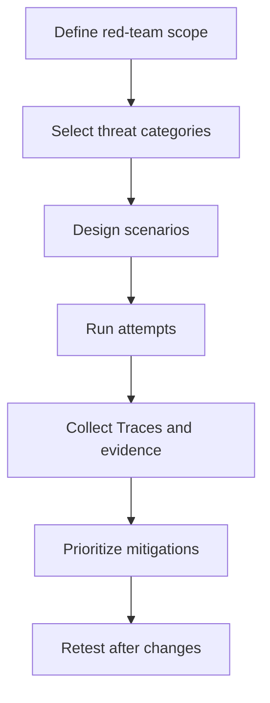

NIST's adversarial machine learning taxonomy is useful because it provides shared language for attacks, lifecycle stages, attacker goals, capabilities, and mitigations. OWASP's agentic guidance makes the agent-specific point: excessive agency, weak observability, unsafe memory, and tool misuse are core risks, not edge cases.

The professional outcome of red teaming is not a list of clever prompts. It is a prioritized set of system changes: narrower tool boundaries, stronger validation, better Traces, new evaluation cases, safer memory policies, improved human review, and clearer stop conditions.

### 4.3.2 Simulating Failures and Edge Cases

Many agent failures are rare until they become expensive. A production database deletion, a leaked customer record, or a cascading multi-agent error should not first surface live in production.

Useful red-team scenarios include:

- Direct prompt injection: the user instructs the agent to ignore policy.
- Indirect prompt injection: a retrieved document contains instructions targeting the agent.
- Tool misuse: the agent calls a sensitive tool for a harmless request.
- Excessive agency: the agent takes action when it should recommend or ask.
- Memory poisoning: false or malicious state persists into later runs.
- Data leakage: private information appears in a response, log, or tool call.
- Multi-agent amplification: one agent's false claim is trusted by another.
- Approval bypass: the agent reframes a sensitive action as a safe one.
- Looping and budget exhaustion: the agent repeats work without progress.
- Compliance bypass: the agent processes GDPR, DPDP Act, HIPAA, or PCI DSS scoped data outside approved purpose, retention, access, or masking rules.

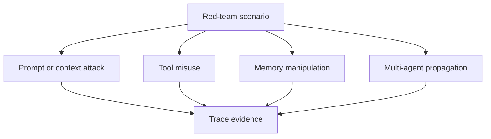

The simulation should capture traces and expected outcomes. For example, an indirect prompt injection test should specify the malicious document, the tool the agent must not call, the expected refusal or escalation behavior, and the Trace signal that proves the control worked. When the control under test is a Policy, the test becomes concrete: feed the flow an input designed to trigger the guarded tool, then confirm in the Playground and Traces that the Policy blocked the action rather than allowing it.

Professionals should also test edge cases that are not adversarial: missing tool results, partial outages, slow approvals, duplicate interrupts, conflicting retrieved sources, malformed user input, and stale memory. Reliability and security meet at the same point: the agent must behave safely when the environment is not clean.

OWASP and NIST should shape the scenario library. OWASP's agentic guidance is useful for excessive agency, tool misuse, memory manipulation, and orchestration failures. NIST's adversarial machine learning taxonomy is useful for naming attacker goals, capabilities, lifecycle stages, and mitigation categories. A red-team plan that maps scenarios to these frameworks is easier to audit, repeat, and improve than a list of one-off jailbreak prompts.

### 4.3.3 Strengthening Agentic AI through Red Teaming

Red teaming only earns its keep when it changes the system. A report that never becomes controls, tests, and operational practice is theater. The whole point is to strengthen the agentic system over time.

The improvement loop is:

1. Run scenario.
2. Capture Trace.
3. Identify control failure.
4. Prioritize by impact and likelihood.
5. Implement mitigation.
6. Add regression evaluation.
7. Retest.
8. Monitor production for related patterns.

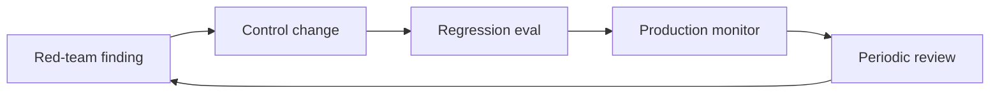

Mitigations in a Langflow system may include tightening the tool boundary so the Agent reaches fewer Tool Mode or MCP tools, adding or sharpening a Policy, requiring human approval before a side effect, cleaning session memory, filtering retrieval, isolating subagents, moving secrets into Credentials, and adding clearer stop conditions. The right mitigation depends on the failure mode. A prompt injection failure may require retrieval sanitization and a tighter tool boundary. A policy bypass may require a deterministic Policy rather than a longer instruction. A multi-agent propagation failure may require provenance and disagreement handling. The blog example of guarded tools is instructive here: the durable fix for an unsafe tool call is to compile the rule into a Policy so the guard runs every time, not to hope a better prompt holds.

As introduced in Chapter 6, "Governance and Compliance Considerations", red teaming also supports organizational governance. It creates evidence that leaders, auditors, risk teams, and engineering teams can discuss together. Responsible agentic AI is not a single feature; it is a lifecycle.

## Closing Recap

Safe and responsible agentic AI is built through layered controls: boundaries, Policies, human approval, evaluation, monitoring, and red teaming. The more an agent can act, the more explicit each of those layers has to be. In Langflow, those layers are mostly design decisions on the canvas: which tools the Agent can reach, which Policies guard them, which secrets live in Credentials, and what the Traces record.

The bar is evidence. Define what the agent may do, trace what it actually does, evaluate both outcomes and trajectories, monitor production behavior, and red-team the system against realistic failures. Policies and tool boundaries reduce specific risks. They do not remove the need for design judgment, governance, or ongoing testing.

Chapter 5, "Transitioning from Traditional Engineering to Agentic AI", shifts from safety architecture to engineering practice. We look at how teams can move from deterministic "if-else" thinking to goal-driven systems while keeping the discipline that makes software reliable in the first place.
