# Chapter 4. Ensuring Safe and Responsible Agentic AI

An agent that summarizes a support ticket can be wrong and still be recoverable. An agent that emails a customer, updates an account, deletes records, or triggers a production rollback is different. The moment an agent can act through tools, safety stops being a content-moderation feature and becomes a systems engineering problem.

The central challenge is agency. The same property that makes agents valuable, the ability to choose actions over time, also expands the failure surface. A model can misunderstand a goal. A tool can be called with the wrong arguments. A retrieved document can contain an indirect prompt injection. A subagent can pass along a false assumption. A human can approve an action without seeing the relevant context.

Safe and responsible agentic AI requires controls across the entire loop: what the agent may perceive, what state it may retain, what tools it may call, when it must ask for approval, how its behavior is evaluated, and how failures are discovered before they become incidents.

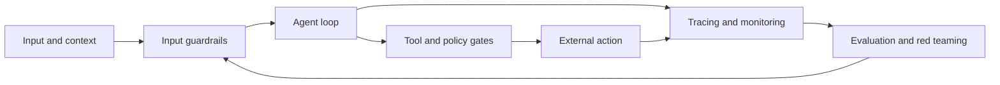

As introduced in Chapter 3, "Coordination and Cooperation", multiple agents require explicit coordination to create system-level value. Chapter 4 adds a second requirement: the system must remain bounded, observable, and accountable even when agents cooperate, fail, or encounter adversarial inputs.

## 4.1 Guardrails for Agentic AI

Guardrails matter because prompts are not boundaries. A system prompt can express a policy, but it cannot reliably enforce permissions, validate tool arguments, prevent every leak, or guarantee that a model will stop at the right moment. Guardrails are the controls that sit around and inside the agent loop to reduce specific risks.

The important phrase is "specific risks." A guardrail does not make an agent safe in an absolute sense. It blocks, redirects, reviews, or records particular classes of behavior. Professionals should therefore design guardrails from a risk model: What can this agent do? What can go wrong? Which controls reduce the likelihood or impact of that failure?

LangChain's current documentation describes guardrails as safety checks and content filtering at key points in an agent's execution. They can be deterministic, such as regex checks and policy rules, or model-based, such as an LLM judging whether a response violates a policy. The best systems usually layer both.

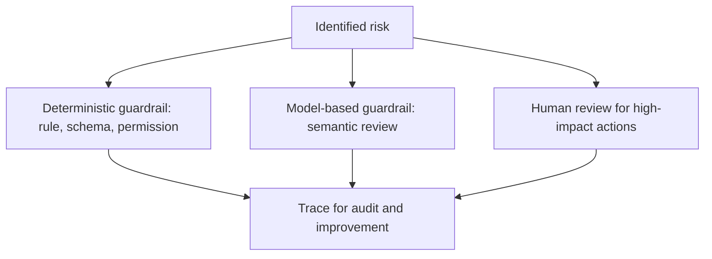

### 4.1.1 Defining Agent Boundaries

Boundaries matter because agentic systems fail most dangerously when they can do more than the task requires. The OWASP agentic guidance uses the idea of least agency: avoid unnecessary autonomy because every extra permission expands the attack surface. This is the agentic version of least privilege.

An agent boundary should answer five questions:

1. What data may the agent read?
2. What state may the agent retain?
3. What tools may the agent call?
4. What actions require human approval?
5. What conditions force the agent to stop or escalate?

In regulated workflows, those questions must be mapped to the governing framework. GDPR requires personal data to be processed lawfully, fairly, transparently, for specified purposes, with minimization, storage limitation, and appropriate security. India's Digital Personal Data Protection Act, 2023, often abbreviated as the DPDP Act or DPDPA, focuses on digital personal data processing, data fiduciary obligations, reasonable safeguards, breach notification, and erasure when the purpose no longer applies. HIPAA adds privacy and security obligations for protected health information, especially electronic protected health information. PCI DSS applies when an agent touches systems that store, process, or transmit payment account data. The agent design must therefore answer not only "Can this tool work?" but "Is this data, purpose, retention period, and action allowed under the applicable regime?"

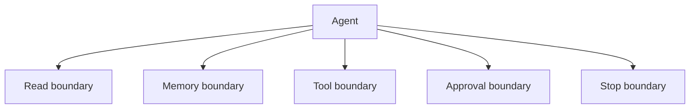

Boundaries should be implemented in code and infrastructure, not only in model instructions. For example, a customer-support agent should not merely be told, "Do not refund more than $100." The refund tool should enforce limits, require identity and entitlement checks, and interrupt for approval when the requested action exceeds policy.

LangChain 1.0 provides built-in middleware for common boundaries such as PII handling and human-in-the-loop approval. The following snippet demonstrates layered guardrails around sensitive communication.

```python
from langchain.agents import create_agent
from langchain.agents.middleware import HumanInTheLoopMiddleware, PIIMiddleware
from langchain.tools import tool
from langgraph.checkpoint.memory import InMemorySaver


@tool
def lookup_order(order_id: str) -> str:
    """Look up non-sensitive order status."""
    # Safe lookup tools can run without human review.
    return f"Order {order_id} is delayed and expected tomorrow."


@tool
def send_customer_email(recipient: str, body: str) -> str:
    """Send an email to a customer."""
    # External communication is a side effect, so it needs approval.
    return f"Queued email to {recipient}: {body}"


agent = create_agent(
    model="openai:gpt-5.4-mini",
    tools=[lookup_order, send_customer_email],
    middleware=[
        PIIMiddleware("email", strategy="redact", apply_to_input=True),
        HumanInTheLoopMiddleware(
            interrupt_on={
                "lookup_order": False,
                "send_customer_email": {
                    "allowed_decisions": ["approve", "edit", "reject"]
                },
            }
        ),
    ],
    # Use a durable checkpointer in production; this is for illustration.
    checkpointer=InMemorySaver(),
)
```

The `PIIMiddleware` prevents raw email addresses in user input from being sent directly to the model. The `HumanInTheLoopMiddleware` lets the order lookup proceed while pausing before external communication. The checkpointer is required because human review pauses execution and resumes later using the same thread state.

The professional lesson is that boundaries should be visible in the architecture. If a reviewer cannot tell which actions are safe, which are sensitive, and which are impossible, the agent is not ready for operational use.

### 4.1.2 Ethical Considerations in Decision-Making

Ethics matters because agentic systems do not only produce outputs; they mediate decisions. They may prioritize cases, recommend actions, escalate users, classify risk, allocate attention, or automate communications. These decisions can affect customers, employees, patients, citizens, and business partners.

Responsible decision-making begins before deployment. It requires clarity about who is affected, what data is used, what errors are most harmful, and who can appeal or override the system. The question is not only "Can the agent complete the task?" but "Should the agent be allowed to make or recommend this decision under these conditions?"

Ethical agent design should include:

- Purpose limitation: the agent is used only for the intended workflow.
- Data minimization: the agent sees only the data required for the task.
- Fairness checks: outcomes are examined across affected groups where relevant.
- Transparency: users and operators know when an agent is involved.
- Contestability: humans can challenge or override decisions.
- Accountability: ownership is assigned for policy, operation, and incidents.


Professional ethics also includes refusing attractive automation when the context is wrong. A hiring-screening agent, healthcare triage agent, or credit-risk agent requires deeper validation, domain oversight, bias evaluation, and regulatory review than an internal documentation assistant. The more consequential the decision, the more the system should favor assistance, evidence preparation, and human review over autonomous final action.

As introduced in Chapter 2, "Decision-Making Under Uncertainty", uncertainty can become a routing signal. In responsible systems, low confidence or high impact should trigger caution: gather more evidence, narrow the action, ask for human review, or decline to proceed.

### 4.1.3 Building Trustworthy Agents

Trust matters because professional users do not trust an agent because it sounds fluent. They trust it when its behavior is bounded, inspectable, consistent, and correct enough for the risk level of the task. Trust is earned through evidence.

A trustworthy agent has several properties:

- It knows what it is allowed to do.
- It exposes why it acted.
- It cites or records important evidence.
- It fails safely when context is missing.
- It asks for approval before high-impact actions.
- It can be evaluated and monitored.
- It improves through controlled feedback loops.

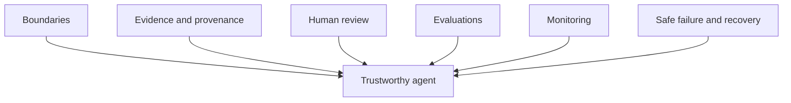

Trustworthiness also requires safe failure states. If a policy service is unavailable, the agent should not silently bypass policy. If a tool result conflicts with another source, the agent should not hide the conflict. If a human approval times out, the agent should not assume approval. Safe failure often means stopping with a clear reason and preserving state for review.

The architecture should make this normal. Agents should not be punished for asking for clarification, escalating, or refusing unsafe actions. In professional systems, the ability to stop correctly is a core capability.

Trustworthiness also depends on compliance evidence. A healthcare agent should be able to show how protected health information was accessed, minimized, safeguarded, and disclosed under HIPAA-aligned controls. A payment workflow should show that cardholder data was never exposed to a model unless explicitly allowed and protected under PCI DSS controls. A customer-data workflow should show GDPR or DPDP Act purpose, retention, erasure, and access decisions. The evidence does not have to live in the model; it should live in traces, policy decisions, tool logs, and approval records.

## 4.2 Evaluating Agent Performance

Evaluation matters because agent behavior cannot be inferred from a few impressive demos. Agents choose paths at runtime. The same agent may succeed on one workflow, call the wrong tool on another, and loop unnecessarily on a third. Without evaluation, teams optimize anecdotes.

Agent evaluation must cover both final outcomes and trajectories. The final answer may be correct even if the agent used an unsafe path. The final answer may be wrong because one early tool call retrieved stale data. A professional evaluation framework must therefore inspect what happened, not only what was returned.

LangSmith's current evaluation guidance distinguishes offline evaluation, which tests before release on curated datasets, from online evaluation, which monitors real production interactions. This distinction maps well to agent development: use offline evals to catch regressions before deployment and online evals to detect new failure modes after deployment.

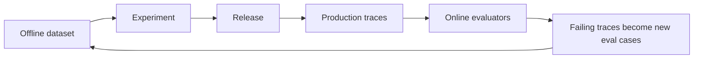

### 4.2.1 Metrics for Agentic Systems

Metrics matter because "quality" is too vague to operate. An agentic system has several dimensions of performance, and optimizing one can damage another. A faster agent may be less accurate. A more autonomous agent may reduce human workload but increase policy risk. A more cautious agent may be safer but less useful.

Useful metrics include:

- Task success rate: Did the agent accomplish the intended task?
- Tool-call correctness: Did it call the right tools with valid arguments?
- Policy adherence: Did it stay within boundaries?
- Escalation quality: Did it ask for help when appropriate?
- Recovery rate: Did it recover from tool failures or contradictory evidence?
- Latency: How long did the workflow take?
- Cost: How many model calls, tokens, and tool calls were required?
- Human override rate: How often did reviewers reject or edit actions?
- Safety incident rate: How often did unsafe or noncompliant behavior occur?

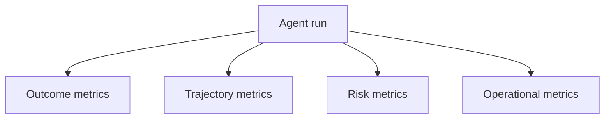

Professional teams should define metrics by workflow. A research agent needs source coverage, citation correctness, and claim verification. A support agent needs resolution accuracy, escalation appropriateness, customer tone, and policy compliance. An incident agent needs evidence quality, time to triage, false escalation rate, and safe action selection.

Metrics should also include negative capability: when should the agent not act? A low refusal rate may look productive but indicate unsafe overreach. A high escalation rate may indicate either caution or poor capability. Metrics need interpretation in context.

### 4.2.2 Continuous Monitoring and Feedback

Continuous monitoring matters because production inputs differ from test inputs. Users phrase requests differently, documents change, tools fail, and adversaries adapt. A one-time evaluation cannot guarantee ongoing safety.

Monitoring should capture traces: user input, retrieved context, model calls, tool calls, tool arguments, tool outputs, interrupts, human decisions, final outputs, latency, cost, and errors. For agentic AI, traces are not a luxury. They are often the only complete record of what the agent did and why.

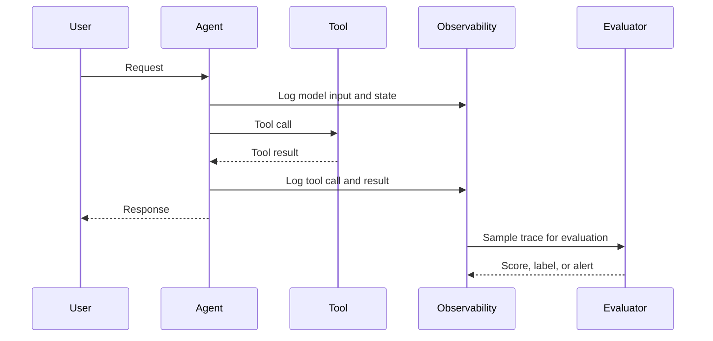

Feedback loops turn monitoring into improvement. A failed trace can become a regression test. A human correction can become an evaluation example. A repeated tool misuse can become a guardrail. A latency pattern can trigger architecture changes.

The important operational pattern is:

1. Observe production traces.
2. Identify failure patterns.
3. Convert failures into datasets or rules.
4. Test fixes offline.
5. Redeploy with monitoring.

This loop mirrors Chapter 2, "Self-Correction and Feedback Loops", but at the system level. The agent may correct itself during a run, while the organization corrects the agent system over time.

### 4.2.3 Evaluations in Production Systems

Production evaluations matter because real behavior emerges under real load, real users, real data, and real tool failures. However, production evaluation must be designed carefully. Evaluating everything with expensive LLM judges can be cost-prohibitive. Logging everything without privacy controls can create new risk.

A practical production evaluation stack uses layers:

- Code evaluators for deterministic checks, such as JSON validity, required fields, policy flags, and tool argument schemas.
- Heuristic evaluators for latency, cost, retry count, and loop length.
- LLM-as-judge evaluators for semantic quality, safety, groundedness, or tone.
- Human review for high-risk, ambiguous, or sampled traces.
- Pairwise evaluation when comparing two agent versions.
- A/B testing or shadow testing when comparing production behavior under controlled exposure.

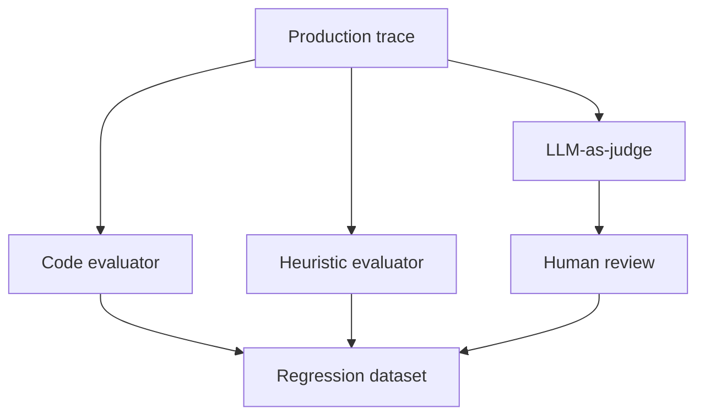

Sampling is a professional necessity. Teams can evaluate all high-risk actions, all rejected human approvals, all tool errors, and a percentage of routine successful runs. This balances cost with coverage.

Production evaluation should also compare versions. Pairwise evaluation is useful when humans or LLM judges can reliably choose which of two outputs is better. A/B testing is useful when the question is behavioral: does version B reduce handling time, increase safe completions, or lower escalation errors on live traffic? For high-risk or regulated workflows, run the comparison in offline replay or shadow mode before exposing users. If a new prompt reduces latency but increases unsafe tool attempts, the system has regressed. If a new model improves answer quality but doubles cost and tool retries, the decision may depend on business context. Evaluation gives teams evidence instead of preference.

## 4.3 Red Teaming for Agentic AI

Red teaming matters because ordinary tests assume the user wants the system to succeed. Adversarial tests assume someone will try to make the system fail, leak data, misuse tools, bypass policy, poison memory, or exploit agent coordination. Agentic AI needs this mindset because agents connect language interfaces to actions.

Modern guidance from OWASP and NIST emphasizes that agentic systems introduce risks beyond model-only applications. Persistent memory can be manipulated. Tool permissions can be abused. Retrieved documents can carry indirect instructions. Multi-agent handoffs can amplify false assumptions. Autonomous planning can create recursive loops or unsafe side effects.

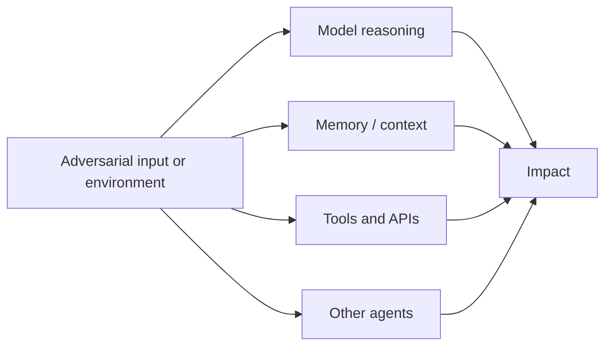

### 4.3.1 What is Red Teaming?

Red teaming matters because it replaces vague concern with structured evidence. In agentic AI, red teaming is a disciplined attempt to discover how an agent system can be made to violate its intended boundaries, fail its task, or produce harmful outcomes.

This is broader than prompt injection testing. A professional red team examines the whole system:

- The model and prompts.
- Tool schemas and permissions.
- Retrieval and memory.
- Human approval flows.
- Multi-agent handoffs.
- Monitoring and audit logs.
- Failure recovery.
- Deployment and identity boundaries.

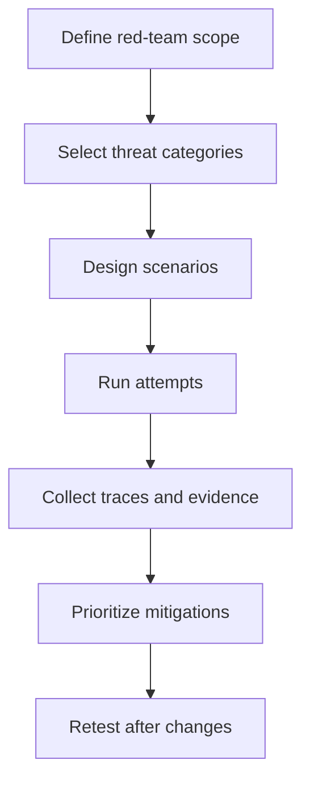

NIST's adversarial machine learning taxonomy is useful because it provides shared language for attacks, lifecycle stages, attacker goals, capabilities, and mitigations. OWASP's agentic guidance makes the agent-specific point: excessive agency, weak observability, unsafe memory, and tool misuse are core risks, not edge cases.

The professional outcome of red teaming is not a list of clever prompts. It is a prioritized set of system changes: narrower permissions, stronger validation, better logging, new eval cases, safer memory policies, improved human review, and clearer stop conditions.

### 4.3.2 Simulating Failures and Edge Cases

Simulation matters because many agent failures are rare until they are expensive. A production database deletion, a leaked customer record, or a cascading multi-agent error should not be discovered for the first time in production.

Useful red-team scenarios include:

- Direct prompt injection: the user instructs the agent to ignore policy.
- Indirect prompt injection: a retrieved document contains instructions targeting the agent.
- Tool misuse: the agent calls a sensitive tool for a harmless request.
- Excessive agency: the agent takes action when it should recommend or ask.
- Memory poisoning: false or malicious state persists into later runs.
- Data leakage: private information appears in a response, log, or tool call.
- Multi-agent amplification: one agent's false claim is trusted by another.
- Approval bypass: the agent reframes a sensitive action as a safe one.
- Looping and budget exhaustion: the agent repeats work without progress.
- Compliance bypass: the agent processes GDPR, DPDP Act, HIPAA, or PCI DSS scoped data outside approved purpose, retention, access, or masking rules.

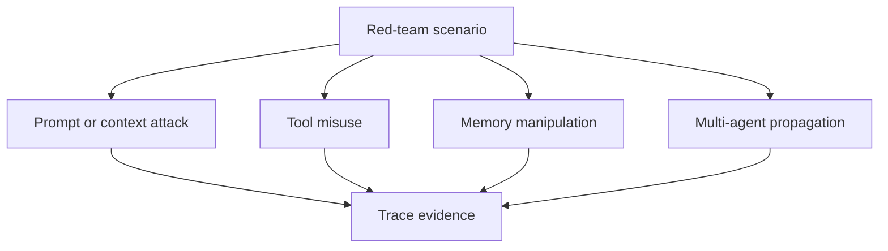

The simulation should capture traces and expected outcomes. For example, an indirect prompt injection test should specify the malicious document, the tool the agent must not call, the expected refusal or escalation behavior, and the monitoring signal that proves the control worked.

Professionals should also test edge cases that are not adversarial: missing tool results, partial outages, slow approvals, duplicate interrupts, conflicting retrieved sources, malformed user input, and stale memory. Reliability and security meet at the same point: the agent must behave safely when the environment is not clean.

OWASP and NIST should shape the scenario library. OWASP's agentic guidance is useful for excessive agency, tool misuse, memory manipulation, and orchestration failures. NIST's adversarial machine learning taxonomy is useful for naming attacker goals, capabilities, lifecycle stages, and mitigation categories. A red-team plan that maps scenarios to these frameworks is easier to audit, repeat, and improve than a list of one-off jailbreak prompts.

### 4.3.3 Strengthening Agentic AI through Red Teaming

Red teaming matters only if it changes the system. A report that does not become controls, tests, and operational practice is theater. The purpose is to strengthen the agentic system over time.

The improvement loop is:

1. Run scenario.
2. Capture trace.
3. Identify control failure.
4. Prioritize by impact and likelihood.
5. Implement mitigation.
6. Add regression evaluation.
7. Retest.
8. Monitor production for related patterns.

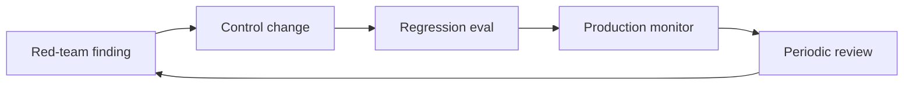

Mitigations may include narrower tool permissions, better schemas, policy gates, PII middleware, human-in-the-loop approval, state cleanup, retrieval filtering, subagent isolation, stronger tracing, and new stop conditions. The right mitigation depends on the failure mode. A prompt injection failure may require retrieval sanitization and tool gating. A policy bypass may require deterministic authorization, not a longer prompt. A multi-agent propagation failure may require provenance and disagreement handling.

As introduced in Chapter 6, "Governance and Compliance Considerations", red teaming also supports organizational governance. It creates evidence that leaders, auditors, risk teams, and engineering teams can discuss together. Responsible agentic AI is not a single feature; it is a lifecycle.

## Closing Recap

Safe and responsible agentic AI is built through layered controls: boundaries, guardrails, human approval, evaluation, monitoring, and red teaming. The more an agent can act, the more explicit those controls must become.

The professional standard is evidence. Define what the agent may do, trace what it actually does, evaluate both outcomes and trajectories, monitor production behavior, and red-team the system against realistic failures. Guardrails reduce specific risks; they do not eliminate the need for design judgment, governance, or ongoing testing.

Chapter 5, "Transitioning from Traditional Engineering to Agentic AI", moves from safety architecture to engineering practice. We will examine how professionals can shift from deterministic "if-else" thinking to goal-driven systems while preserving the discipline that makes software reliable.
