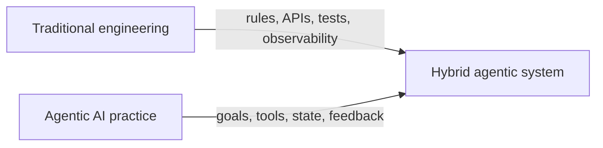
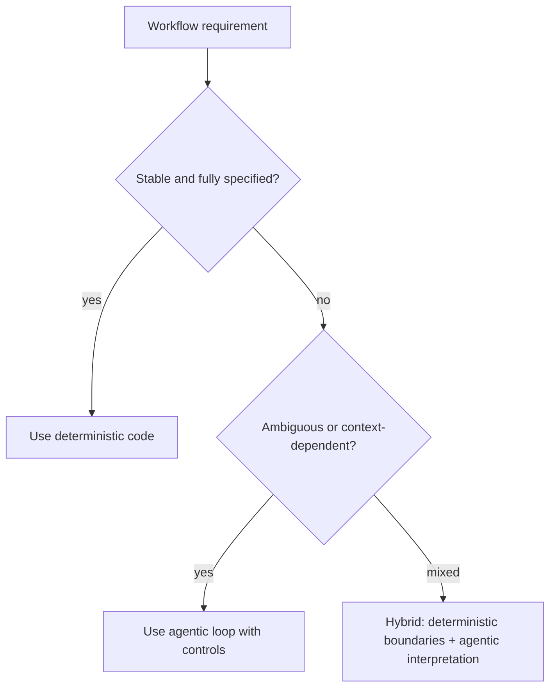
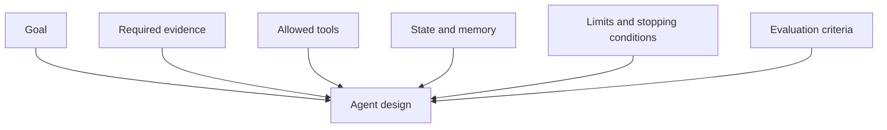
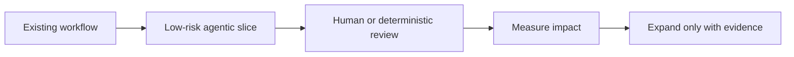
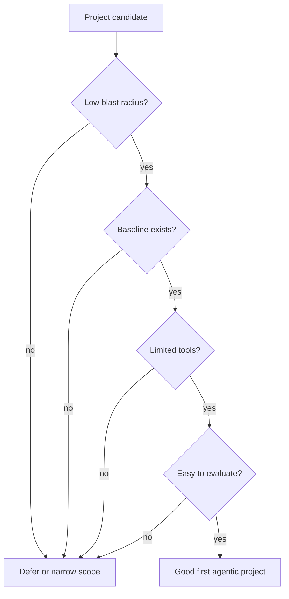
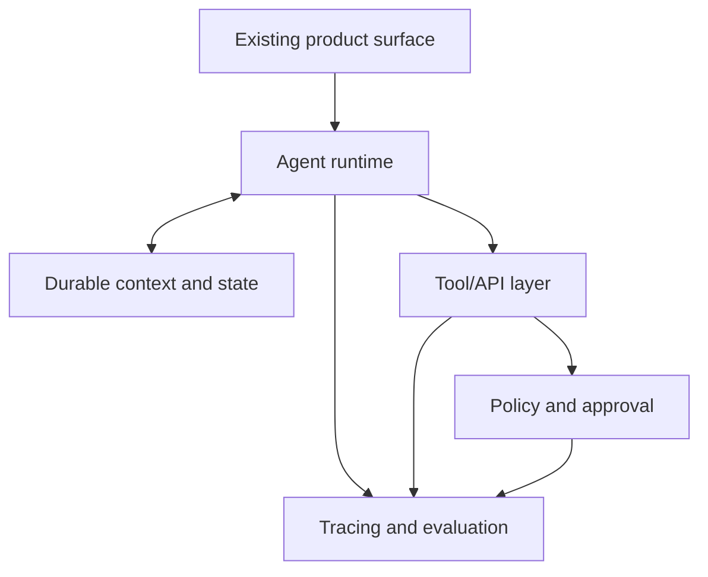
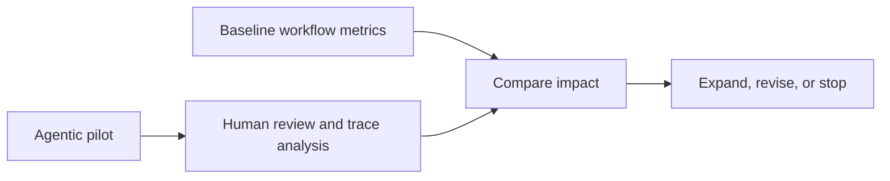
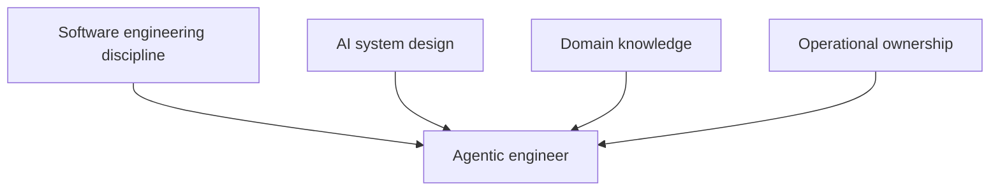
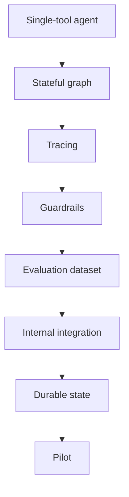
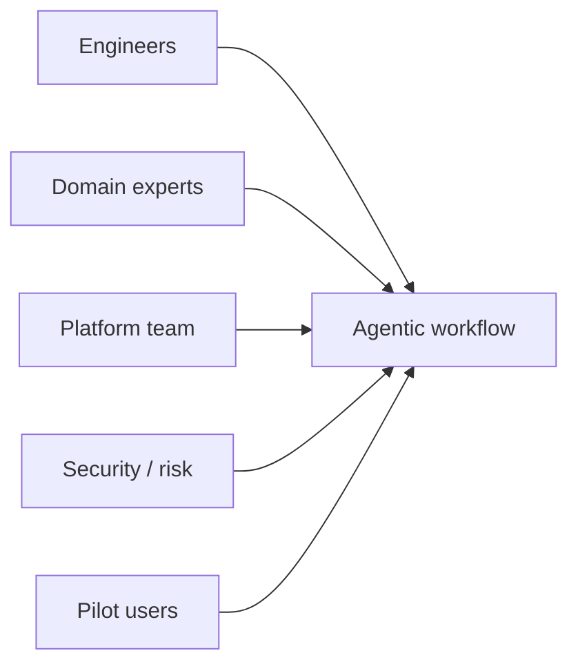

# Chapter 5. Transitioning from Traditional Engineering to Agentic AI

A mature support system may contain hundreds of rules: if the customer mentions billing, route to finance; if the account is enterprise, escalate; if the message contains a cancellation threat, flag customer success; if the region is regulated, apply a different policy. Each rule made sense when it was added. Together, they become a maze.

Agentic AI enters at the point where the maze stops scaling. The goal is not to replace engineering discipline with model improvisation. The goal is to keep the reliability of traditional systems while adding a controlled loop that can interpret context, choose tools, gather evidence, and adapt when the next case does not fit the last branch.

This chapter is about that transition. Professionals moving into agentic AI do not need to abandon request handlers, APIs, tests, queues, permissions, or observability. They need to learn where agentic patterns belong, how to wrap them in deterministic controls, and how to measure whether the new system improves real work.



As introduced in Chapter 4, "Defining Agent Boundaries", the more an agent can act, the more explicit its controls must be. Chapter 5 applies that lesson to engineering practice: how teams begin, how they integrate agents into existing systems, and how professional skillsets evolve.

## 5.1 Shifting from "If-Else" to Goal-Driven Systems

The shift matters because traditional software and agentic systems encode flexibility in different places. Traditional software usually places flexibility in explicit branches. Agentic systems place some flexibility inside a decision loop that uses state, tools, and goals. The engineering task is to decide which kind of flexibility the workflow needs.

If the behavior is stable, high-risk, and easy to specify, deterministic code should remain dominant. If the behavior depends on ambiguous language, variable context, incomplete evidence, or multi-step investigation, agentic design can help. The best systems are not pure. They combine deterministic boundaries with model-mediated interpretation.



### 5.1.1 From Static Code to Dynamic

Dynamic behavior matters because real business workflows contain variation. A user does not always provide the right form field. A support ticket may blend billing, policy, and technical issues. An incident may begin with one alert but require several evidence-gathering steps. Static code can handle variation only when engineers foresee and encode it.

In a traditional design, each new case often becomes another branch. Over time, the branch structure grows faster than understanding. In an agentic design, the system can interpret the current state, choose among allowed actions, observe results, and continue until a stopping condition is met.

The difference is visible in control flow:


Dynamic does not mean unbounded. A professional agentic loop needs allowed tools, structured state, evaluation criteria, and limits. Without those, a dynamic system becomes difficult to test and unsafe to operate.

This snippet demonstrates a small LangGraph workflow that makes the transition explicit: a deterministic router controls whether an agentic review step is needed.

```python
from typing import Literal
from typing_extensions import TypedDict

from langgraph.graph import END, START, StateGraph


class IntakeState(TypedDict):
    request: str
    route: Literal["simple", "review"]
    result: str


def route_request(state: IntakeState) -> dict:
    text = state["request"].lower()
    if "refund" in text or "policy" in text:
        # Route sensitive or ambiguous work into a reviewed path.
        return {"route": "review"}
    return {"route": "simple"}


def simple_response(state: IntakeState) -> dict:
    # Deterministic work stays deterministic.
    return {"result": "Handled by the standard support workflow."}


def reviewed_response(state: IntakeState) -> dict:
    # This placeholder represents a controlled agentic investigation step.
    return {"result": "Needs policy-aware review before action."}


def choose_path(state: IntakeState) -> str:
    return "reviewed_response" if state["route"] == "review" else "simple_response"


builder = StateGraph(IntakeState)
builder.add_node("route_request", route_request)
builder.add_node("simple_response", simple_response)
builder.add_node("reviewed_response", reviewed_response)
builder.add_edge(START, "route_request")
builder.add_conditional_edges(
    "route_request",
    choose_path,
    {
        "simple_response": "simple_response",
        "reviewed_response": "reviewed_response",
    },
)
builder.add_edge("simple_response", END)
builder.add_edge("reviewed_response", END)

workflow = builder.compile()
```

The `route_request` node keeps a deterministic boundary around the agentic path. The conditional edge chooses the next node from structured state, not from an unconstrained model response. This pattern is often a strong first step: insert agentic behavior where ambiguity exists, while preserving conventional paths for predictable work.

### 5.1.2 Developing Agentic Thinking

Agentic thinking matters because professionals must design for trajectories, not just functions. A traditional function has inputs, outputs, and side effects. An agentic workflow has a sequence of observations, decisions, tool calls, state updates, checks, and stopping conditions.

Agentic thinking starts with different questions:

- What goal is the agent pursuing?
- What evidence does it need before acting?
- Which tools are allowed?
- Which actions are reversible?
- What state must persist across steps?
- What should trigger a retry, refusal, or escalation?
- How will we evaluate the path, not only the final answer?



This mindset is closer to designing an operating procedure than writing a single method. A good agent design says not only what success looks like, but how the system should behave when information is missing, tools fail, or the risk level changes.

As introduced in Chapter 2, "Planning and Execution", planning and execution are different capabilities. Agentic thinking keeps that distinction visible. The plan explains the intended route. Execution tests that route against reality.

### 5.1.3 Introducing Agentic Patterns into Projects

Patterns matter because agentic AI should not be introduced as a wholesale rewrite. The safest transition is incremental: add one agentic loop where it reduces real complexity, then evaluate it against the existing workflow.

Useful first patterns include:

- Draft-and-review: the agent prepares a draft, a human approves or edits.
- Retrieve-and-answer: the agent answers using approved sources.
- Investigate-and-summarize: the agent gathers evidence and produces a reviewable report.
- Classify-and-route: the agent interprets intent, then deterministic workflow handles execution.
- Plan-and-propose: the agent creates a plan, but execution remains human-controlled.
- Monitor-and-escalate: the agent observes signals and recommends action.



The professional rule is to start where outputs are reviewable and side effects are limited. An internal incident-summary agent is a better first project than an autonomous rollback agent. A policy lookup assistant is safer than an agent that approves refunds. A release-note drafter is safer than an agent that deploys production services.

Agentic patterns should enter a project as architecture, not as prompt tricks. Each pattern needs state, tools, permissions, monitoring, tests, and a clear owner.

## 5.2 Building Your First Agentic Project

A first project matters because it teaches the team what agentic systems actually require. The first project should be real enough to expose integration and evaluation issues, but narrow enough that mistakes are recoverable.

A strong first professional agentic project has five properties:

1. Low blast radius.
2. Clear baseline for comparison.
3. Reviewable outputs.
4. Limited tool surface.
5. Direct relevance to an existing workflow.



### 5.2.1 Tools and Frameworks to Get Started

Tools and frameworks matter because they shape how quickly a team moves from demo to reliable system. A framework should make the agent loop visible, support tools, handle state, enable tracing, and integrate with evaluation. It should not hide the parts professionals need to control.

For the reference stack in this book:

- LangChain 1.0 is the high-level starting point for creating tool-using agents with `create_agent`.
- LangGraph 1.0 is the lower-level framework for explicit stateful workflows.
- LangSmith supports tracing, evaluation, and monitoring.

LangChain's current quickstart verifies that a first agent can be built with `create_agent` and tools defined through Python functions or `@tool`. Tool docstrings and type hints matter because they become part of the model-facing tool contract.

This snippet demonstrates a narrow first project: an internal release-note assistant that can retrieve deployment facts and draft a reviewable summary.

```python
from langchain.agents import create_agent
from langchain.tools import tool


@tool
def get_deployment_summary(service: str) -> str:
    """Return recent deployment facts for a service."""
    # The tool provides approved operational context instead of free-form guessing.
    return f"{service}: deployed version 2.8, fixed checkout timeout, no rollback."


agent = create_agent(
    model="openai:gpt-5.4-mini",
    tools=[get_deployment_summary],
    system_prompt=(
        "Draft internal release notes from deployment facts. "
        "Do not claim customer impact unless the tool provides it."
    ),
)

result = agent.invoke(
    {
        "messages": [
            {
                "role": "user",
                "content": "Draft release notes for checkout.",
            }
        ]
    }
)
```

The example is intentionally constrained. The agent cannot deploy code, email customers, or query arbitrary systems. It can call one fact-providing tool and draft a reviewable output. That is exactly the shape of a good first project.

### 5.2.2 Integrating Agents into Existing Systems

Integration matters because most professional agents will not live in isolation. They will sit inside ticketing systems, CRMs, IDEs, data platforms, support tools, CI pipelines, workflow engines, and internal portals. The agent must respect the system it joins.

The integration model should include:

- Identity: who is the user or service principal?
- Authorization: what may this agent do on behalf of that identity?
- State: where is workflow state stored?
- Tool execution: how are side effects validated and recorded?
- Observability: how are traces collected and reviewed?
- Human review: where do approvals happen?
- Evaluation: how do failures become tests?



Production sources consistently emphasize that an agent is not just an LLM with tools. The product must manage permissions, state, cost, observability, evaluation, and recovery. In practice, this means the model should not be the system of record. Store decisions, tool results, approvals, artifacts, and progress in durable application state.

A practical integration path is:

1. Add the agent as an assistant that drafts or recommends.
2. Require human review for side effects.
3. Record traces and decisions.
4. Convert failures into tests.
5. Expand tool permissions only after evidence.

As introduced in Chapter 4, "Human-in-the-loop", approval should be a first-class branch, not an afterthought.

### 5.2.3 Measuring Your First Agent's Impact

Measurement matters because agentic AI can create the appearance of productivity while shifting work elsewhere. A team may generate more drafts but overload reviewers. A support agent may reduce handling time but increase escalations. A coding agent may produce more changes but increase defect review.

Measure impact against the current baseline. Before launching, capture how the workflow performs today:

- How long does the task take?
- How often is it completed correctly?
- How much human effort is required?
- How often does it escalate?
- What is the cost per task?
- What are the common defects?

After launch, compare the same metrics.



Good first-project metrics include:

- Time saved per task.
- Acceptance rate of agent drafts.
- Human edit distance or review effort.
- Correctness score.
- Policy violation rate.
- Escalation rate.
- Cost per successful task.
- User satisfaction.
- Incident or defect rate.

When the workflow risk is low, an A/B test can make this comparison more rigorous: route a small percentage of eligible work to the agentic version, keep the rest on the existing workflow, and compare outcomes with the same measurement window. When the workflow is regulated or high impact, use offline replay, shadow mode, or pairwise evaluation before live A/B exposure. The goal is not to "test on users"; it is to learn with controls that match the risk of the workflow.

The professional standard is not "the agent worked once." It is "the agent improved the workflow without increasing unacceptable risk."

## 5.3 Skillsets for Agentic Engineers

Skillsets matter because agentic AI changes what engineers must be good at. The core craft of software engineering remains: abstraction, testing, reliability, security, debugging, and maintainability. The new layer is designing systems where a model participates in control flow.

Agentic engineers need to understand both sides:

- Deterministic systems: APIs, data models, authorization, testing, observability, deployment.
- Agentic systems: goals, tools, state, memory, planning, evaluation, feedback, guardrails.



### 5.3.1 What New Skills Are Needed?

New skills matter because traditional engineering experience is necessary but not sufficient. A professional who can build APIs and services already has much of the foundation. The new work is learning how model-mediated decisions behave inside those systems.

Key skills include:

- Agent loop design: structuring observe-decide-act-evaluate cycles.
- Tool design: creating narrow, typed, well-described capabilities.
- Context engineering: giving the model the right information at the right time.
- State management: separating transient context, durable workflow state, and long-term memory.
- Evaluation: measuring trajectories, tool calls, and final outcomes.
- Safety engineering: permissions, human review, guardrails, and red teaming.
- Cost and latency engineering: budgets, model routing, parallelism, and stopping conditions.
- Observability: tracing, failure analysis, and production feedback loops.
- Domain collaboration: encoding real workflow constraints with subject-matter experts.

These skills reinforce one another. A poorly described tool creates bad model decisions. Missing traces make evaluation weak. Weak evaluation makes prompt changes risky. Missing domain context makes the agent optimize the wrong thing.

### 5.3.2 Upskilling Paths for Engineers

Upskilling matters because professionals learn agentic engineering best by moving from controlled loops to production workflows. Reading about agents is not enough; teams need to build, trace, evaluate, and revise them.

A practical path is:

1. Build a single-tool LangChain agent.
2. Build a small LangGraph workflow with explicit state.
3. Add tracing and inspect every step.
4. Add deterministic guardrails and human review.
5. Create an offline evaluation dataset.
6. Integrate with one real internal system.
7. Add durable state and recovery.
8. Pilot with domain users.
9. Expand to multi-agent or higher autonomy only when needed.



Engineers should also study failures. Agentic engineering maturity comes from reading traces where the agent called the wrong tool, stopped too early, exceeded budget, or needed human review. The fastest learning loop is not more demos; it is deliberate failure analysis.

### 5.3.3 Bringing Teams Along

Team adoption matters because individual experimentation does not automatically become organizational capability. A few developers using agents locally may increase personal throughput, but production adoption requires shared tools, governance, workflow design, and accountability.

Professional teams should bring agents into the operating model deliberately:

- Define decision tiers: what agents can do, recommend, or never touch.
- Map agent scope to team boundaries.
- Create shared tool and prompt standards.
- Establish review and escalation paths.
- Maintain evaluation datasets.
- Track cost, quality, and risk.
- Include domain experts in design and review.



The organizational shift can be summarized as moving from "humans execute, tools assist" to "humans steer, agents execute within boundaries." That shift increases the importance of review capacity, documentation, ownership, and shared context.

Bringing teams along also means preserving trust. Start with workflows where users can see the agent's evidence and edit its outputs. Celebrate safe stops and escalations, not only autonomous completions. Make the agent's behavior reviewable enough that professionals can form accurate confidence in it.

## Closing Recap

Transitioning from traditional engineering to agentic AI is not a rejection of software engineering. It is an expansion of it. Deterministic code still defines boundaries, tools, permissions, tests, and state. Agentic loops add flexible interpretation, planning, tool use, and feedback where static branches become brittle.

The practical path is incremental: choose a low-risk workflow, build a narrow agent, integrate it with existing systems, measure against a baseline, and expand autonomy only with evidence. The engineers who succeed will combine architecture, domain understanding, evaluation, safety, and operations.

Chapter 6, "Enterprise Adoption of Agentic AI", builds on this transition at organizational scale. We will examine use cases, governance, compliance, guardrails across business units, and how leaders measure return on agentic AI investments.
