# Chapter 5. Transitioning from Traditional Engineering to Agentic AI

A mature support system may contain hundreds of rules. If the customer mentions billing, route to finance. If the account is enterprise, escalate. If the message contains a cancellation threat, flag customer success. If the region is regulated, apply a different policy. Each rule made sense when it was added. Stacked together, they turn into a maze.

Agentic AI enters at the point where the maze stops scaling. The goal is not to replace engineering discipline with model improvisation. It is to keep the reliability of traditional systems while adding a controlled loop that can interpret context, choose tools, gather evidence, and adapt when the next case does not fit the last branch.

This chapter is about that transition, and it is the most hands-on chapter in the book. Moving into agentic AI does not mean abandoning request handlers, APIs, tests, queues, permissions, or observability. It means learning where agentic patterns belong, how to wrap them in deterministic controls, and how to measure whether the new system actually improves real work. Throughout, the build path is Langflow: you compose a flow from components on a canvas, test it in the Playground, and ship it through the Langflow API rather than hand-writing agent code.

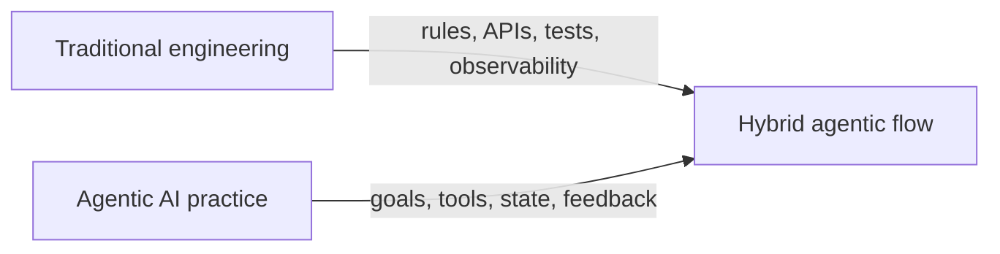

> As introduced in Chapter 4, "Defining Agent Boundaries", the more an agent can act, the more explicit its controls must be. Chapter 5 applies that lesson to engineering practice: how teams begin, how they integrate flows into existing systems, and how professional skillsets evolve.

## 5.1 Shifting from "If-Else" to Goal-Driven Systems

Traditional software and agentic systems store their flexibility in different places. Conventional code keeps it in explicit branches. Agentic systems push some of it into a decision loop that draws on state, tools, and goals. The engineering call is which kind of flexibility the workflow actually needs.

If the behavior is stable, high-risk, and easy to specify, deterministic logic should remain dominant. If the behavior depends on ambiguous language, variable context, incomplete evidence, or multi-step investigation, agentic design can help. The best systems are not pure. They combine deterministic boundaries with model-mediated interpretation. Langflow makes this explicit on the canvas: deterministic routing components sit next to an Agent component, and you can see exactly where each kind of flexibility lives.

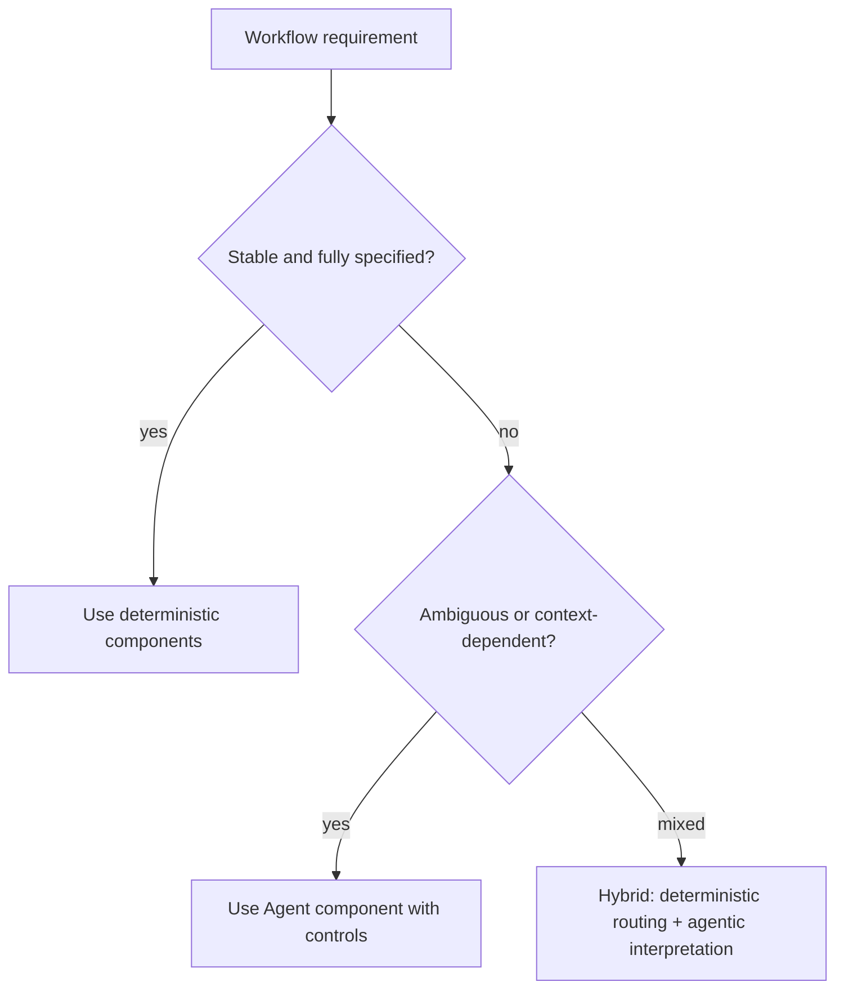

### 5.1.1 From Static Code to Dynamic

Real business workflows are full of variation. A user does not always provide the right form field. A support ticket can blend billing, policy, and technical issues. An incident may start with a single alert and pull in several rounds of evidence gathering. Static branching only handles variation that someone foresaw and encoded.

In a traditional design, each new case often becomes another branch. Over time, the branch structure grows faster than understanding. In an agentic design, the system can interpret the current state, choose among allowed actions, observe results, and continue until a stopping condition is met. The Agent component is where that reasoning loop runs: it pairs a language model with instructions and tools, then decides which action to take next.

The difference is visible in control flow. Static branching follows a fixed path; the agentic loop cycles through observation and decision until it is done.

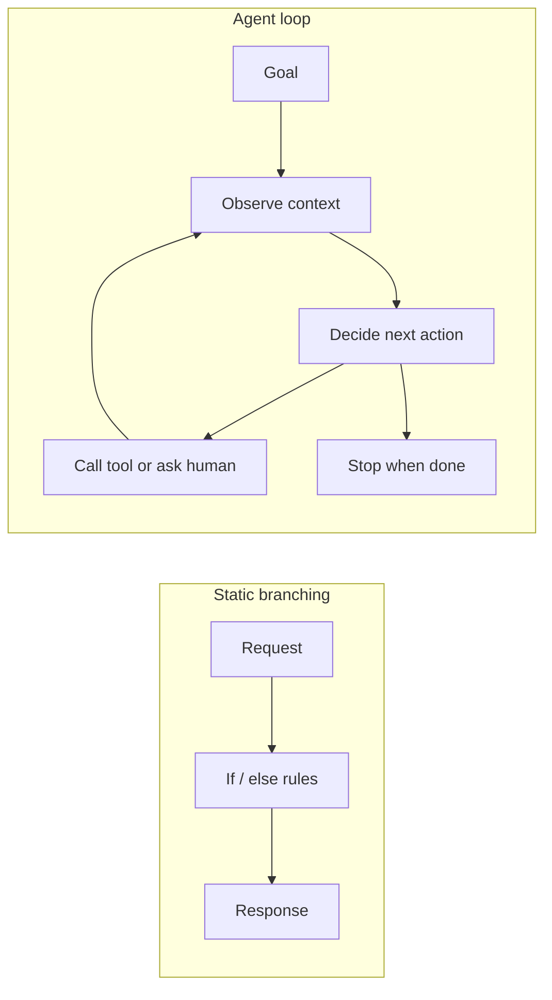

Dynamic does not mean unbounded. A professional agentic loop needs allowed tools, structured handoffs, evaluation criteria, and limits. Without those, a dynamic system becomes difficult to test and unsafe to operate.

The cleanest way to make the transition explicit is a hybrid flow: a deterministic routing component decides whether work stays on a predictable path or enters a reviewed, agentic one. Langflow's If-Else component does exactly this. It compares an incoming message against a match string using an operator such as `contains`, `equals`, or `regex`, and routes the message to its true output or its false output. Sensitive or ambiguous requests flow to an Agent component; routine requests flow to a fixed response. The following flow demonstrates a deterministic router choosing whether the agentic path runs at all.

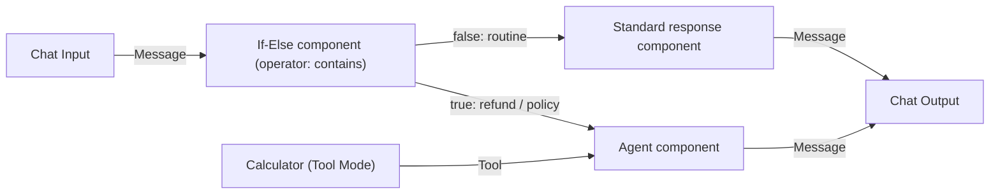

To build this flow, you would:

1. Add a **Chat Input** component as the entry point.
2. Add an **If-Else** component and connect Chat Input's Message output to its input.
3. Set the match string and operator (for example, operator `contains`, match text `refund`) so policy-sensitive language triggers the true branch.
4. Connect the **false** output to a standard response component for routine work.
5. Connect the **true** output to an **Agent** component for the reviewed path.
6. Enable **Tool Mode** on any tools the agent needs and connect their Toolset ports to the Agent's Tools port.
7. Send both branches to a single **Chat Output** component.

A short table makes the routing choices concrete.

| Component | Parameter | Purpose |
|---|---|---|
| If-Else | operator | How the input is compared (`equals`, `contains`, `regex`) to decide the branch |
| If-Else | match text | The string or pattern that sends a message to the true output |
| If-Else | case_sensitive | Whether matching respects letter case |
| Agent | Agent Instructions | Constrains what the reviewed path is allowed to do |
| Calculator | Tool Mode | Exposes the component's action to the Agent through the Tools port |

The If-Else component keeps a deterministic boundary around the agentic path. The branch is chosen by an explicit string comparison, not by an unconstrained model response, so the routing itself stays testable and auditable. This pattern is often a strong first step: insert agentic behavior only where ambiguity exists, while preserving conventional components for predictable work.

### 5.1.2 Developing Agentic Thinking

Agentic design asks you to think about trajectories, not just functions. A traditional function has inputs, outputs, and side effects. An agentic flow has a sequence: observations, decisions, tool calls, state updates, checks, and stopping conditions.

Agentic thinking starts with different questions:

- What goal is the agent pursuing?
- What evidence does it need before acting?
- Which tools are allowed?
- Which actions are reversible?
- What state must persist across steps?
- What should trigger a retry, refusal, or escalation?
- How will we evaluate the path, not only the final answer?

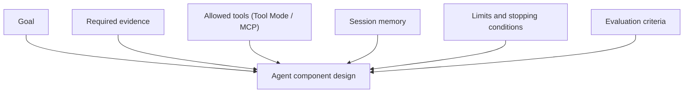

This mindset is closer to designing an operating procedure than writing a single method. In Langflow terms, it means writing clear Agent Instructions, deciding which components to expose through Tool Mode, choosing how session memory is grouped, and deciding when a human should review the output. A good design says not only what success looks like, but how the flow should behave when information is missing, a tool fails, or the risk level changes.

> As introduced in Chapter 2, "Planning and Execution", planning and execution are different capabilities. Agentic thinking keeps that distinction visible. The plan explains the intended route. Execution tests that route against reality, which is exactly what the Playground lets you watch step by step.

### 5.1.3 Introducing Agentic Patterns into Projects

Agentic AI is not a system you bring in through a wholesale rewrite. The safest path is incremental. Add one agentic loop where it removes real complexity, then evaluate it against the existing workflow before adding more. Because Langflow flows are visual and callable through an API, a single flow can be the unit you pilot, measure, and either keep or discard.

Useful first patterns include:

- Draft-and-review: the agent prepares a draft, a human approves or edits.
- Retrieve-and-answer: the agent answers using approved sources.
- Investigate-and-summarize: the agent gathers evidence and produces a reviewable report.
- Classify-and-route: an If-Else or Smart Router component interprets intent, then deterministic components handle execution.
- Plan-and-propose: the agent creates a plan, but execution remains human-controlled.
- Monitor-and-escalate: the agent observes signals and recommends action.

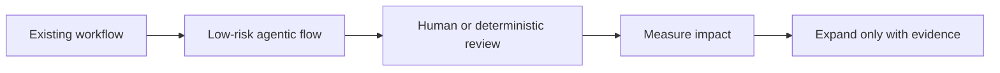

The professional rule is to start where outputs are reviewable and side effects are limited. An internal incident-summary flow is a better first project than an autonomous rollback agent. A policy lookup assistant is safer than a flow that approves refunds. A release-note drafter is safer than a flow that deploys production services.

Agentic patterns should enter a project as architecture, not as prompt tricks. Each pattern needs tools, permissions, session memory, observability through Traces, tests, and a clear owner.

## 5.2 Building Your First Agentic Project

A first project is where a team finds out what agentic systems actually require. It should be real enough to surface integration and evaluation issues, but narrow enough that mistakes are still recoverable.

A strong first professional agentic project has five properties:

1. Low blast radius.
2. Clear baseline for comparison.
3. Reviewable outputs.
4. Limited tool surface.
5. Direct relevance to an existing workflow.

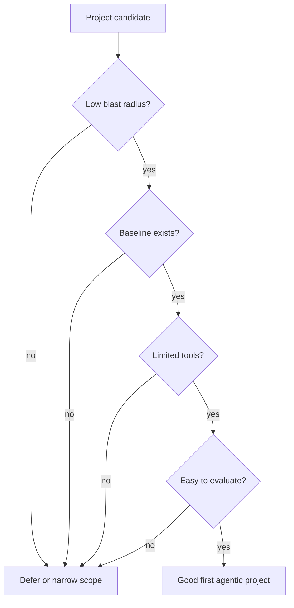

### 5.2.1 Tools and Frameworks to Get Started

The tooling choice shapes how quickly a team moves from demo to reliable system. A good environment keeps the agent loop visible, supports tools, handles session memory, exposes tracing, and integrates with evaluation. It should not hide the parts a professional needs to control.

For the reference stack in this book, that environment is Langflow itself:

- The **visual editor** is where you add, configure, and connect components into a flow on the canvas.
- The **Simple Agent template** is the canonical first flow: an Agent component already wired to Chat Input, Chat Output, a Calculator, and a URL component.
- **Core components** provide generic building blocks, and **Bundles** provide provider-specific integrations, so most capabilities are a drag away rather than a library to install.
- The **Playground** is where you chat with the flow, watch the Agent's tool calls and intermediate steps, and debug behavior before exposing it.
- **Traces** and the Inspection Panel give you the observability surface for reviewing reasoning and tool calls after a run.

The fastest first build follows the quickstart path: create a new flow from the Simple Agent template, set a model provider, open the Playground, and confirm the Agent uses its Calculator and URL tools. From there, you narrow the flow to a real internal task. Consider an internal release-note assistant that drafts a reviewable summary from approved deployment facts, or a document Q&A flow that answers from a fixed set of sources. Either gives you a low-risk, reviewable output with a small tool surface.

Starting from a template means your first project opens as a working flow on the canvas, not a blank page. You then trim and adjust it rather than wiring everything from scratch.

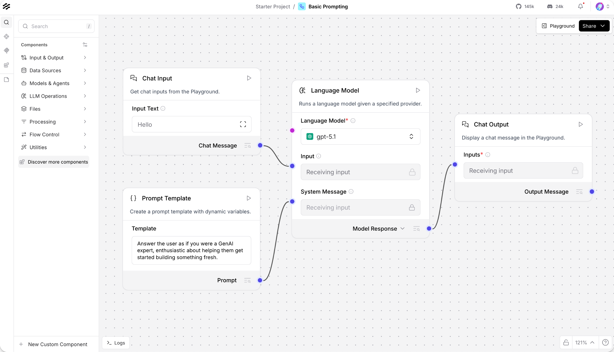
*Figure 5.1: A template opens as a complete, runnable flow. The first project is a matter of narrowing it to one real task, not building from nothing. Source: Langflow documentation (docs.langflow.org).*

The flow below demonstrates a narrow release-note assistant built from the Simple Agent template, trimmed to one or two Tool Mode tools and tested entirely in the Playground.

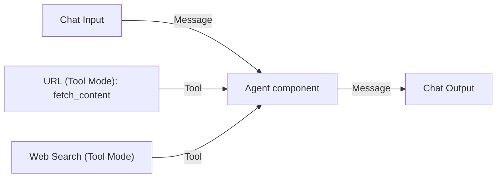

The ordered build is short:

1. Start from the **Simple Agent template** so the Agent, Chat Input, and Chat Output are already wired.
2. In the **Agent** component, set the Language Model provider and write **Agent Instructions** that constrain scope, for example: *Draft internal release notes only from the facts the tools return. Do not claim customer impact unless a tool provides it.*
3. Keep the tool surface narrow. Connect a **URL** component in Tool Mode (its `fetch_content` action) so the agent can read an approved deployment page, and optionally a **Web Search** component for internal references.
4. Remove tools the task does not need, such as the Calculator, to keep the surface minimal.
5. Open the **Playground**, send a request like *Draft release notes for the checkout service*, and inspect the tool calls and intermediate steps in Traces.

| Component | Parameter | Purpose |
|---|---|---|
| Agent | Language Model | Selects the provider and model that act as the reasoning engine |
| Agent | Agent Instructions | Pins the agent to drafting from tool-provided facts only |
| Agent | Tools port | Receives the Tool Mode connections that define what the agent may do |
| URL | Tool Mode | Exposes `fetch_content` so the agent reads approved sources, not arbitrary ones |
| Chat Output | Response | Returns the reviewable draft to the Playground or caller |

The design is intentionally constrained. The flow cannot deploy code, email customers, or query arbitrary systems. It can read approved sources and draft a reviewable output. That narrow shape is exactly what makes it a good first project, and the Playground lets the team confirm the behavior before any system depends on it.

### 5.2.2 Integrating Agents into Existing Systems

Most professional flows will not live in isolation. They sit inside ticketing systems, CRMs, IDEs, data platforms, support tools, CI pipelines, workflow engines, and internal portals. Langflow is both an IDE and a runtime: once a flow works in the Playground, it is callable through the Langflow API and exposable as an MCP tool.

The integration model should still answer the familiar questions:

- Identity: who is the user or service principal calling the flow?
- Authorization: what may this flow do on behalf of that identity?
- State: how is session memory grouped and where is durable state stored?
- Tool execution: how are side effects validated and recorded?
- Observability: how are Traces collected and reviewed?
- Human review: where do approvals happen?
- Evaluation: how do failures become tests?

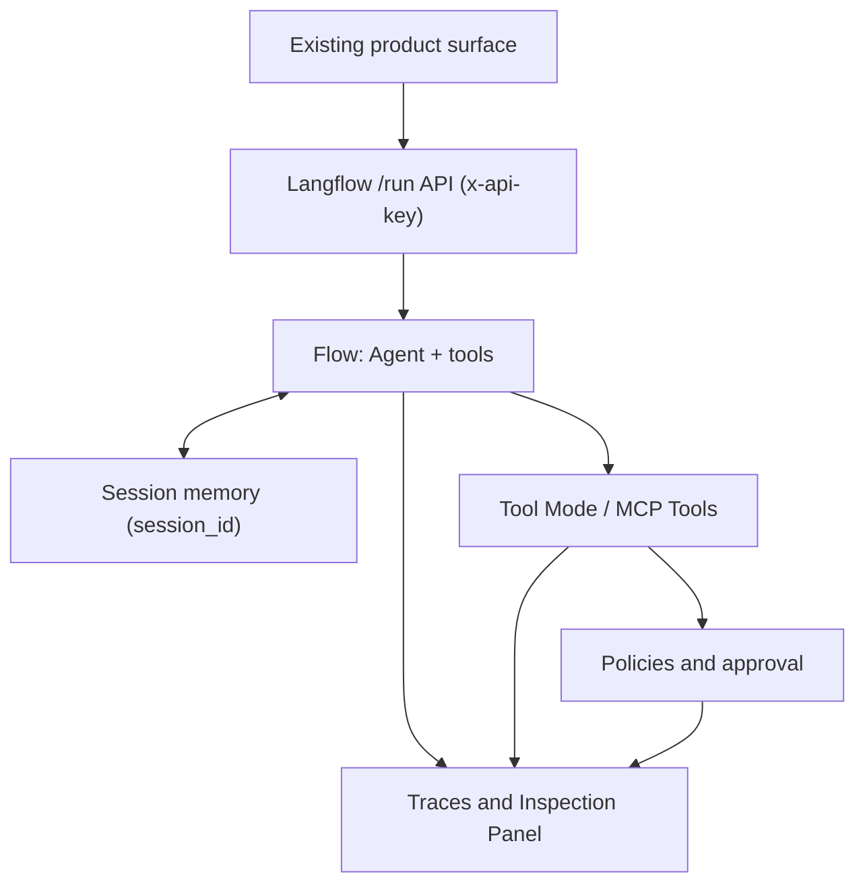

The primary integration point is the Langflow `/run` endpoint. You create an API key in Settings, then call the flow by its ID, passing the user input in the request body. The Share menu generates ready-made snippets for curl, Python, and JavaScript. The curl call below demonstrates invoking a flow and authenticating with the `x-api-key` header.

```bash
# Call a deployed flow by its ID, authenticating with a Langflow API key.
curl -X POST "http://LANGFLOW_SERVER_ADDRESS/api/v1/run/FLOW_ID" \
  -H "Content-Type: application/json" \
  -H "x-api-key: $LANGFLOW_API_KEY" \
  -d '{
    "input_type": "chat",
    "output_type": "chat",
    "input_value": "Draft release notes for the checkout service"
  }'
```

The key lines are the endpoint (`/api/v1/run/FLOW_ID`, which identifies the flow), the `x-api-key` header (which authenticates the caller), and the body fields `input_type`, `output_type`, and `input_value` (which set the input and the shape of the response). The same call in Python uses the standard request libraries that the Share pane generates.

```python
import os, requests

# The /run endpoint identifies the flow by ID and returns a structured response.
resp = requests.post(
    "http://LANGFLOW_SERVER_ADDRESS/api/v1/run/FLOW_ID",
    headers={"x-api-key": os.environ["LANGFLOW_API_KEY"]},
    json={
        "input_type": "chat",
        "output_type": "chat",
        "input_value": "Draft release notes for the checkout service",
    },
)
data = resp.json()
# The response is large and structured (session_id, outputs, durations, agent steps).
# In production, extract only the message your system needs.
```

The response is intentionally rich. It includes a `session_id`, the `outputs`, message content, run durations, and the agent's intermediate steps. That structure is useful for debugging and observability, but a production integration should extract only the relevant message rather than passing the whole payload downstream. Group related calls under a stable `session_id` so the flow's chat memory behaves as one conversation.

When a single call needs to deviate from the saved flow, use **tweaks**: per-run overrides placed in the `/run` payload. A tweak can switch the Agent's model or provider for one request without changing the flow on the canvas, which is useful for cost routing or testing a model on live traffic.

```json
{
  "input_type": "chat",
  "output_type": "chat",
  "input_value": "Draft release notes for the checkout service",
  "tweaks": {
    "Agent": { "model_name": "a-faster-model-for-this-run" }
  }
}
```

Tweaks apply to a single run only and are never persisted, so they are a safe way to override behavior at the edge without editing the flow others depend on.

A second integration path is the Model Context Protocol. Every Langflow project runs an MCP server that exposes its flows as tools, so other agents and IDEs can call your flow as a capability. Flows need a Chat Output to be exposed as a tool, and clear tool names and descriptions matter because clients use them to decide when to call the tool. A client registers the server with a small JSON configuration.

```json
{
  "mcpServers": {
    "release-notes-project": {
      "url": "http://LANGFLOW_SERVER_ADDRESS/api/v1/mcp/project/PROJECT_ID/streamable",
      "headers": { "x-api-key": "YOUR_LANGFLOW_API_KEY" }
    }
  }
}
```

This configuration points an MCP client at the project's streamable HTTP endpoint and authenticates with the same API key mechanism. With it, the release-note flow becomes a tool another agent can invoke, which is how multi-agent and IDE integrations reuse a flow without copying its internals.

Deployment determines who can reach these endpoints. For a quick internal demo, exposing a local server through ngrok is enough. For a durable service, containerize the flow with a Docker image and run it behind a reverse proxy; for production-grade high availability and scale, deploy on Kubernetes. The deployment choice should match the blast radius of the flow, not the ambition of the demo.

A practical integration path stays incremental:

1. Add the flow as an assistant that drafts or recommends, called through `/run`.
2. Require human review for any side effect.
3. Record Traces and decisions in durable application state, not in the model.
4. Convert failures into evaluation cases.
5. Expand tool permissions only after evidence.

> As introduced in Chapter 4, "Defining Agent Boundaries", approval should be a first-class branch, not an afterthought. In Langflow, that branch is concrete: route side-effecting work to a reviewer before any tool acts.

### 5.2.3 Measuring Your First Agent's Impact

Agentic AI can create the appearance of productivity while quietly shifting work elsewhere. A team produces more drafts but overloads reviewers. A support flow cuts handling time and pushes escalations up. A coding agent ships more changes and the defect-review queue grows. Measurement is what keeps the real picture in view, and it remains framework-agnostic: the metrics matter whether or not the flow runs in Langflow.

Measure impact against the current baseline. Before launching, capture how the workflow performs today:

- How long does the task take?
- How often is it completed correctly?
- How much human effort is required?
- How often does it escalate?
- What is the cost per task?
- What are the common defects?

After launch, compare the same metrics. Langflow gives you two surfaces that feed this comparison directly: the Playground for interactive checks and Traces for after-the-fact analysis of reasoning and tool calls.

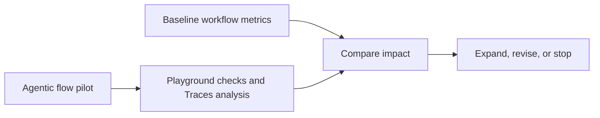

Good first-project metrics include:

- Time saved per task.
- Acceptance rate of agent drafts.
- Human edit distance or review effort.
- Correctness score.
- Policy violation rate.
- Escalation rate.
- Cost per successful task.
- User satisfaction.
- Incident or defect rate.

When the workflow risk is low, an A/B test can make this comparison more rigorous: route a small percentage of eligible work to the agentic flow, keep the rest on the existing workflow, and compare outcomes within the same measurement window. Tweaks on the `/run` call make it easy to vary the model for one arm of the test without maintaining two flows. When the workflow is regulated or high impact, use offline replay, shadow mode, or pairwise evaluation before live A/B exposure. Traces are what make offline replay practical, because each captured run records the path the agent took, not just its final answer. The goal is not to "test on users"; it is to learn with controls that match the risk of the workflow.

The professional standard is not "the flow worked once." It is "the flow improved the workflow without increasing unacceptable risk."

## 5.3 Skillsets for Agentic Engineers

Agentic AI changes what engineers need to be good at. The core craft of software engineering stays: abstraction, testing, reliability, security, debugging, and maintainability. What is new is designing systems where a model participates in the control flow, and doing much of that design visually by composing components rather than writing framework code.

Agentic engineers need to understand both sides:

- Deterministic systems: APIs, data models, authorization, testing, observability, deployment.
- Agentic systems: goals, tools, session memory, planning, evaluation, feedback, guardrails.

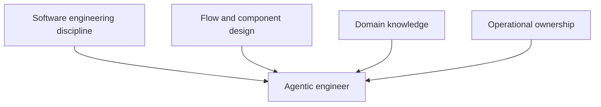

### 5.3.1 What New Skills Are Needed?

Traditional engineering experience is necessary, but no longer sufficient. Anyone who can build APIs and services already has most of the foundation. The new work is learning how model-mediated decisions behave once they are dropped into those systems, and how to express the controls visually.

Key skills include:

- Flow and component design: structuring observe-decide-act-evaluate loops as connected components on the canvas.
- Tool Mode and MCP design: deciding which capabilities become Tool Mode components, which come from MCP Tools, and how to name them so the agent selects correctly.
- Context engineering: giving the model the right information through Agent Instructions, inputs, and connected sources.
- Session and state management: separating transient context, session memory grouped by `session_id`, and durable application state.
- Policies and guardrails: turning business rules into deterministic guards around tools so violations are caught before they happen.
- Traces and observability: reading the Inspection Panel and Traces to see which tool was called, with what input, and why a run stopped.
- Evaluation: measuring trajectories and tool calls, not only final outputs.
- Cost and latency engineering: model routing through tweaks, stopping conditions, and budgets.
- Domain collaboration: encoding real workflow constraints with subject-matter experts.

These skills reinforce one another. A poorly named Tool Mode component creates bad model decisions. Missing Traces make evaluation weak. Weak evaluation makes instruction changes risky. Missing domain context makes the flow optimize the wrong thing. The existing software discipline does not disappear; it now wraps a flow that a model helps drive.

### 5.3.2 Upskilling Paths for Engineers

The fastest way to learn agentic engineering is to move from a working template to a production flow. Reading about agents is not enough. Teams need to build flows, trace them, evaluate them, and revise them in light of what the Traces show.

A practical path uses Langflow end to end:

1. Build the **Simple Agent template** and run it in the Playground.
2. Narrow it to a single real tool through Tool Mode, such as the URL component.
3. Inspect every step in Traces and the Inspection Panel.
4. Add deterministic routing with an If-Else component and a human-review branch.
5. Add **Policies** so business rules guard the tools the agent can call.
6. Create an offline evaluation set from real and replayed runs.
7. Integrate with one real internal system through the `/run` API.
8. Add durable state and recovery around the flow, and group memory by `session_id`.
9. Pilot with domain users, then expose the flow as an MCP tool only when reuse demands it.

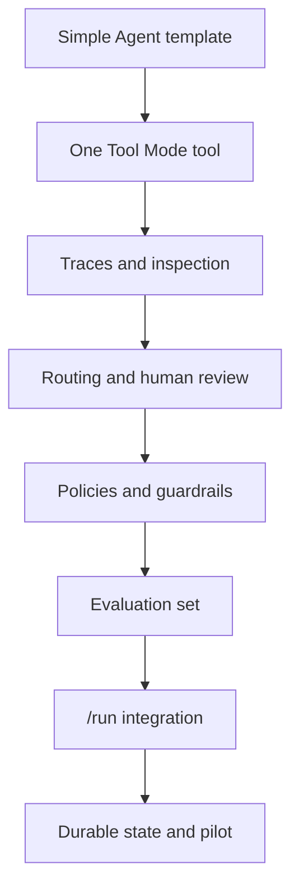

Engineers should also study failures. Agentic engineering maturity comes from reading Traces where the agent called the wrong tool, stopped too early, exceeded budget, or needed human review. The fastest learning loop is not more demos; it is deliberate failure analysis, and the Playground plus Traces make those failures visible step by step.

### 5.3.3 Bringing Teams Along

Individual experimentation does not automatically become organizational capability. A few developers building flows on their laptops can lift personal throughput, but production adoption needs shared tools, governance, workflow design, and accountability. Langflow's project structure helps here: a project groups related flows and defines an MCP server boundary, which gives teams a natural unit to own and govern.

Professional teams should bring flows into the operating model deliberately:

- Define decision tiers: what flows can do, recommend, or never touch.
- Map flow and project scope to team boundaries.
- Create shared standards for components, Agent Instructions, and tool naming.
- Establish review and escalation paths.
- Maintain evaluation sets drawn from Traces.
- Track cost, quality, and risk.
- Include domain experts in design and review.

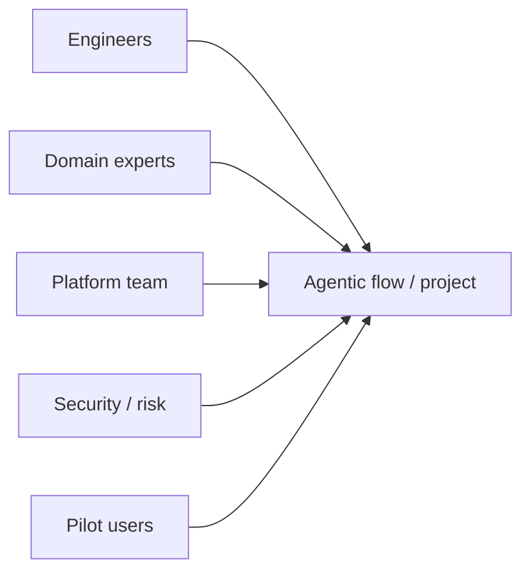

The organizational shift can be summarized as moving from "humans execute, tools assist" to "humans steer, flows execute within boundaries." That shift increases the importance of review capacity, documentation, ownership, and shared context.

Bringing teams along also means preserving trust. Start with flows where users can see the agent's evidence in the Playground and edit its outputs. Celebrate safe stops and escalations, not only autonomous completions. Make the flow's behavior reviewable enough, through Traces and clear Policies, that professionals can form accurate confidence in it.

## Closing Recap

Moving from traditional engineering to agentic AI is not a rejection of software engineering. It is an expansion of it. Deterministic components still own boundaries, routing, permissions, tests, and state. Agentic loops, built around the Agent component, add flexible interpretation, planning, tool use, and feedback in the places where static branches turn brittle.

The practical path is incremental and visual. Start from the Simple Agent template, narrow it to a low-risk workflow, test it in the Playground, integrate it through the `/run` API or as an MCP tool, measure against a baseline, and expand autonomy only when the evidence justifies it. The engineers who do well will combine architecture, domain understanding, evaluation, safety, and operations with fluency in flow and component design.

Chapter 6, "Enterprise Adoption of Agentic AI", carries this transition to organizational scale. We look at use cases, governance, compliance, Policies across business units, and how leaders measure return on agentic AI investments.
