# Chapter 6. Enterprise Adoption of Agentic AI

A pilot agent can impress a leadership team in a conference room. It answers questions, calls a tool, drafts a report, and looks like the future. Enterprise adoption begins after the applause, when someone asks harder questions: Who owns this agent? Which data can it read? Which systems can it change? How do we know what it did? What happens when policy changes? What business result justifies the cost?

Agentic AI at enterprise scale is not a collection of clever pilots. It is an operating model.

The transition from isolated demos to enterprise adoption requires runtime governance, identity-aware authorization, observability, evaluation, cost controls, risk management, and a measurement model that finance, legal, security, engineering, and business leaders can all recognize. The agent may be powered by a language model, but the enterprise system is powered by trust.

```mermaid
flowchart TD
    UseCase["Enterprise use case"]
    Agent["Agent workflow"]
    Governance["Runtime governance"]
    Observability["Observability and evaluation"]
    Business["Business outcome"]
    Scale["Scaled adoption"]

    UseCase --> Agent
    Agent --> Governance
    Governance --> Observability
    Observability --> Business
    Business --> Scale
```

As introduced in Chapter 5, "Measuring Your First Agent's Impact", the right first projects are narrow, measurable, and low-risk. Chapter 6 asks what happens when an organization expands beyond one project into a portfolio of agents operating across business units.

## 6.1 Agentic AI in Large Enterprises

Enterprise adoption matters because large organizations are not merely bigger versions of startups. They contain regulated data, legacy systems, regional constraints, procurement processes, audit requirements, shared services, and overlapping accountability. An agent that is useful in one team's sandbox can become risky when connected to enterprise systems of record.

The professional challenge is to convert agentic AI from a local productivity tool into a governed capability. That means selecting use cases carefully, building shared platform foundations, and scaling with evidence rather than enthusiasm.

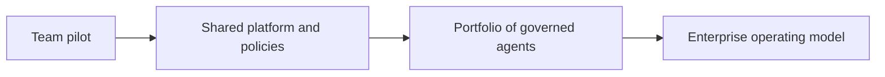

### 6.1.1 Use Cases: From RPA to Agentic Processes

Use cases matter because enterprises already have automation. Robotic process automation, scripts, workflow engines, and business rules are deeply embedded in operations. Agentic AI does not replace all of them. It extends automation into workflows where exceptions, language, judgment, and cross-system context make rigid scripts brittle.

Traditional RPA is strongest when the path is stable: click this screen, copy this field, submit this form. It is weakest when the input changes format, the screen changes, or a judgment call appears. Agentic processes are useful when the workflow requires interpreting context, gathering evidence, resolving exceptions, and routing uncertain cases to humans.

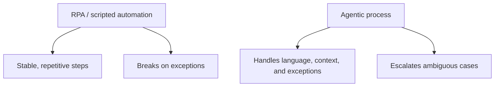

Enterprise use cases often cluster around high-volume, exception-heavy work:

- Customer support: triage, account lookup, answer drafting, escalation.
- Finance: invoice reconciliation, expense auditing, cash application, month-end close.
- IT operations: access requests, password resets, incident triage, knowledge retrieval.
- HR: onboarding, benefits support, policy lookup, employee service workflows.
- Sales and customer success: account research, renewal risk, outreach preparation.
- Security: alert enrichment, evidence collection, case prioritization.

Reported enterprise examples show the pattern. Finance workflows such as vendor invoice reconciliation can parse invoices, match purchase orders and goods receipts, fetch contract terms, draft clarifications, and update systems after review. Customer operations agents can retrieve account history, inspect order status, draft responses, and escalate only cases requiring human judgment. The common thread is not "chat." It is multi-step work across systems.

The best enterprise starting point is not the most glamorous workflow. It is the workflow with measurable volume, known pain, clear policies, available data, and tolerable risk.

### 6.1.2 Governance and Compliance Considerations

Governance matters because enterprise agents can act on behalf of people and business units. A policy document is not enough when an agent can call tools at runtime. The governance question changes from "Was the model response safe?" to "Is this specific action authorized right now?"

Modern enterprise guidance increasingly describes runtime governance: a control layer that evaluates proposed agent actions against identity, policy, data boundaries, approval state, and budget before tools execute. Microsoft describes this as an authorization fabric with a policy enforcement point and policy decision point. Oracle frames the same shift as moving from model safety to governed execution. Forrester describes an emerging agent control plane.

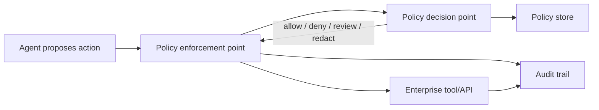

Enterprise governance should include:

- Agent registry: each agent has an owner, purpose, tool scope, model binding, and risk tier.
- Data classification: agents know which data they may read, retain, and disclose.
- Identity and authorization: every tool call is evaluated against user and agent identity.
- Approval workflows: high-impact actions require review.
- Deployment gates: evals and security checks run before release.
- Auditability: traces are complete enough to reconstruct material decisions.
- Change management: policy updates propagate without editing every prompt.

Compliance obligations must be translated into this runtime model. GDPR should shape personal-data purpose limitation, minimization, retention, security, and data-subject rights. India's Digital Personal Data Protection Act, 2023 (DPDP Act / DPDPA) should shape digital personal-data processing, data fiduciary obligations, safeguards, breach response, and erasure. HIPAA should shape healthcare workflows involving protected health information and electronic protected health information. PCI DSS should shape any agent that touches payment account data or systems in the cardholder data environment. OWASP and NIST should shape security testing, threat modeling, and adversarial evaluation.

Compliance teams need evidence, not assurances. A replayable trace showing user request, retrieved context, model decision, tool arguments, policy decision, approval, and outcome is far more useful than a narrative statement that the agent "followed policy."

### 6.1.3 Scaling Agentic Solutions in Enterprises

Scaling matters because the first agent is usually not the hardest part. The hard part is preventing agent sprawl: duplicated tools, inconsistent policies, unclear ownership, uncontrolled cost, and multiple teams solving the same governance problem differently.

Scaling requires shared foundations:

- A common tool catalog.
- A policy and approval layer.
- Observability and evaluation standards.
- Identity integration.
- Environment separation for development, staging, and production.
- Cost attribution by team, project, and agent.
- Documentation of agent capabilities and boundaries.

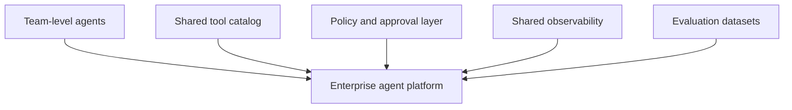

LangSmith's enterprise documentation reflects these concerns in platform form: deployment options for cloud, hybrid, and self-hosted environments; RBAC and ABAC; workspace isolation; data privacy and PII controls; data retention and purge; cost controls and granular usage reporting; and deployment infrastructure for durable execution and horizontal scaling.

The professional scaling sequence is:

1. Prove one workflow.
2. Extract shared tools and policies.
3. Standardize observability and evals.
4. Register agents and owners.
5. Expand to adjacent workflows.
6. Review portfolio-level cost, risk, and impact.

Enterprises should resist scaling autonomy faster than governance. The bottleneck should not be enthusiasm; it should be evidence.

## 6.2 Guardrails at Enterprise Scale

Enterprise guardrails matter because local controls do not automatically compose. A support agent, finance agent, and HR agent may each be safe within one team, but together they can create cross-domain risks: data leakage, inconsistent policy, duplicated approvals, or actions taken under the wrong identity.

At scale, guardrails become a platform capability. They must be centrally defined, locally contextualized, and continuously monitored.

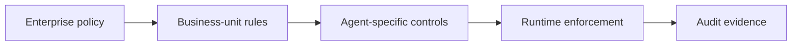

### 6.2.1 Enterprise Policies for Agents

Policies matter because agents need machine-enforceable constraints. A PDF acceptable-use policy may guide humans, but agents require structured rules that runtime systems can evaluate.

Enterprise agent policies should cover:

- Data access: what sources may be read.
- Data handling: what may be stored, summarized, redacted, or shared.
- Tool access: which tools are available under which conditions.
- Action approval: which actions require human review.
- Budget: cost ceilings by workflow, tenant, or business unit.
- Geography: region-specific data residency or regulatory rules.
- Retention: how long traces, memory, and artifacts are kept.
- Incident response: when an agent is paused, disabled, or escalated.

The policy set should include framework-specific profiles. A GDPR profile may require lawful basis, purpose tags, data minimization, retention controls, and erasure workflows. A DPDP Act profile may require consent or legitimate-use tracking, data fiduciary ownership, breach notification paths, and processor controls. A HIPAA profile may require administrative, physical, and technical safeguards around protected health information. A PCI DSS profile may require cardholder-data minimization, tokenization or masking, access control, monitoring, vulnerability management, and strict restrictions on sensitive authentication data. These profiles let the same runtime governance layer enforce different rules for different workflows.

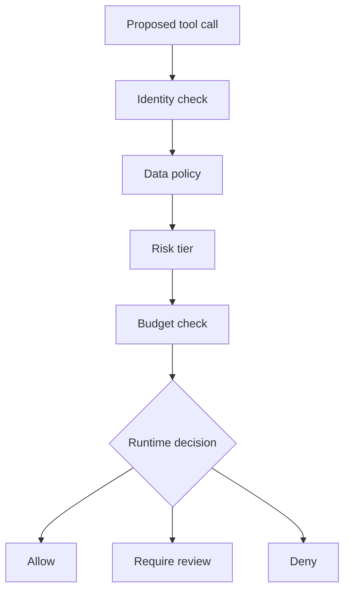

The most important design rule is non-bypassability. If the agent can call business tools directly without the policy layer, the policy layer is advisory. Enterprise guardrails should be part of the execution path.

This does not mean every action requires a meeting. Low-risk reads can be allowed automatically. Medium-risk actions can require additional validation. High-risk actions can require approval, dual control, or denial. The control should match the risk.

### 6.2.2 Ensuring Ethical Enterprise AI

Ethical enterprise AI matters because organizations deploy agents into social and economic systems: hiring, healthcare, finance, employee management, customer support, and public services. At scale, small biases or opaque decisions can affect thousands or millions of people.

Ethical enterprise governance should include:

- Clear purpose and acceptable-use definitions.
- Impact assessments for high-risk workflows.
- Bias and fairness evaluation where decisions affect people.
- Transparency to users and employees.
- Human appeal paths.
- Data minimization and retention limits.
- Accountability for agent outcomes.

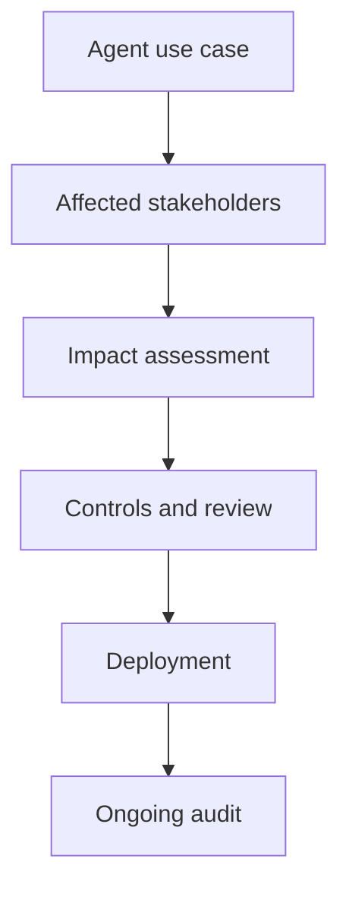

Ethics is not separate from architecture. If a user cannot appeal a decision, the architecture lacks contestability. If the organization cannot explain why an agent escalated one customer and not another, the architecture lacks traceability. If agents see more data than the task requires, the architecture violates minimization.

As introduced in Chapter 4, "Ethical Considerations in Decision-Making", responsible behavior begins before deployment. At enterprise scale, it becomes a governance program with owners, policies, evidence, and periodic review.

### 6.2.3 Monitoring Agents Across Business Units

Monitoring matters because enterprise risk is distributed. A finance agent may behave well, an HR agent may behave well, and a sales agent may behave well, while the organization as a whole accumulates excessive cost, duplicated capabilities, inconsistent approval practices, or data exposure.

Cross-business-unit monitoring should track:

- Agent inventory and ownership.
- Tool usage by agent and business unit.
- Sensitive action attempts.
- Human approval rates and rejection reasons.
- Cost by workflow and team.
- Latency and reliability.
- Policy violations.
- Evaluation trends.
- Data retention and access patterns.
- Compliance posture by framework, such as GDPR, DPDP Act, HIPAA, PCI DSS, OWASP, and NIST mapped controls.

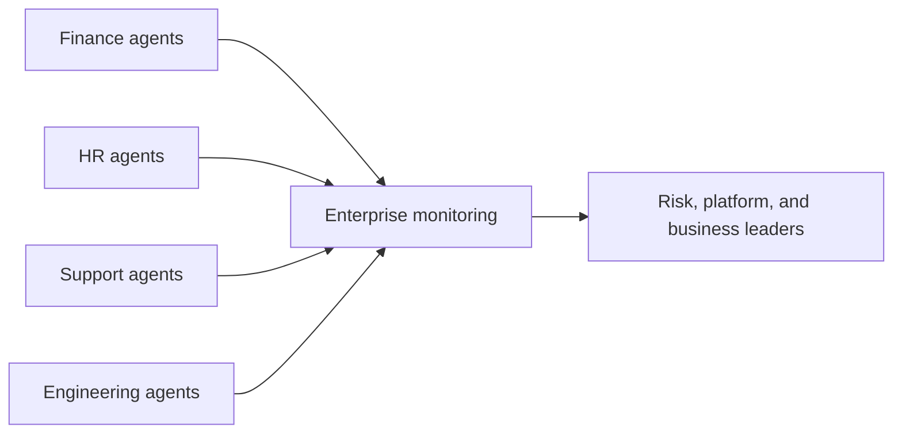

LangSmith enterprise features such as workspaces, RBAC, ABAC, usage reporting, and trace controls map directly to these needs. The broader architectural point is that monitoring must support both local debugging and enterprise oversight.

The goal is not surveillance for its own sake. It is operational clarity. Leaders should know which agents exist, what they can do, how they perform, what they cost, and where risk is concentrated.

## 6.3 The ROI of Agentic AI

ROI matters because enterprise adoption competes for capital, attention, and trust. A compelling demo can open a door, but durable adoption requires a business case. In 2026, sources increasingly report that enterprise buyers are moving from generic productivity claims toward direct financial impact: revenue, margin, cost, risk, and cycle time.

The mistake is measuring only activity. Number of agents deployed, number of prompts sent, or hours estimated does not prove value. The enterprise question is: did the agentic workflow improve a business outcome enough to justify cost and risk?

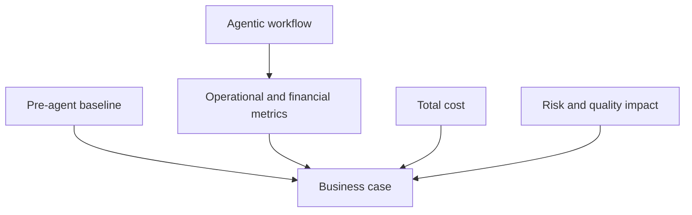

### 6.3.1 Measuring the Business Impact of Agents

Measurement matters because ROI cannot be reconstructed honestly after the fact. Before deployment, teams should define the baseline, target metrics, attribution method, and cost model.

Four ROI pillars are especially useful:

- Cost takeout: reduced manual effort, vendor spend, rework, or headcount growth.
- Revenue acceleration: faster conversions, better retention, more timely outreach.
- Quality and risk reduction: fewer errors, fewer compliance incidents, better audit readiness.
- Cycle-time compression: faster processing, faster resolution, shorter close periods.

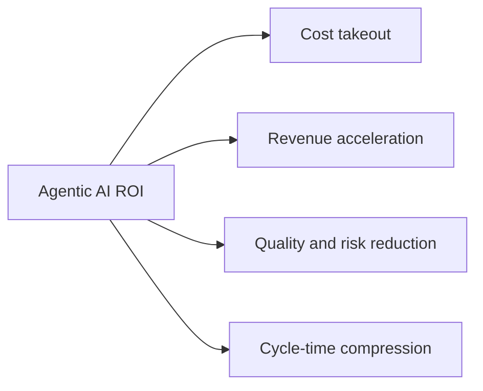

Metrics should be tied to the workflow:

- Cost per completed task.
- Cycle time from request to resolution.
- Automation rate.
- Human review rate.
- Rework or error rate.
- Compliance incident rate.
- Customer satisfaction.
- Revenue influenced.
- Margin per transaction.
- Cost of model, infrastructure, tooling, governance, and review.

Finance should agree to the methodology before the pilot. Otherwise, the team may produce a technically successful agent that cannot defend its value. A narrow workflow with a clean baseline is better than a broad transformation program with vague measurement.

### 6.3.2 Success Stories and Case Studies

Case studies matter because they make the value pattern concrete, but they should be read carefully. Vendor and press examples often report impressive numbers, but professionals should look for the underlying shape: workflow volume, baseline, exception rate, human review, and measurable outcome.

Reported examples include:

- Customer service agents handling routine conversations, reducing resolution time, and escalating harder cases.
- Finance agents reconciling invoices, matching purchase orders, finding discrepancies, and preparing audit trails.
- AI email or outreach systems reading CRM context, generating personalized messages, classifying replies, and routing outcomes.
- Enterprise support agents connecting ITSM, HRIS, ERP, CRM, and knowledge bases to resolve employee or customer requests.

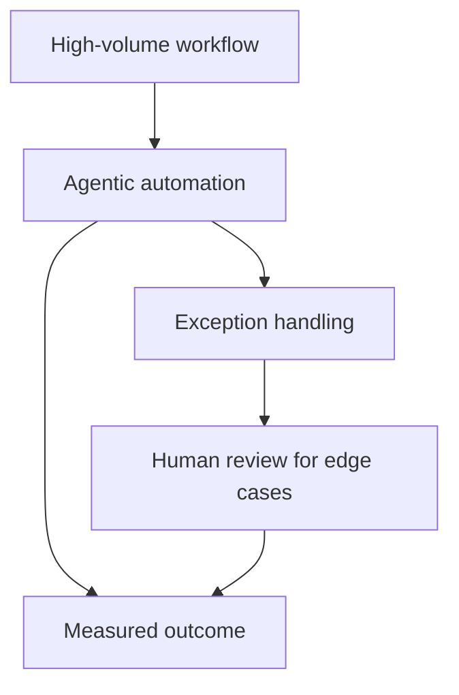

The strongest stories share common traits:

- The workflow was already expensive or slow.
- The process crossed multiple systems.
- Policies were clear enough to encode.
- Exceptions were common but classifiable.
- Humans remained responsible for ambiguous or high-risk decisions.
- The organization measured before and after.

The lesson is not that every enterprise should copy the same use case. The lesson is that agentic AI creates value when it moves work through a governed loop that handles routine cases, packages exceptions with context, and improves measurable outcomes.

### 6.3.3 Making the Business Case for Agentic AI

The business case matters because enterprise adoption requires sustained support from finance, risk, security, platform, and business leaders. A strong business case connects technical capability to operational economics.

A practical business case includes:

1. Workflow description and current pain.
2. Baseline volume, cost, cycle time, and quality.
3. Proposed agentic scope and non-goals.
4. Tool and data access requirements.
5. Risk tier and required guardrails.
6. Success metrics and attribution method.
7. Cost model, including model, infrastructure, platform, review, and maintenance.
8. Pilot timeline and expansion criteria.

The measurement design should specify whether the pilot uses before-and-after comparison, A/B testing, shadow mode, or offline replay. A/B testing is appropriate for low-risk workflows where users can safely experience either version and outcomes are measurable. Shadow mode is better when the agent should make recommendations without executing them. Offline replay is best when the workflow includes regulated data, irreversible actions, or high-stakes decisions. Pairwise evaluation is useful when two agent versions need qualitative comparison before a live pilot.

The best business cases are explicit about what the agent will not do. It may draft but not send. It may recommend but not approve. It may reconcile routine invoices but escalate exceptions. This clarity reduces risk and makes measurement easier.

At enterprise scale, the business case should also include platform reuse. A single workflow may not justify a full agent platform, but repeated use of shared identity, tools, policy, observability, and evaluation can. The ROI of agentic AI is often both local and platform-level: one workflow produces direct value, while the platform reduces the marginal cost of the next workflow.

## Closing Recap

Enterprise adoption of agentic AI requires more than capable models. It requires runtime governance, identity-aware authorization, policy enforcement, observability, evaluation, cost controls, data privacy, and a business case tied to measurable outcomes.

The highest-value enterprise workflows are often high-volume, exception-heavy, cross-system processes where traditional automation breaks at judgment calls. Guardrails must scale from local middleware to enterprise policy layers. ROI must move beyond hours saved toward cost, revenue, quality, risk, and cycle-time impact.

Chapter 7, "The Future of Agentic AI and Your Role", looks ahead. With the foundations now in place, we will examine emerging trends, human-agent collaboration, professional leadership, continuous learning, and career paths in agentic AI.
