# Chapter 6. Enterprise Adoption of Agentic AI

A pilot flow can impress a leadership team in a conference room. It answers questions, calls a tool, drafts a report, and looks like the future. Enterprise adoption begins after the applause, when someone asks the harder questions. Who owns this flow? Which data can it read? Which systems can it change? How do we know what it did? What happens when policy changes? What business result justifies the cost?

Agentic AI at enterprise scale is not a collection of clever pilots. It is an operating model.

Getting from isolated demos to enterprise adoption takes runtime governance, identity-aware authorization, observability, evaluation, cost controls, risk management, and a measurement model that finance, legal, security, engineering, and business leaders can all recognize. The agent is powered by a language model. The enterprise system around it is powered by trust. Langflow gives us a concrete place to put that trust: flows become the unit of work, projects become a boundary, Policies become the guardrail layer, and Traces become the audit record.

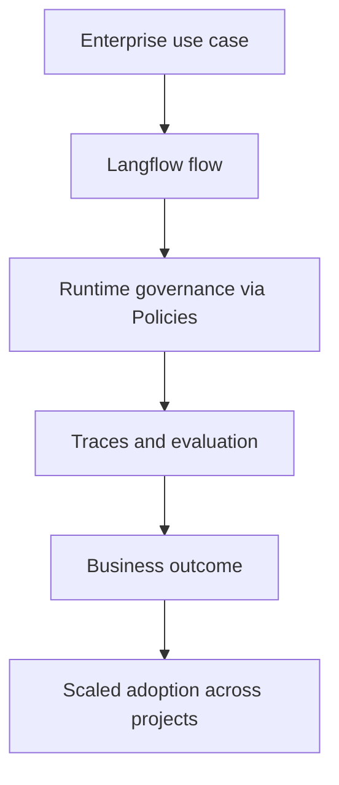

As introduced in Chapter 5, "Measuring Your First Agent's Impact", the right first projects are narrow, measurable, and low-risk. Chapter 6 asks what happens when an organization expands beyond one flow into a portfolio of agents operating across business units.

## 6.1 Agentic AI in Large Enterprises

Large organizations are not bigger versions of startups. They carry regulated data, legacy systems, regional constraints, procurement processes, audit requirements, shared services, and overlapping accountability. A flow that is useful in one team's workspace can turn risky the moment it is wired into enterprise systems of record.

The real challenge is converting agentic AI from a local productivity tool into a governed capability. In Langflow terms, that means choosing use cases carefully, building shared platform foundations on projects and reusable components, and scaling on evidence rather than enthusiasm.

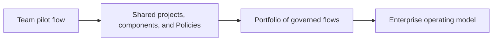

### 6.1.1 Use Cases: From RPA to Agentic Processes

Enterprises are not arriving at agentic AI from a blank slate. Robotic process automation, scripts, workflow engines, and business rules are already deeply embedded in operations. Agentic AI does not replace all of that. It extends automation into workflows where exceptions, language, judgment, and cross-system context make rigid scripts brittle.

Traditional RPA is strongest when the path is stable: click this screen, copy this field, submit this form. It is weakest when the input changes format, the screen changes, or a judgment call appears. Agentic processes are useful when the workflow requires interpreting context, gathering evidence, resolving exceptions, and routing uncertain cases to humans. In Langflow, that judgment lives in an Agent component that reasons over instructions and calls tools, while deterministic routing components keep the predictable parts predictable.

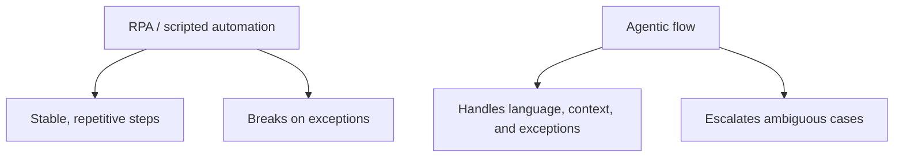

Langflow's use-case templates give teams a fast way to recognize where an agentic flow fits. The library is organized into categories that map cleanly onto enterprise functions: Business, Documents, Analytics, Processing, Automation, Data, and Productivity. Concrete starting points such as Call Classification Analytics, CSV Query Assistant, Data Extraction, and Document Q&A show the common shapes a first enterprise flow tends to take.

Enterprise use cases often cluster around high-volume, exception-heavy work, and each maps to a flow built from an Agent component plus Tool Mode components and, where needed, MCP Tools:

| Business unit | Example flow | Typical tools (Tool Mode / MCP) | Template family |
| --- | --- | --- | --- |
| Customer support | Ticket triage, account lookup, answer drafting, escalation | Web Search, URL, knowledge base retrieval, ITSM via MCP | Business, Productivity |
| Finance | Invoice reconciliation, expense auditing, month-end close | Data Extraction, Calculator, ERP via MCP | Documents, Processing |
| IT operations | Access requests, password resets, incident triage | Knowledge retrieval, ITSM via MCP | Automation, Data |
| HR | Onboarding, benefits support, policy lookup | Document Q&A, HRIS via MCP | Documents, Productivity |
| Sales and customer success | Account research, renewal risk, outreach prep | Web Search, CRM via MCP, CSV Query Assistant | Business, Analytics |
| Security | Alert enrichment, evidence collection, case prioritization | Call Classification Analytics, log retrieval via MCP | Analytics, Processing |

Reported patterns show the same shape regardless of department. A finance flow for vendor invoice reconciliation can use a Data Extraction step to parse invoices, an Agent component to match purchase orders and goods receipts, MCP Tools to fetch contract terms and update the ERP after review, and a Chat Output for the human-readable summary. A customer operations flow can retrieve account history, inspect order status, draft a response, and escalate only the cases that need human judgment. The common thread is not "chat." It is multi-step work across systems, expressed as connected components on the canvas.

The best enterprise starting point is not the most glamorous workflow. It is the one with measurable volume, known pain, clear policies, available data, and tolerable risk. A team can clone the closest template, swap in its own model provider and tools, and validate the behavior in the Playground before anything touches production.

### 6.1.2 Governance and Compliance Considerations

Enterprise flows act on behalf of people and business units, which is what makes governance non-negotiable. A policy document is not enough when a flow can call tools at runtime. The question shifts from "Was the model response safe?" to "Is this specific action authorized right now?"

Modern enterprise guidance increasingly describes runtime governance: a control layer that evaluates proposed agent actions against identity, policy, data boundaries, approval state, and budget before tools execute. Microsoft describes this as an authorization fabric with a policy enforcement point and policy decision point. Oracle frames the same shift as moving from model safety to governed execution. Forrester describes an emerging agent control plane. Langflow's answer to this need is **Policies**, which compile natural-language business rules into deterministic guards around an agent's tools, so a violation is caught before the tool runs rather than explained after.

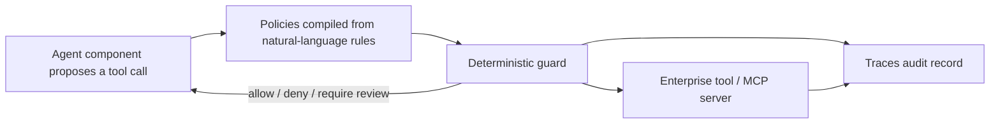

In Langflow, the building blocks of enterprise governance line up with concrete platform features:

| Governance need | Langflow mechanism |
| --- | --- |
| Flow registry with owner, purpose, and scope | Projects grouping related flows; each project is an MCP server boundary |
| Identity and authentication on every entry point | Langflow API keys (`x-api-key`); MCP server auth via API key or OAuth |
| Secret handling for tools and providers | Global variables and Credentials, referenced by name, never inlined in a flow |
| Action constraints around tools | Policies that turn business rules into guarded tool execution |
| Approval for high-impact actions | Human review steps in the flow plus risk-tiered Policies |
| Auditability of material decisions | Traces and the Inspection Panel capturing reasoning, tool calls, and outputs |
| Change management without editing every prompt | Update a Policy or a shared component once; reuse propagates across flows |

Projects deserve particular attention, because they are where Langflow draws the line that enterprises care about. A project groups flows and exposes them as tools on its own MCP server, which makes the project a natural trust and ownership boundary: a finance project, an HR project, a security project, each with its own flows, its own MCP surface, and its own access controls. Crossing that boundary should be a deliberate, governed integration, not an accident of shared state. The MCP Server Tools dialog is where an owner decides exactly which flows are published as tools, and gives each a clear name and description, which is the registry, in practice, for what a project exposes to the rest of the organization.

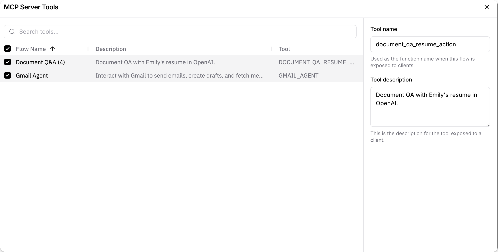
*Figure 6.1: Controlling which flows a project publishes as tools, and how they are named and described, is a concrete governance act: it defines the project's authorized surface area. Source: Langflow documentation (docs.langflow.org).*

Compliance obligations must be translated into this runtime model rather than left in a binder. GDPR should shape personal-data purpose limitation, minimization, retention, security, and data-subject rights. India's Digital Personal Data Protection Act, 2023 (DPDP Act / DPDPA) should shape digital personal-data processing, data fiduciary obligations, safeguards, breach response, and erasure. HIPAA should shape healthcare workflows involving protected health information and electronic protected health information. PCI DSS should shape any flow that touches payment account data or systems in the cardholder data environment. OWASP and NIST should shape security testing, threat modeling, and adversarial evaluation. These frameworks are independent of Langflow; the platform's job is to give them an enforcement point through Policies and an evidence trail through Traces.

Compliance teams need evidence, not assurances. A replayable trace showing the user request, retrieved context, the model's decision, the tool arguments, the Policy decision, the approval, and the outcome is far more useful than a narrative statement that the flow "followed policy."

### 6.1.3 Scaling Agentic Solutions in Enterprises

The first flow is rarely the hardest part. The hard part is preventing flow sprawl: duplicated tools, inconsistent policies, unclear ownership, uncontrolled cost, and several teams solving the same governance problem in incompatible ways.

Scaling requires shared foundations, and Langflow provides most of them as first-class concepts:

- Reusable building blocks: shared Core components and provider Bundles, plus custom components saved once and reused across flows.
- Global model providers: configure providers and keys centrally in Settings so flows bind to approved models rather than scattering credentials.
- A guardrail layer: Policies defined centrally and applied consistently around tools.
- Observability standards: Traces and the Inspection Panel as the default for debugging and review.
- Environment separation: distinct Langflow instances or configurations for development, staging, and production.
- Project boundaries: projects as the unit of ownership, MCP exposure, and access control.
- Cost attribution: usage tracked by project, flow, and model provider.

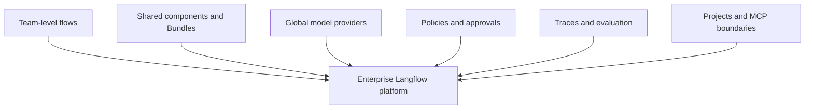

Two parts of the Langflow story matter most as scale increases. The first is deployment. Langflow is both an IDE and a runtime: a flow validated on the canvas is the same flow callable through the `/run` API and exposable as an MCP tool. For production, teams move beyond a single local instance to containerized deployments, and to Kubernetes when they need horizontal scale and high availability. A minimal containerized run looks like this:

```bash
# Run a Langflow server in a container, with flows and secrets supplied as environment configuration.
docker run -p 7860:7860 \
  -e LANGFLOW_AUTO_LOGIN=false \
  -e LANGFLOW_MCP_SERVER_ENABLED=true \
  langflowai/langflow:latest
```

Setting `LANGFLOW_AUTO_LOGIN=false` forces authenticated access, which is the baseline expectation in any shared environment. From there, the deployment guides cover remote servers behind a reverse proxy, TLS termination, and managed Kubernetes for production-grade scale.

The second part is operating flows outside the visual builder. Langflow 1.9 introduces the **Flow DevOps Toolkit**, which lets teams manage flows as artifacts in source control and pipelines rather than editing them by hand in the canvas. Alongside it, Langflow 1.9 adds the Langflow Assistant for in-product help, broader MCP support for IDEs and coding agents, V2 workflow APIs, centralized global model provider setup, Traces, the Inspection Panel, and knowledge bases. Together these turn a collection of individual flows into something a platform team can version, review, and promote across environments.

The professional scaling sequence is:

1. Prove one flow against a real baseline.
2. Extract shared components, providers, and Policies.
3. Standardize Traces and evaluation.
4. Register flows and owners inside projects.
5. Expand to adjacent workflows that reuse the same foundations.
6. Review portfolio-level cost, risk, and impact.

Enterprises should resist scaling autonomy faster than governance. The bottleneck should not be enthusiasm; it should be evidence.

## 6.2 Guardrails at Enterprise Scale

Local controls do not automatically compose. A support flow, a finance flow, and an HR flow may each be safe in their own project and still create cross-domain risks together: data leakage, inconsistent policy, duplicated approvals, or actions taken under the wrong identity.

At scale, guardrails become a platform capability. They have to be defined centrally, adapted to local context, and watched continuously. Langflow concentrates this responsibility in Policies, which sit between an Agent component and the tools it can call.

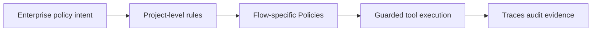

### 6.2.1 Enterprise Policies for Agents

Agents need machine-enforceable constraints, not paperwork. A PDF acceptable-use policy can guide humans, but a flow needs structured rules that the runtime can actually evaluate. This is the precise gap Langflow Policies fill: a rule is authored in natural language, compiled into a deterministic guard, and attached to the tools an Agent component is allowed to call.

Enterprise flow policies should cover:

- Data access: which sources a flow may read.
- Data handling: what may be stored, summarized, redacted, or shared.
- Tool access: which Tool Mode components and MCP servers are available under which conditions.
- Action approval: which actions require human review before execution.
- Budget: cost ceilings by flow, project, or business unit.
- Geography: region-specific data residency or regulatory rules.
- Retention: how long traces, session memory, and artifacts are kept.
- Incident response: when a flow is paused, disabled, or escalated.

The policy set should include framework-specific profiles, and because Policies are authored as rules, a profile is just a named set of rules applied to the relevant flows. A GDPR profile may require lawful basis, purpose tags, data minimization, retention controls, and erasure workflows. A DPDP Act profile may require consent or legitimate-use tracking, data fiduciary ownership, breach notification paths, and processor controls. A HIPAA profile may require administrative, physical, and technical safeguards around protected health information. A PCI DSS profile may require cardholder-data minimization, tokenization or masking, access control, monitoring, vulnerability management, and strict restrictions on sensitive authentication data. The same runtime guardrail layer enforces different rules for different flows.

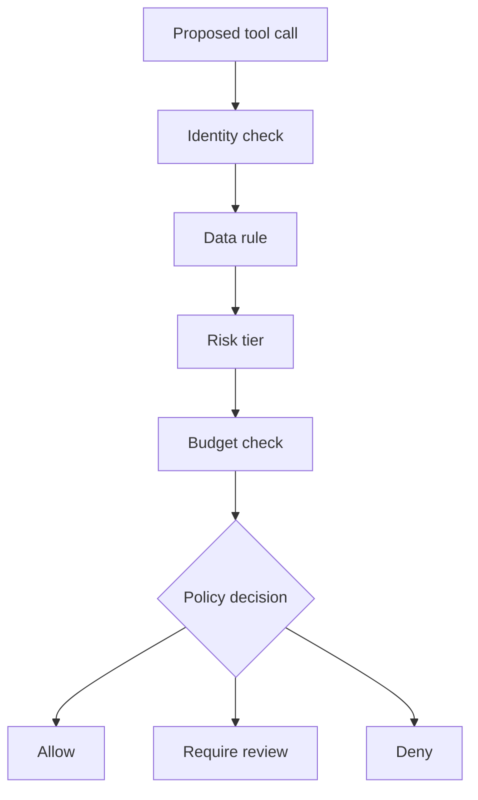

The most important design rule is non-bypassability. If an Agent component can reach business tools directly without passing through Policies, the policy layer is advisory. Enterprise guardrails should be part of the execution path, wrapped around the tools themselves rather than bolted on as a suggestion in the system prompt. Pairing this with API-key authentication on the flow's entry points and global variables for secrets keeps the whole path closed: authenticated request in, guarded tool calls in the middle, audited result out.

This does not mean every action requires a meeting. Low-risk reads can be allowed automatically. Medium-risk actions can require additional validation. High-risk actions can require approval, dual control, or denial. The control should match the risk, and Policies make that tiering explicit instead of implicit.

### 6.2.2 Ensuring Ethical Enterprise AI

Organizations deploy flows into social and economic systems: hiring, healthcare, finance, employee management, customer support, public services. At enterprise scale, small biases or opaque decisions can ripple out to thousands, sometimes millions, of people. The ethics question becomes structural rather than abstract.

Ethical enterprise governance should include:

- Clear purpose and acceptable-use definitions.
- Impact assessments for high-risk workflows.
- Bias and fairness evaluation where decisions affect people.
- Transparency to users and employees.
- Human appeal paths.
- Data minimization and retention limits.
- Accountability for flow outcomes.

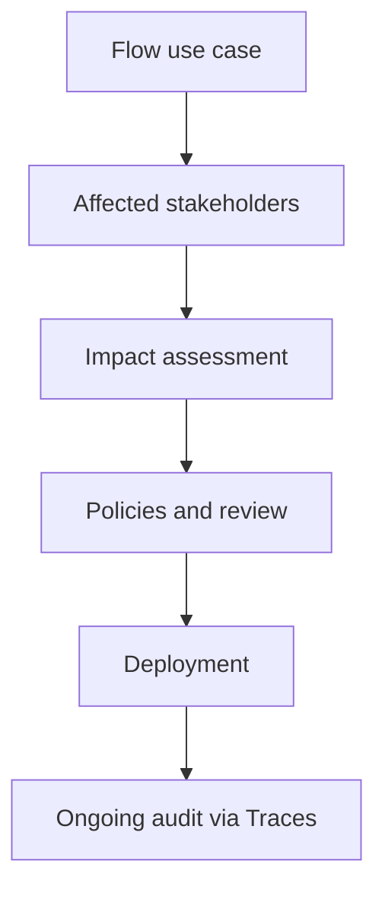

Ethics is not separate from architecture. If a user cannot appeal a decision, the flow lacks contestability. If the organization cannot explain why a flow escalated one customer and not another, the flow lacks traceability, and that is exactly what Traces and the Inspection Panel are meant to restore. If a flow sees more data than the task requires, the design violates minimization, and a data-access Policy is the place to correct it.

As introduced in Chapter 4, "Ethical Considerations in Decision-Making", responsible behavior begins before deployment. At enterprise scale, it becomes a governance program with owners, Policies, evidence, and periodic review.

### 6.2.3 Monitoring Agents Across Business Units

Enterprise risk is distributed by default. A finance flow can behave well, an HR flow can behave well, and a sales flow can behave well, while the organization as a whole picks up excessive cost, duplicated capabilities, inconsistent approval practices, or quiet data exposure.

Cross-business-unit monitoring should track:

- Flow inventory and ownership, organized by project.
- Tool usage by flow and business unit.
- Sensitive action attempts and Policy decisions.
- Human approval rates and rejection reasons.
- Cost by flow, project, and model provider.
- Latency and reliability.
- Policy violations.
- Evaluation trends.
- Data retention and access patterns.
- Compliance posture by framework, such as GDPR, DPDP Act, HIPAA, PCI DSS, OWASP, and NIST mapped controls.

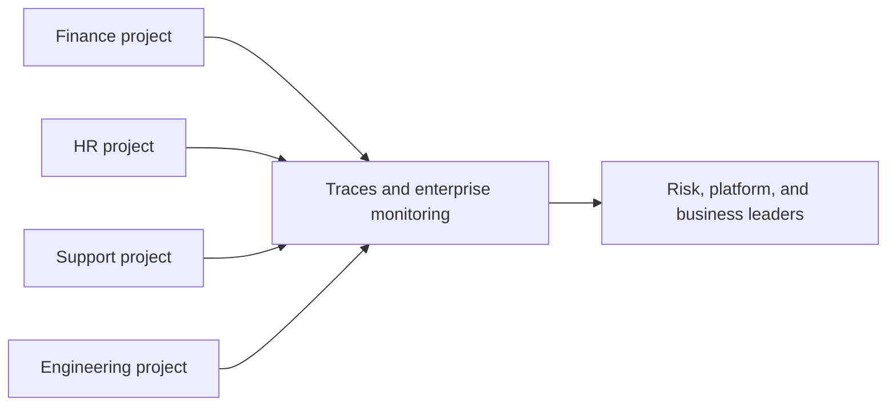

Langflow's observability surfaces support both ends of this need. Traces and the Inspection Panel give an engineer the detail to debug a single flow's reasoning and tool calls, while the same trace data, aggregated across projects, gives platform and risk leaders the portfolio view. Projects provide the natural grouping for ownership and cost attribution, and global model provider configuration makes model spend visible rather than buried inside individual flows. Where an organization already runs a broader observability or evaluation stack, Langflow's traces feed into it as the source events; the platform here is Langflow, but the monitoring discipline is the same one any mature agent program adopts.

The goal is not surveillance for its own sake. It is operational clarity. Leaders should know which flows exist, what they can do, how they perform, what they cost, and where risk is concentrated.

## 6.3 The ROI of Agentic AI

Enterprise adoption competes for capital, attention, and trust. A compelling demo opens a door; durable adoption requires a business case. In 2026, enterprise buyers are increasingly moving past generic productivity claims and asking for direct financial impact: revenue, margin, cost, risk, and cycle time.

The common mistake is measuring only activity. Number of flows deployed, number of runs triggered, or hours estimated does not prove value. The question that actually matters is whether the agentic workflow improved a business outcome enough to justify the cost and the risk.

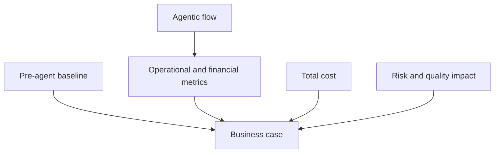

### 6.3.1 Measuring the Business Impact of Agents

ROI cannot be reconstructed honestly after the fact. Before deployment, the team has to define the baseline, the target metrics, the attribution method, and the cost model. The measurement itself is framework-agnostic; Langflow's contribution is that Traces make the operational numbers observable per run instead of guessed.

Four ROI pillars are especially useful:

- Cost takeout: reduced manual effort, vendor spend, rework, or headcount growth.
- Revenue acceleration: faster conversions, better retention, more timely outreach.
- Quality and risk reduction: fewer errors, fewer compliance incidents, better audit readiness.
- Cycle-time compression: faster processing, faster resolution, shorter close periods.

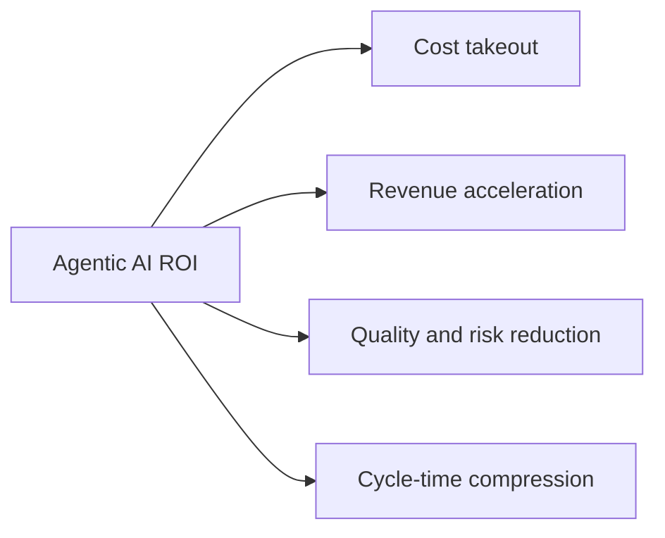

Metrics should be tied to the workflow:

- Cost per completed task.
- Cycle time from request to resolution.
- Automation rate.
- Human review rate.
- Rework or error rate.
- Compliance incident rate.
- Customer satisfaction.
- Revenue influenced.
- Margin per transaction.
- Cost of model, infrastructure, tooling, governance, and review.

Finance should agree to the methodology before the pilot. Otherwise, the team may produce a technically successful flow that cannot defend its value. A narrow workflow with a clean baseline is better than a broad transformation program with vague measurement.

### 6.3.2 Success Stories and Case Studies

Case studies make the value pattern concrete, but they reward careful reading. Vendor and press examples are full of impressive numbers. The thing to look for is the underlying shape: workflow volume, baseline, exception rate, human review, and a measurable outcome.

Reported examples translate naturally into Langflow flows:

- Customer service flows handling routine conversations, reducing resolution time, and escalating harder cases, built from an Agent component with retrieval and ITSM tools.
- Finance flows reconciling invoices, matching purchase orders, finding discrepancies, and preparing audit trails, often starting from a Data Extraction and Document Q&A pattern.
- Outreach flows reading CRM context, generating personalized messages, classifying replies, and routing outcomes, where a CSV Query Assistant or Call Classification Analytics template gives the first structure.
- Enterprise support flows connecting ITSM, HRIS, ERP, CRM, and knowledge bases through MCP Tools to resolve employee or customer requests.

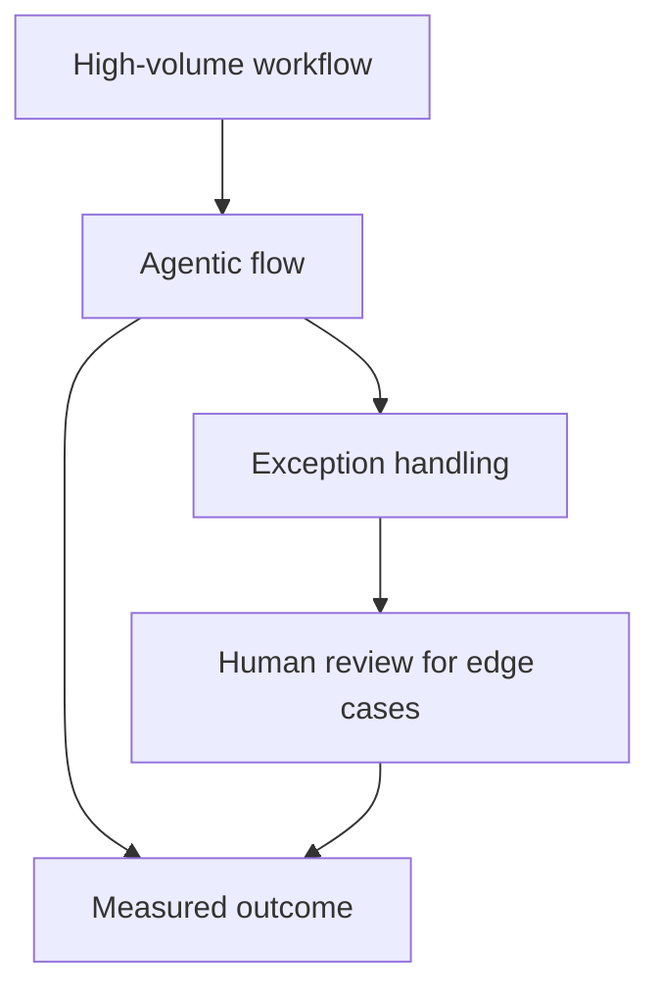

The strongest stories share common traits:

- The workflow was already expensive or slow.
- The process crossed multiple systems.
- Policies were clear enough to encode.
- Exceptions were common but classifiable.
- Humans remained responsible for ambiguous or high-risk decisions.
- The organization measured before and after.

The lesson is not that every enterprise should copy the same use case. The lesson is that agentic AI creates value when it moves work through a governed loop that handles routine cases, packages exceptions with context, and improves measurable outcomes. A Langflow template is a head start on that loop, not a guarantee of value; the value comes from the baseline, the guardrails, and the measurement around it.

### 6.3.3 Making the Business Case for Agentic AI

Enterprise adoption needs sustained backing from finance, risk, security, platform, and business leaders. A strong business case connects technical capability to operational economics in language each of those audiences recognizes.

A practical business case includes:

1. Workflow description and current pain.
2. Baseline volume, cost, cycle time, and quality.
3. Proposed flow scope and non-goals.
4. Tool and data access requirements, expressed as Tool Mode components, MCP servers, and global variables.
5. Risk tier and required Policies.
6. Success metrics and attribution method.
7. Cost model, including model, infrastructure, platform, review, and maintenance.
8. Pilot timeline and expansion criteria.

The measurement design should specify whether the pilot uses before-and-after comparison, A/B testing, shadow mode, or offline replay. A/B testing is appropriate for low-risk workflows where users can safely experience either version and outcomes are measurable; per-run tweaks make it straightforward to route some traffic to an alternate model or configuration. Shadow mode is better when the flow should make recommendations without executing them, which a draft-only design and review-required Policies can enforce. Offline replay is best when the workflow includes regulated data, irreversible actions, or high-stakes decisions. Pairwise evaluation is useful when two flow versions need qualitative comparison before a live pilot.

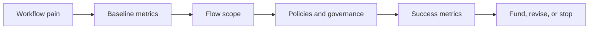

The best business cases are explicit about what the flow will not do. It may draft but not send. It may recommend but not approve. It may reconcile routine invoices but escalate exceptions. This clarity reduces risk and makes measurement easier, and in Langflow it is enforceable: the line between "draft" and "send" is a Policy around a tool, not a hope about the prompt.

At enterprise scale, the business case should also include platform reuse. A single workflow may not justify a full agent platform, but repeated use of shared projects, components, model providers, Policies, and Traces can. The ROI of agentic AI is often both local and platform-level: one flow produces direct value, while the shared Langflow foundation reduces the marginal cost of the next flow.

## Closing Recap

Enterprise adoption of agentic AI takes more than capable models. It takes runtime governance through Policies, identity-aware authorization via API keys and project boundaries, secret handling through global variables, observability through Traces, evaluation, cost controls, data privacy, and a business case tied to measurable outcomes.

The highest-value enterprise workflows are usually the high-volume, exception-heavy, cross-system processes where traditional automation breaks at the judgment calls, and Langflow's use-case templates give teams a fast way to recognize and start them. Guardrails have to scale from a single flow's Policies up to an enterprise-wide, non-bypassable control layer. ROI has to move past runs triggered and toward cost, revenue, quality, risk, and cycle-time impact, measured against a real baseline.

Chapter 7, "The Future of Agentic AI and Your Role", looks ahead. With the foundations in place, we turn to emerging trends, human-agent collaboration, professional leadership, continuous learning, and career paths in agentic AI.
