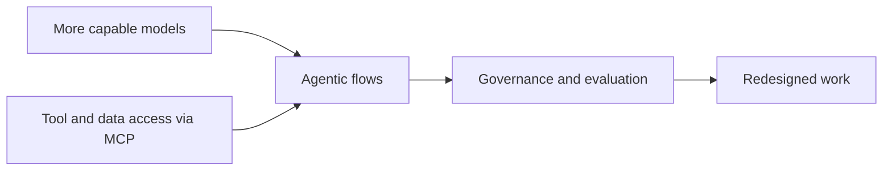
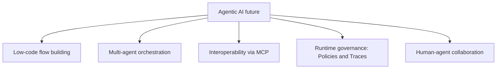
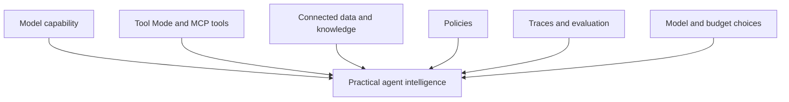
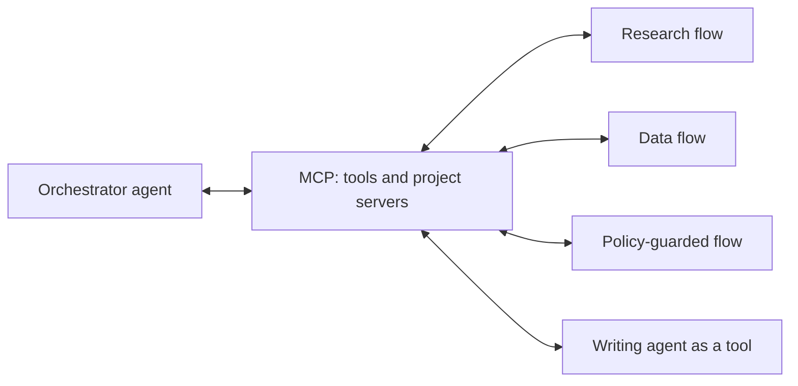
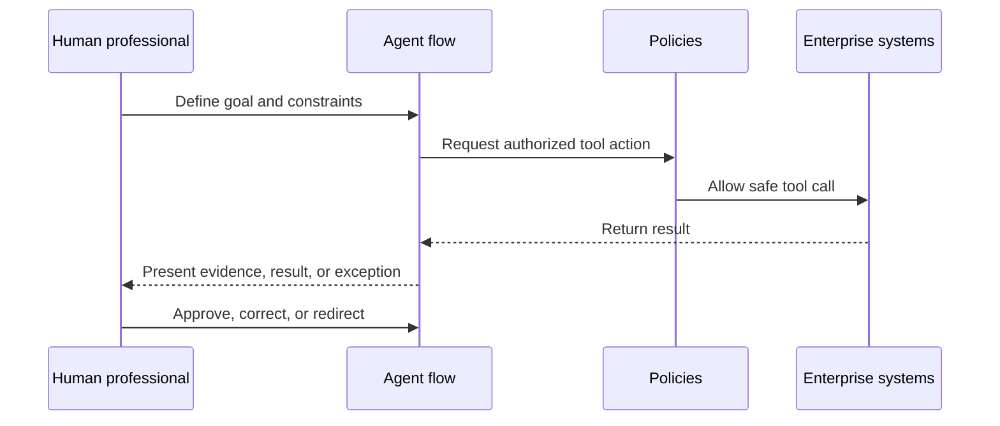
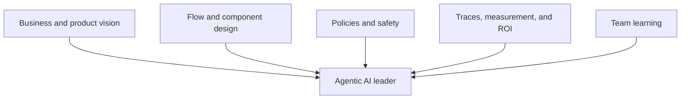
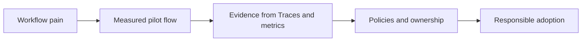
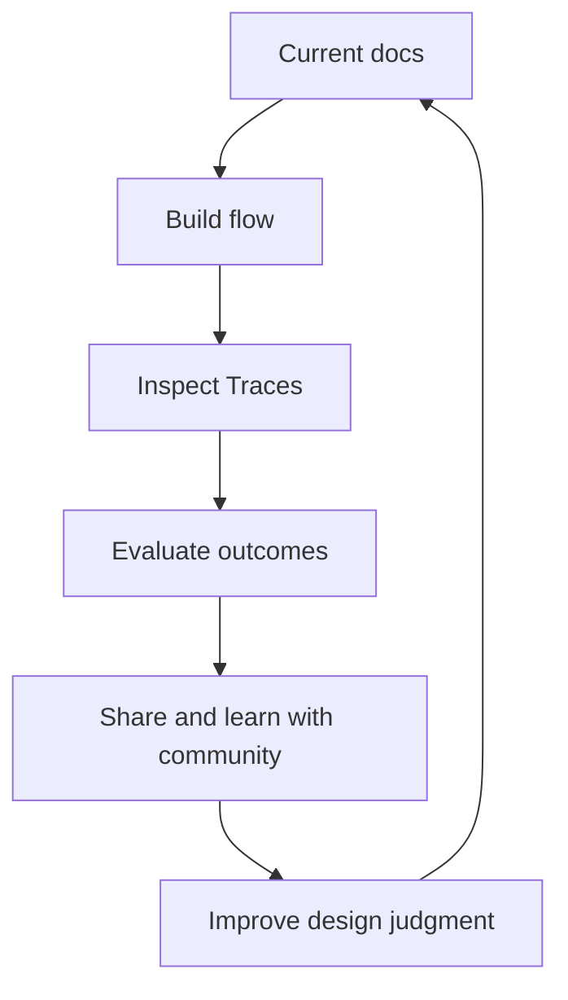
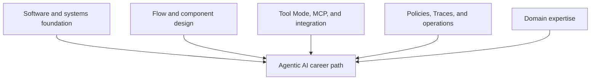

# Chapter 7. The Future of Agentic AI and Your Role

The future of agentic AI will not arrive as one dramatic moment when software suddenly becomes autonomous. It is arriving through small changes that compound. A support flow resolves routine requests on a canvas a domain expert helped design. An engineering agent drafts a migration plan using tools wired in through Tool Mode. A finance flow reconciles invoices and pauses for human review when an amount crosses a threshold. A research agent delegates to a second agent exposed to it as a tool. A policy layer decides, before any tool runs, which actions are allowed.

This is how a new execution layer forms.

The important professional question is not whether agents will become more capable. They will. The question is how professionals will shape the systems around them: the flows, components, protocols, boundaries, evaluations, governance, and human roles that decide whether agentic AI ends up as reliable infrastructure or uncontrolled automation. Low-code platforms change who gets to participate in that shaping. When building an agent is mostly composition on a canvas rather than framework code, the people closest to the work can help design it.

> As introduced in Chapter 6, "Enterprise Adoption of Agentic AI", enterprise adoption depends on operating models, not isolated demos. Chapter 7 closes the book by looking ahead and asking what kind of professional leadership this new layer requires, and how a visual platform like Langflow changes who can lead it.

## 7.1 Emerging Trends in Agentic AI

Professionals have to decide what to invest in before the market fully settles. The hard part is separating durable direction from short-term noise. Agentic AI is moving quickly, but the strongest signals are architectural, not cosmetic.

Several trends are already visible, and each shows up concretely in how a platform like Langflow is evolving:

- Building agents is getting easier. Low-code, visual editors lower the barrier so that the unit of agent work becomes a **flow** on a canvas rather than a codebase, and domain experts can build alongside engineers.
- Agents are becoming workflow participants, not just chat interfaces. A flow can be triggered, called through an API, or invoked as a tool by another system.
- Multi-agent systems are emerging where one agent cannot hold every domain, tool, and context. An Agent component can be used as a tool for another Agent.
- Interoperability protocols are becoming important because agents need standardized ways to access tools and communicate. Langflow acts as both an **MCP server** and an **MCP client**, and recent work extends MCP support to IDEs and coding agents.
- Observability, evaluation, and governance are becoming first-class platform requirements, surfaced through **Traces**, the Inspection Panel, and **Policies**.
- Human-agent collaboration is becoming an operating model, not a slogan.

Langflow's own roadmap reflects this direction. Recent releases point toward in-product AI assistance for building flows (a Langflow Assistant), tooling for managing flows outside the visual builder (a Flow DevOps toolkit), updated workflow APIs, global model-provider configuration, and richer observability through Traces and the Inspection Panel. None of these change what an agent fundamentally is. They change how quickly a professional can build one, govern it, and move it into production.

The useful professional stance is balanced. Agentic AI will become more capable, but capability does not remove the need for architecture. It increases the value of architecture. Low-code does not remove that need either; it makes good architecture faster to express and easier to share.

### 7.1.1 Agentic AI and General Intelligence

Agentic systems can look more general than earlier AI applications. A model connected to tools, memory, retrieval, planning, and feedback can do work across domains that once needed separate applications. That breadth is real, and it also breeds conceptual confusion.

Agentic AI is not the same thing as unconstrained general intelligence. What makes the distinction easy to see in Langflow is that every source of an agent's apparent generality is a concrete, configurable part of a flow. In production, an agent's reach is bounded by:

- The tools it can call, which are exactly the components placed in Tool Mode and the MCP tools wired to its Tools port.
- The data it can access, defined by the components, knowledge bases, and credentials connected to the flow.
- The state it can retain, set by its session memory and the number of chat-history messages kept per session.
- The policies it must follow, compiled from natural-language rules into deterministic guards around its tools.
- The evaluations it must pass, observed through the Playground and Traces.
- The cost and latency budget it must respect, shaped by model choice and how many tool calls a task requires.
- The environment in which it runs, whether Langflow Desktop, a container, or a cluster.

The near-term future is likely to be portfolios of specialized agents rather than one fully general autonomous worker. A legal review agent, a finance reconciliation agent, a code migration agent, and an incident triage agent may all use powerful models, but each is a distinct flow with different tools, memory, policies, and approval boundaries. On a visual canvas, that distinction is not abstract. You can see one agent's tool set differ from another's, and you can change scope by connecting or removing a single component.

This is a professional advantage. It means organizations can make progress without waiting for a mythical all-purpose system. They can build practical intelligence by combining model capability with well-designed context, tools, and controls, and they can do it in a form that non-specialists can read and review.

### 7.1.2 The Future of Multi-Agent Societies

Complex work is rarely single-threaded. Enterprises, supply chains, software teams, markets, hospitals, and cities already operate as networks of specialized actors. Agentic AI is starting to mirror that structure.

Research on LLM-based multi-agent systems describes a shift from isolated models toward collaboration-centric systems. Agents can take roles, divide work, debate, critique, negotiate, and coordinate across tasks. Industry sources compare this shift to microservices: smaller specialized components connected by protocols and orchestration.

The analogy is useful but incomplete. Microservices exchange structured data. Agents exchange task context, uncertain claims, tool results, plans, and judgments. That makes protocols and governance even more important.

Langflow gives this trend a low-code shape through two patterns. First, an Agent component can be placed in Tool Mode and used as a tool by another Agent, so an orchestrating agent can delegate a sub-task to a specialist agent without leaving the canvas. Second, every Langflow **project** runs an MCP server that exposes its flows as tools, so an agent in one project can call a flow in another, or an external client can call yours.

Two protocol categories are especially important:

- Tool access protocols, in particular the Model Context Protocol, help agents discover and call external tools and data sources. Langflow speaks this protocol as a client (through the MCP Tools component) and as a server (every project exposes its flows).
- Agent-to-agent patterns help agents discover capabilities, delegate tasks, and return results across boundaries. In Langflow, the practical building block today is "agent as a tool" combined with projects-as-MCP-servers, which lets one agent treat another flow as a callable capability.

The platform used throughout this book is moving in the same direction the broader field is. The emphasis is shifting from "how clever is the model" toward how reliably an agent can be deployed, composed, observed, and governed. Langflow reflects that by being both an IDE and a runtime: flows are callable through the API, exposable as MCP tools, deployable as containers or on a cluster, and inspectable through Traces. Future agent systems will be judged not only by model capability, but by how dependably they can be wired together and watched.

> As introduced in Chapter 3, "Centralized vs. Decentralized Control", multi-agent systems create trade-offs. More agents can mean more specialization and parallelism. They can also mean more latency, cost, ambiguity, and failure propagation. The future will reward teams that treat multi-agent flows as distributed systems with reasoning components, not as collections of independent chatbots. A visual canvas makes the wiring visible, but it does not make the trade-offs disappear.

### 7.1.3 Agentic AI and Human Collaboration

The future of agentic AI is not only technical; it changes how work is allocated. The most durable pattern is not "humans replaced by agents." It is "humans steer, agents execute within boundaries, and humans handle judgment, exceptions, and accountability."

This shift appears across enterprise sources. Organizations are redesigning workflows so agents handle routine, bounded, multi-step work while people define intent, supervise outcomes, manage exceptions, and make high-stakes decisions. The professional value moves from manual execution toward orchestration, evaluation, judgment, and system design.

Low-code reinforces this in a quiet but important way. Because a flow is readable, the people who own the workflow can sit at the canvas, see which tools an agent can use, read the natural-language rules behind its Policies, and review its behavior in the Playground and Traces. Steering stops being something only engineers can do.

The best human-agent teams have clear role boundaries:

- Humans define purpose, values, risk tolerance, and exception handling.
- Agent flows gather context, perform routine steps, and maintain execution momentum.
- Policies enforce boundaries by guarding tools before they run.
- Traces and the Playground make behavior observable and measurable.
- Operators and domain experts provide feedback, and on a low-code platform they can act on it directly.

This is not a demotion of human work. It is a shift toward work that requires context, judgment, accountability, and creativity. Professionals who learn to design and lead these flows, and to invite domain experts into building them, will be central to their organizations.

## 7.2 How You Can Lead the Agentic Future

Agentic AI will be shaped by the people who understand both its capability and its constraints. The field does not need more unbounded claims. It needs professionals who can turn potential into reliable systems, and who can do it in a form their colleagues can inspect.

Leading the agentic future means asking better questions:

- What workflow are we improving?
- What should remain deterministic?
- Which actions require approval or a Policy guard?
- How will we evaluate trajectories in Traces and the Playground?
- What evidence will build trust?
- Who owns the flow after launch?
- How will the team learn from failures?

### 7.2.1 Becoming an Agentic AI Advocate

Organizations need translation. Executives see opportunity. Engineers see risk. Domain teams see disruption. Security and compliance teams see exposure. A strong advocate connects those views into a practical path, and low-code gives that advocate a powerful prop: a working flow that people from each group can actually look at.

An effective agentic AI advocate does not sell autonomy for its own sake. They advocate for better workflows with appropriate autonomy. They know when to start with drafting, when to require human review, when to keep a step deterministic, and when a multi-agent flow is unnecessary.

Professional advocacy includes:

- Identifying workflows where agentic AI fits.
- Explaining benefits and risks in operational terms.
- Building small pilots from templates, such as Simple Agent, with measurable baselines.
- Bringing domain experts to the canvas to co-design flows.
- Making Traces and Playground runs visible to non-engineers.
- Treating Policies and governance as design inputs, not afterthoughts.
- Communicating failures honestly.

The advocate's credibility comes from restraint. Saying "not yet" to a high-risk use case can build more trust than forcing an impressive demo into production. A canvas that anyone can read makes that restraint easier to justify, because the limits of the flow are in plain sight.

### 7.2.2 Continuous Learning and Community

Agentic AI is still a fast-moving field. APIs change. Protocols evolve. Attack patterns emerge. Evaluation practices mature. Platforms add features. The professionals who thrive will build a learning loop for themselves, not only for their agents.

A practical learning loop includes:

1. Read current official documentation before relying on examples, because component names, ports, and features shift between versions.
2. Build small flows that expose real failure modes, starting from a template and changing one thing at a time.
3. Inspect behavior in Traces and the Playground for every flow you build.
4. Study production incidents and red-team findings.
5. Participate in communities around low-code agent platforms, MCP, evaluation, and safety.
6. Maintain a portfolio of working, measured flows you can export and share.

Communities matter because no single organization has solved every failure mode. Langflow and low-code platform users, MCP tool authors, agent-platform engineers, security researchers, domain experts, and AI governance professionals are all discovering the field together. Open templates, shared flow exports, and protocol specifications make that learning unusually concrete: you can often open someone else's flow, read it, and adapt it. The best learning happens where implementation, evaluation, and responsible critique meet.

### 7.2.3 Building a Career in Agentic AI

Agentic AI is becoming a professional discipline, not just a feature category. The roles are still settling, but the direction is clear. Organizations need people who can build, operate, evaluate, govern, and productize agentic systems, and increasingly they need people who can do this on low-code platforms where the build artifact is a flow.

Emerging roles include:

- AI Agent Engineer or Flow Designer: designs and builds agent flows that reason, use tools, and complete tasks.
- Agent Platform Engineer: builds shared infrastructure for components, tools, MCP servers, deployment, observability, Policies, and cost controls.
- LLM Infrastructure Engineer: manages model serving, latency, reliability, and cost behind the model providers a platform exposes.
- Agentic Operator or AI Workflow Supervisor: monitors live flows through Traces and handles exceptions and approvals.
- AI Product Manager: connects agent capability to business outcomes and user workflows.
- AI Governance or Risk Lead: owns Policies, compliance, auditability, and responsible deployment.

The skill stack is interdisciplinary, and on a low-code platform it shifts toward design and integration without abandoning fundamentals:

- Software engineering and systems fundamentals, which still explain why a flow behaves the way it does.
- Flow and component design: choosing components, wiring ports, and structuring agent loops on the canvas.
- Tool design and integration: building components in Tool Mode and connecting MCP tools and servers.
- Retrieval, memory, and session-state management.
- Evaluation and observability through Traces, the Inspection Panel, and the Playground.
- Governance through Policies, plus security, identity, and permissions.
- Human-in-the-loop and review design.
- API and deployment literacy: calling flows through the Langflow API and shipping them as containers or services.
- Product thinking and domain fluency.
- Light coding where low-code meets code: API integration, configuration, and the occasional custom component.

The most compelling career signal is not a certificate or a demo alone. It is evidence that you can build an agentic flow that handles a real workflow responsibly: clear scope, the right tools, sensible memory, Policies, visible Traces, evaluated outcomes, and measured impact. Because flows are exportable and readable, that evidence is unusually easy to show.

## Closing Recap

Agentic AI is becoming an execution layer for professional work. Its future will be shaped by more capable models, richer tools, protocol-driven interoperability through MCP, multi-agent coordination, runtime governance, and human-agent collaboration. Low-code platforms like Langflow change who gets to build that layer, turning agent construction into the composition of flows that domain experts and engineers can read together.

The central lesson of this book stays simple. An agent is a system that perceives, decides, acts, and continues toward a goal. Professional agentic AI is what makes that loop useful, bounded, observable, and accountable. In Langflow terms, that loop is an Agent component with the right tools in Tool Mode, the right data and memory, Policies guarding its actions, and Traces making its behavior visible. The future belongs to people who can design the flow, measure it, govern it, and improve it.

Your role is not to wait for the field to settle. It is to build with evidence, lead with judgment, learn continuously, and help organizations adopt agentic AI in ways that make work more capable, more trustworthy, and more human-centered.
