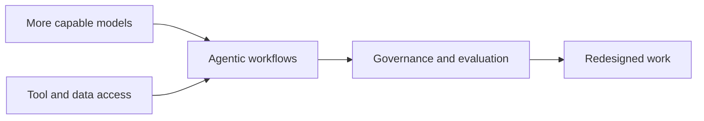
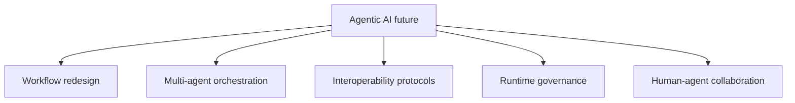
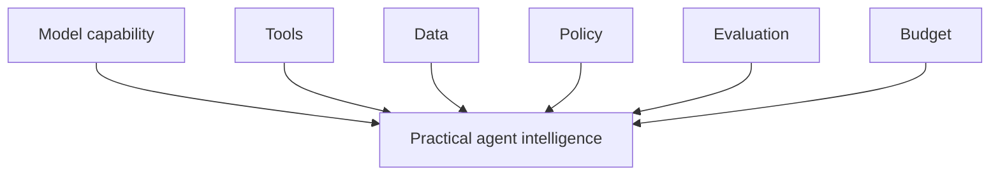
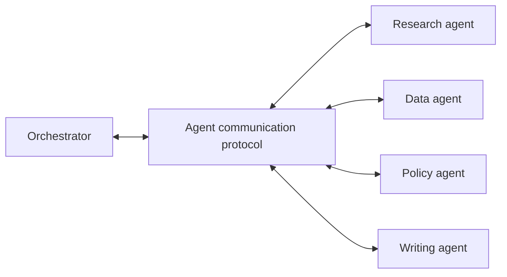
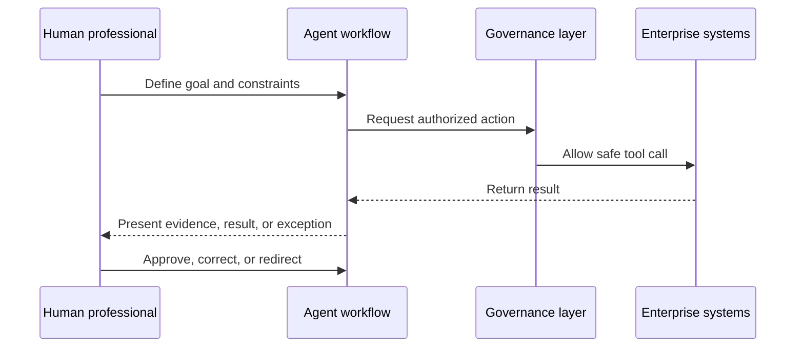
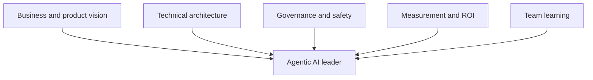
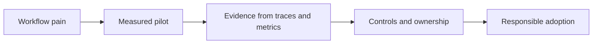
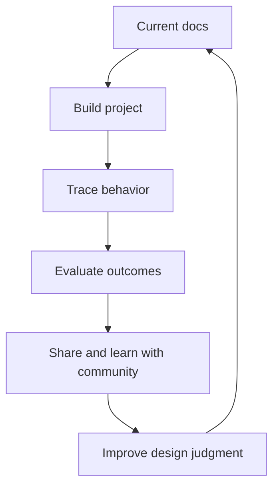
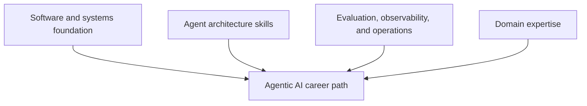

# Chapter 7. The Future of Agentic AI and Your Role

The future of agentic AI will not arrive as one dramatic moment when software suddenly becomes autonomous. It is arriving through smaller changes that compound: a support agent resolves routine requests, an engineering agent drafts a migration plan, a finance agent reconciles invoices, a research agent delegates to subagents, and a governance layer decides which actions require review.

This is how a new execution layer forms.

The most important professional question is not whether agents will become more capable. They will. The question is how professionals will shape the systems around them: the workflows, protocols, boundaries, evaluations, governance, and human roles that determine whether agentic AI becomes reliable infrastructure or uncontrolled automation.

As introduced in Chapter 6, "Enterprise Adoption of Agentic AI", enterprise adoption depends on operating models, not isolated demos. Chapter 7 closes the book by looking ahead and asking what kind of professional leadership this new layer requires.

## 7.1 Emerging Trends in Agentic AI

Trends matter because professionals must decide what to invest in before the market fully settles. The challenge is separating durable direction from short-term noise. Agentic AI is moving quickly, but the strongest signals are architectural rather than cosmetic.

Several trends are already visible:

- Agents are becoming workflow participants, not just chat interfaces.
- Multi-agent systems are emerging where one agent cannot hold every domain, tool, and context.
- Interoperability protocols are becoming important because agents need standardized ways to access tools and communicate.
- Observability, evaluation, and governance are becoming first-class platform requirements.
- Human-agent collaboration is becoming an operating model, not a slogan.

The useful professional stance is balanced. Agentic AI will become more capable, but capability does not remove the need for architecture. It increases the value of architecture.

### 7.1.1 Agentic AI and General Intelligence

General intelligence matters as a topic because agentic systems can appear more general than earlier AI applications. A model connected to tools, memory, retrieval, planning, and feedback can do work across domains that once required separate applications. That creates real power, but it also creates conceptual confusion.

Agentic AI is not the same thing as unconstrained general intelligence. In production, an agent's apparent generality is bounded by:

- The tools it can call.
- The data it can access.
- The state it can retain.
- The policies it must follow.
- The evaluations it must pass.
- The cost and latency budget it must respect.
- The environment in which it operates.

The near-term future is likely to be portfolios of specialized agents rather than one fully general autonomous worker. A legal review agent, a finance reconciliation agent, a code migration agent, and an incident triage agent may all use powerful models, but each should have different tools, state, evaluation, and approval boundaries.

This is a professional advantage. It means organizations can make progress without waiting for a mythical all-purpose system. They can build practical intelligence by combining model capability with well-designed context, tools, and controls.

### 7.1.2 The Future of Multi-Agent Societies

Multi-agent societies matter because complex work is rarely single-threaded. Enterprises, supply chains, software teams, markets, hospitals, and cities already operate as networks of specialized actors. Agentic AI is beginning to mirror that structure.

Research on LLM-based multi-agent systems describes a shift from isolated models toward collaboration-centric systems. Agents can take roles, divide work, debate, critique, negotiate, and coordinate across tasks. Industry sources compare this shift to microservices: smaller specialized components connected by protocols and orchestration.

The analogy is useful but incomplete. Microservices exchange structured data. Agents exchange task context, uncertain claims, tool results, plans, and judgments. That makes protocols and governance even more important.

Two protocol categories are especially important:

- Tool access protocols, such as Model Context Protocol patterns, help agents discover and call external tools and data sources.
- Agent-to-agent protocols, such as A2A-style patterns, help agents discover capabilities, delegate tasks, and return results across boundaries.

The reference stack used throughout this book is moving in the same direction. LangGraph continues to emphasize stateful agent runtimes with persistence, streaming, and human-in-the-loop support, while LangSmith Deployment frames production agents around durable execution, Agent Server runtimes, threads, runs, and composition through MCP and A2A-style connectivity. The trend is clear: future agent systems will be judged not only by model capability, but by how reliably they can be deployed, composed, observed, and governed.

As introduced in Chapter 3, "Centralized vs. Decentralized Control", multi-agent systems create trade-offs. More agents can mean more specialization and parallelism. They can also mean more latency, cost, ambiguity, and failure propagation. The future will reward teams that treat multi-agent systems as distributed systems with reasoning components, not as collections of independent chatbots.

### 7.1.3 Agentic AI and Human Collaboration

Human collaboration matters because the future of agentic AI is not only technical. It changes how work is allocated. The most durable pattern is not "humans replaced by agents." It is "humans steer, agents execute within boundaries, and humans handle judgment, exception, and accountability."

This shift appears across enterprise sources. Organizations are redesigning workflows so agents handle routine, bounded, multi-step work while people define intent, supervise outcomes, manage exceptions, and make high-stakes decisions. The professional value moves from manual execution toward orchestration, evaluation, judgment, and system design.

The best human-agent teams have clear role boundaries:

- Humans define purpose, values, risk tolerance, and exception handling.
- Agents gather context, perform routine steps, and maintain execution momentum.
- Governance systems enforce boundaries.
- Evaluation systems measure behavior.
- Operators and domain experts provide feedback.

This is not a demotion of human work. It is a shift toward work that requires context, judgment, accountability, and creativity. Professionals who learn to design and lead these systems will be central to their organizations.

## 7.2 How You Can Lead the Agentic Future

Leadership matters because agentic AI will be shaped by the people who understand both its capability and its constraints. The field does not need more unbounded claims. It needs professionals who can turn potential into reliable systems.

Leading the agentic future means asking better questions:

- What workflow are we improving?
- What should remain deterministic?
- Which actions require approval?
- How will we evaluate trajectories?
- What evidence will build trust?
- Who owns the agent after launch?
- How will the team learn from failures?

### 7.2.1 Becoming an Agentic AI Advocate

Advocacy matters because organizations need translation. Executives may see opportunity. Engineers may see risk. Domain teams may see disruption. Security and compliance teams may see exposure. A strong advocate connects these views into a practical path.

An effective agentic AI advocate does not sell autonomy for its own sake. They advocate for better workflows with appropriate autonomy. They know when to start with drafting, when to require human review, when to keep deterministic code, and when a multi-agent system is unnecessary.

Professional advocacy includes:

- Identifying workflows where agentic AI fits.
- Explaining benefits and risks in operational terms.
- Building small pilots with measurable baselines.
- Bringing domain experts into design.
- Making traces and evals visible.
- Treating safety and governance as design inputs.
- Communicating failures honestly.

The advocate's credibility comes from restraint. Saying "not yet" to a high-risk use case can build more trust than forcing an impressive demo into production.

### 7.2.2 Continuous Learning and Community

Continuous learning matters because agentic AI is still a fast-moving field. APIs change. Protocols evolve. Attack patterns emerge. Evaluation practices mature. Frameworks consolidate. The professionals who thrive will build a learning loop for themselves, not only for their agents.

A practical learning loop includes:

1. Read official documentation before relying on examples.
2. Build small systems that expose real failure modes.
3. Trace and evaluate every agent you build.
4. Study production incidents and red-team findings.
5. Participate in communities around frameworks, protocols, evaluation, and safety.
6. Maintain a portfolio of working, measured projects.

Communities matter because no single organization has solved every failure mode. LangChain and LangGraph practitioners, agent-platform engineers, security researchers, domain experts, and AI governance professionals are all discovering the field together. The best learning happens where implementation, evaluation, and responsible critique meet.

### 7.2.3 Building a Career in Agentic AI

Career building matters because agentic AI is becoming a professional discipline, not merely a feature category. The roles are still settling, but the direction is clear: organizations need people who can build, operate, evaluate, govern, and productize agentic systems.

Emerging roles include:

- AI Agent Engineer: designs and builds agent workflows that reason, use tools, and complete tasks.
- Agent Platform Engineer: builds shared infrastructure for tools, state, deployment, observability, guardrails, and cost controls.
- LLM Infrastructure Engineer: manages model serving, latency, reliability, and cost.
- Agentic Operator or AI Workflow Supervisor: monitors live agent workflows and handles exceptions.
- AI Product Manager: connects agent capability to business outcomes and user workflows.
- AI Governance or Risk Lead: owns policy, compliance, auditability, and responsible deployment.

The skill stack is interdisciplinary:

- Software engineering fundamentals.
- Python or TypeScript.
- API and tool design.
- LangChain, LangGraph, or comparable orchestration frameworks.
- Retrieval, memory, and state management.
- Evaluation and observability.
- Security, identity, and permissions.
- Human-in-the-loop design.
- Product thinking and domain fluency.

The most compelling career signal is not a certificate or a demo alone. It is evidence that you can build an agentic system that handles a real workflow responsibly: clear scope, tools, state, guardrails, traces, evaluations, and measured outcomes.

## Closing Recap

Agentic AI is becoming an execution layer for professional work. Its future will be shaped by more capable models, richer tools, protocol-driven interoperability, multi-agent coordination, runtime governance, and human-agent collaboration.

The central lesson of this book remains simple: an agent is a system that perceives, decides, acts, and continues toward a goal. Professional agentic AI makes that loop useful, bounded, observable, and accountable. The future belongs to people who can design the loop, measure it, govern it, and improve it.

Your role is not to wait for the field to settle. It is to build with evidence, lead with judgment, learn continuously, and help organizations adopt agentic AI in ways that make work more capable, trustworthy, and human-centered.
