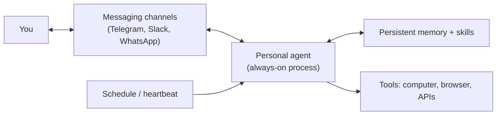
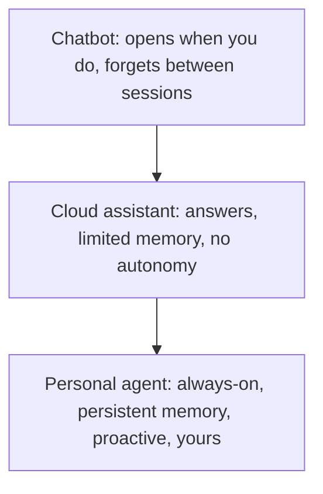
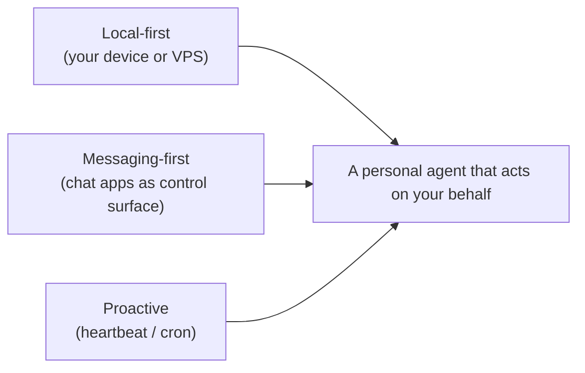
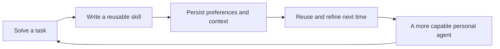
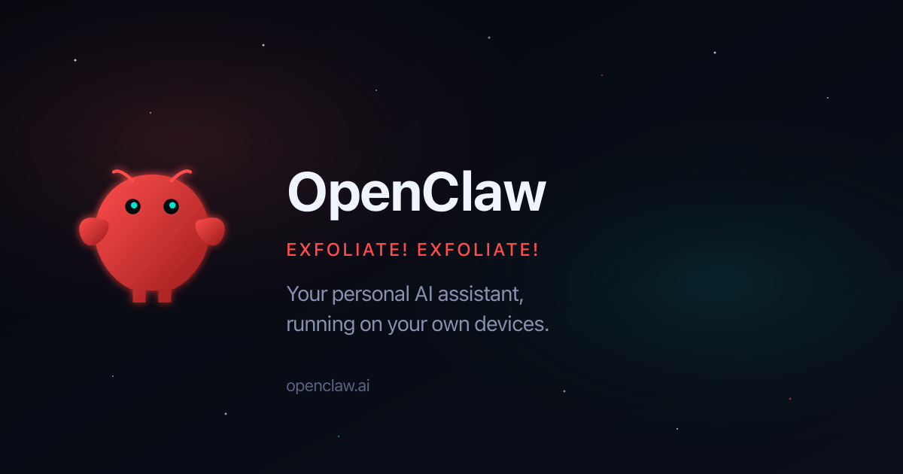
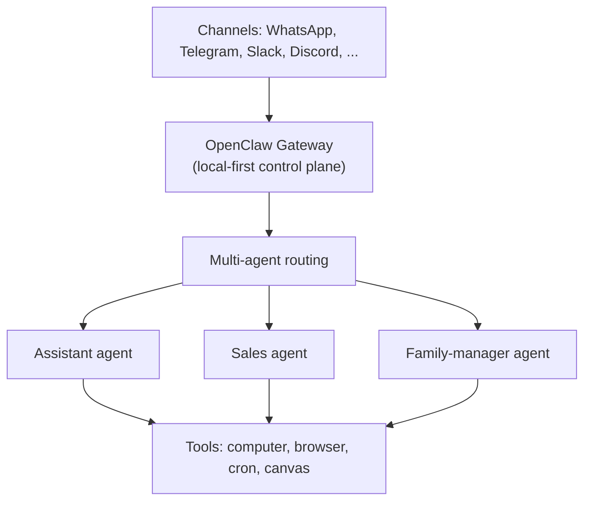
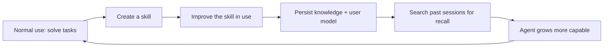
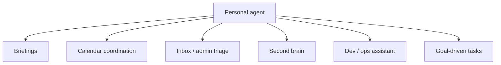
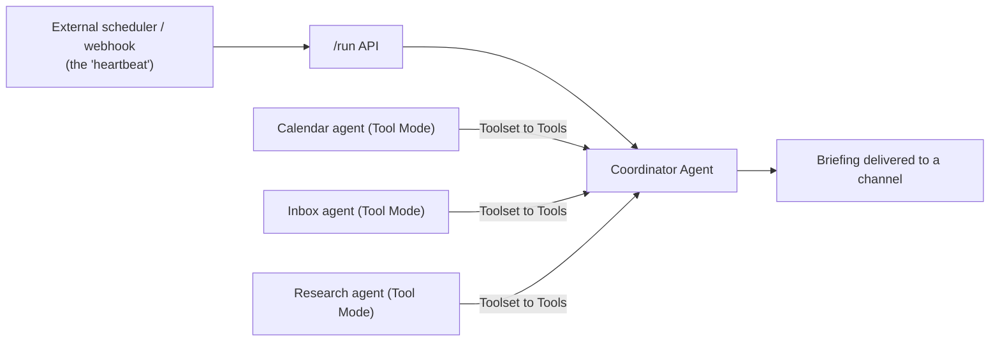
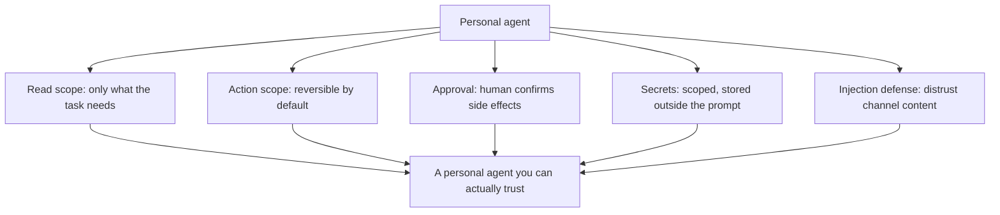

# Chapter 8. Personal Agents: Always-On Assistants You Run Yourself

Most of this book has treated agents as something an organization builds: a support flow, an incident triage flow, a finance reconciliation flow, governed and deployed for many users. There is a second wave happening in parallel, and it is more personal. People are running a single agent of their own, on their own hardware or a cheap server, that knows their projects, watches their calendar, reads their inboxes, and quietly does work while they sleep.

These are personal agents, and two open-source projects have come to define the category: OpenClaw and Hermes.

A personal agent is not a smarter chatbot you open in a browser tab. It is a long-lived process you talk to through the messaging apps you already use, that holds memory across months, builds its own reusable skills, and acts on a schedule without waiting for a prompt. The same agent loop from Chapter 1 is still at the core, but the framing flips: instead of one agent serving thousands of users inside a company, one person directs a small team of agents that serve only them.

This chapter looks closely at that model. We will define what makes a personal agent distinct, study OpenClaw and Hermes as real systems, walk through the use cases people actually run, and then connect the pattern back to the low-code, visual approach used throughout the book. The goal is not to sell autonomy. It is to understand a fast-moving category well enough to adopt it deliberately, with the same attention to boundaries, privacy, and trust that the rest of the book demands.

## 8.1 What Makes a Personal Agent Different

It is tempting to treat a personal agent as just a chatbot with extra permissions. That framing misses what actually changes. The shift is not the model; it is the relationship. A personal agent is always on, it is yours alone, it remembers, and it acts on its own schedule. Each of those properties changes the engineering and the etiquette of using it.

This section draws the line between the assistant model most people already know and the personal-agent model that OpenClaw and Hermes represent. The distinction matters because the controls, the risks, and the benefits all follow from it.

### 8.1.1 From Shared Service to Personal, Always-On Agent

The enterprise agents in earlier chapters are shared services. One flow is built once and serves many users, so it must be governed, multi-tenant, and conservative about what any single user can make it do. A personal agent inverts every part of that. It has one principal, one set of preferences, and one risk tolerance: yours.

That inversion is what makes the personal model interesting. Because the agent serves only you, it can be given context that no shared service should ever hold centrally: your calendar, your private notes, your messages, your accounts. And because it answers only to you, it can take initiative that a shared service would never be allowed to take on a stranger's behalf.

The defining property is "always on." As introduced in Chapter 1, "What is an Agent?", an agent runs a loop: observe, decide, act, repeat. A chatbot only runs that loop while you are watching. A personal agent runs it continuously. OpenClaw describes itself as always on, running locally, and able to work on its own schedule, even overnight. Hermes is built to run 24/7 on a small server and to be reached from a phone while it works on a cloud machine. The agent is no longer a tab you open; it is a process that is already running when you think to message it.

This continuity is the source of both the value and the responsibility. An agent that is always running, holding your private context, and able to act is a powerful ally and a serious surface area. The rest of the chapter keeps returning to that trade-off.

### 8.1.2 Local-First, Messaging-First, and Proactive

Three design choices recur across personal agents, and together they explain how the category feels different to use.

The first is local-first. OpenClaw runs on your own devices: a laptop, a Mac Mini under the desk, an old PC, or a small VPS. Hermes installs on your own server with a single command and can run on a $5 VPS or scale up to a GPU cluster. Running your own agent means your private context does not have to be handed to a third-party product; the data and the decisions stay on infrastructure you control. That is a meaningful privacy posture, though as Section 8.3.2 stresses, local-first is not automatically safe.

The second is messaging-first. Rather than inventing a new interface, personal agents meet you on the channels you already use. OpenClaw answers on WhatsApp, Telegram, Slack, Discord, Signal, iMessage, and many more, through a single gateway that routes messages to the agent. Hermes connects Telegram, Discord, Slack, WhatsApp, Signal, and a CLI from one gateway process, with cross-platform continuity so a conversation started on your phone can continue in your terminal. The chat app becomes the control surface for real work.

The third is proactivity. As introduced in Chapter 2, "Agentic AI and Proactive Behavior", the most valuable workflows often do not begin with a typed question. Personal agents lean into this with scheduling. OpenClaw uses a "heartbeat": scheduled checks that wake the agent to look at its to-do list and monitor calendars without being prompted. Hermes ships a built-in cron scheduler that delivers daily reports, nightly backups, and weekly audits unattended. The agent initiates, you review.

### 8.1.3 Memory, Skills, and Getting Smarter Over Time

A shared service is often deliberately stateless between users. A personal agent is the opposite: its value compounds precisely because it remembers. This is where the category's most distinctive engineering shows up.

Persistent memory is the baseline. Hermes builds a deepening model of who you are across sessions, so you do not re-explain your projects and preferences every time; it can even search its own past conversations. OpenClaw manages memory through compaction and an explicit capabilities file so the agent carries forward what matters without drowning in history. As introduced in Chapter 2, "Adding Learning Capabilities", controlled, inspectable memory is what lets an agent improve without becoming unaccountable, and personal agents make memory a first-class, persistent store rather than a rolling window.

The newer idea is self-authored skills. When Hermes solves a hard problem, it writes a reusable skill document so it never has to relearn the solution; those skills are searchable, improve during use, and follow the open agentskills.io standard. OpenClaw similarly lets the agent build its own skills and define its capabilities explicitly, then reuse them. A community stack built on Hermes captures this neatly: skills are markdown playbooks that teach the agent specific tasks, like airline check-in or booking a laundry pickup, and each new skill gets cheaper to build because the agent and its knowledge base already know the patterns.

This is the compounding loop that makes personal agents feel alive over time: act, capture what worked as a skill, reuse and refine it, and grow more capable with use.

## 8.2 Two Open-Source Personal Agents

Abstractions only go so far. The personal-agent category is best understood through the two projects that defined it, because their design choices are concrete and their use cases are documented by real users. OpenClaw and Hermes share the same DNA, always-on, messaging-first, memory-rich, but they emphasize different things: OpenClaw the multi-channel personal assistant, Hermes the self-improving agent.

This section profiles both, then surveys the use cases people actually run. Treat the specifics as a snapshot of a fast-moving space; the patterns will outlast the version numbers.

### 8.2.1 OpenClaw: The Multi-Channel Personal Assistant

OpenClaw is an open-source personal AI assistant you run on your own devices, on any OS and any platform. Its organizing metaphor is "your assistant on every channel you use." You message it where you already chat, and it can control your computer and take care of tasks just as you would, on its own schedule.

*Figure 8.1: OpenClaw frames itself as a personal AI assistant that runs on hardware you own. Source: OpenClaw (openclaw.ai).*

Architecturally, OpenClaw centers on a local-first Gateway: a single control plane for sessions, channels, tools, and events. The Gateway is just the plumbing; the product is the assistant that sits behind it. Around that core, OpenClaw provides multi-channel messaging across a long list of platforms, multi-agent routing that sends different channels or contacts to isolated agents with their own workspaces and sessions, first-class tools (a browser, a canvas, cron scheduling, and chat-platform actions), and a skills system set up through an onboarding wizard.

In practice, that messaging-first design means the interface is just a chat thread. You talk to the agent in an app you already use, and it replies, remembers context, and acts, with no separate console to learn.

*Figure 8.2: OpenClaw in everyday use, reached through WhatsApp like any other contact. The chat app is the control surface. Source: OpenClaw documentation (docs.openclaw.ai).*

Two design choices stand out for professionals. First, multi-agent routing: rather than one overloaded assistant, OpenClaw encourages a small team of specialized agents, each with its own "quiet room" of context. This is the personal-scale version of the lesson from Chapter 3, "What Are Multi-Agent Systems?": a single general-purpose agent hits context overload, and specialization is the cure. Users describe running distinct agents like a salesperson agent that does daily CRM sweeps and a family-manager agent that untangles school and sports schedules. Second, the heartbeat: scheduled jobs that let agents wake themselves, check a to-do list, and monitor calendars without a prompt, which is what turns OpenClaw from something you chat with into something that collaborates with you over time.

OpenClaw is open source under a permissive license and built in TypeScript. A Go reimplementation, GoClaw, targets multi-tenant production use with stronger isolation, which hints at how a personal-agent design grows up into a team or enterprise platform, a thread we pick up in Section 8.3.3.

### 8.2.2 Hermes: The Self-Improving Agent

Hermes, built by Nous Research and released in early 2026, takes the same always-on, messaging-first foundation and pushes hardest on one idea: an agent that learns. Its tagline, "the agent that grows with you," is meant literally. Hermes is the mainstream personal agent built around a closed learning loop that creates, edits, and improves its own skills during normal use.

*Figure 8.3: Hermes leads with the properties that define the personal-agent category: self-hosted, persistent memory, and multi-platform. Source: Hermes Agent, Nous Research (hermes-agent.org).*

The learning loop is the headline feature. Hermes creates skills from experience, improves them while using them, nudges itself to persist what it has learned, searches its own past conversations for recall, and maintains a deepening user model across sessions. Skills follow the open agentskills.io standard, so they are shareable and portable rather than locked inside one install.

The rest of the system is built to keep that loop running cheaply and everywhere. Hermes is model-agnostic: you can point it at a hosted portal, an aggregator with many models, or your own endpoint, and switch with a single command. It runs anywhere, from a $5 VPS to a GPU cluster, with serverless backends that hibernate when idle so an always-on agent costs almost nothing between bursts of work. It reaches you across Telegram, Discord, Slack, WhatsApp, Signal, and a full terminal interface, with voice transcription and cross-platform continuity. It spawns isolated subagents for parallel work, and it includes a cron scheduler for unattended reports and audits.

Hermes is open source under a permissive license, with a Python and TypeScript codebase, and it doubles as a research platform: it can generate training trajectories and run reinforcement-learning experiments, reflecting its origin in a research lab. For our purposes, the important point is the design stance: where OpenClaw optimizes for reach across every channel, Hermes optimizes for an agent that compounds its own competence over time. Most teams evaluating personal agents are really choosing between, or combining, those two emphases.

### 8.2.3 Personal Agent Use Cases in Practice

The reason these projects spread is not their architecture diagrams; it is the everyday work they take off people's plates. The documented use cases cluster into a handful of patterns that recur across both OpenClaw and Hermes.

- Daily and weekly briefings. The agent pulls news, calendar, and tasks from your chosen sources, filters by what you care about, and delivers a prioritized briefing to your chat app each morning, with no app-switching.
- Calendar and schedule coordination. The agent watches calendars, resolves conflicts, prepares "just-in-time" meeting prep, and untangles messy logistics like parsing a sports tournament's emails into who-picks-up-whom.
- Inbox and admin triage. The agent triages email and messages, flags action items, summarizes threads, and drafts replies in your voice for you to approve.
- A second brain. The agent captures notes, ideas, and reminders over time, keeps them in sync with a note system, and answers questions like "what did I work on this month?"
- Developer and ops work. The agent runs code reviews, remembers your conventions, drafts a daily standup summary, monitors infrastructure for drift, and can act as a night-shift on-call that summarizes alerts and flags what needs a human.
- Research on your niche. The agent watches specific newsletters, blogs, and feeds and delivers a periodic brief with the signal pulled out.
- Goal-driven autonomous tasks. You "brain dump" your goals once, and the agent generates and completes daily tasks that advance them, even building small applications overnight for you to review in the morning.
- Hands-on errands through skills. With explicit, reviewable skills, users have automated tasks like airline check-in and booking recurring service pickups.

A consistent lesson runs through these stories. The users who succeed do not hand one agent everything. They start with a single real task, confirm it works, and only then expand the agent's responsibilities, often splitting work across specialized agents. They also keep a human in the loop for anything consequential: the agent drafts the reply, books the slot, or opens the pull request, and the person approves. This mirrors the discipline from Chapter 5, "Building Your First Agentic Project": start narrow, keep outputs reviewable, and expand only with evidence.

## 8.3 Building Personal Agents Responsibly with Low-Code

OpenClaw and Hermes are purpose-built personal-agent runtimes. This book, though, teaches the low-code, visual approach, and the two worlds meet more than they might first appear. The patterns that make personal agents valuable, an agent loop, tools, memory, scheduling, multi-agent specialization, are exactly the patterns you can compose on a Langflow canvas. Just as importantly, the boundaries that make personal agents safe are the same controls the book has stressed throughout.

This section connects the personal-agent model to Langflow, then treats the privacy and trust questions that always-on personal agents raise, and closes by following the path from a personal agent to a team and enterprise capability.

### 8.3.1 Personal Agent Patterns in Langflow

A personal agent is, at its core, an Agent component with tools, memory, and a trigger, the same building blocks introduced in Chapter 1, "What is an Agent?". Langflow lets you assemble a personal-assistant flow without committing to a dedicated runtime, which is a good way to prototype the idea or to build the specific workflows you care about most.

The building blocks line up cleanly:

| Personal-agent capability | Langflow building block |
| --- | --- |
| The agent loop and reasoning | An Agent component with Language Model and Agent Instructions |
| Tools and actions | Tool Mode components (Web Search, URL, and more) on the Tools port |
| Reaching outside systems | The MCP Tools component connecting to external or Langflow MCP servers |
| Memory across turns | Built-in session memory keyed by `session_id` |
| Specialized sub-agents | Other Agent components in Tool Mode, the "agent as a tool" pattern |
| Proactive triggers | The flow's `/run` API called by an external scheduler or webhook |
| Guardrails on actions | Policies that compile rules into deterministic guards around tools |

Two patterns from earlier chapters carry over directly. The "agent as a tool" composition from Chapter 3, "Centralized vs. Decentralized Control", is exactly how OpenClaw's team-of-specialists model would look on a canvas: a coordinating Agent with a calendar agent, an inbox agent, and a research agent connected to its Tools port. And the proactivity that defines personal agents maps onto Langflow's runtime: a flow is not limited to someone typing in the Playground, because the same flow can be invoked through the `/run` endpoint by an external scheduler, which is the low-code equivalent of a heartbeat or cron job.

The honest trade-off: dedicated runtimes like OpenClaw and Hermes give you channel integrations, persistent cross-session memory, and self-authored skills out of the box, which a hand-built flow does not match without extra work. Langflow's strength is that it makes the workflow itself explicit, visual, and governable. A pragmatic pattern is to use both: let a personal-agent runtime own the always-on, multi-channel front end, and expose your governed Langflow flows to it as MCP tools, so sensitive or shared workflows run inside the controls described in Chapter 6, "Governance and Compliance Considerations".

### 8.3.2 Boundaries, Privacy, and Trust for Personal Agents

A personal agent concentrates risk in one place. It holds your private context, runs continuously, and can act on your accounts. Local-first deployment helps with privacy, but it does not, by itself, make any of this safe. The controls from Chapter 4 apply with extra force here, because the principal and the victim of a mistake are the same person.

The boundary questions from Chapter 4, "Defining Agent Boundaries", translate directly to the personal setting:

- What can the agent read? An agent with your inboxes, messages, and notes has access most software never gets. Scope it to what each task needs.
- What can it act on? Reading is recoverable; sending money, emailing contacts, or changing accounts is not. Reserve those for explicit approval.
- When must it ask first? Side-effecting actions, especially anything irreversible or public, should pause for human confirmation rather than proceed autonomously.
- What runs unattended? A heartbeat that drafts is very different from a heartbeat that sends. Keep overnight autonomy on the preparation side of that line until trust is earned.

Two risks deserve special attention for always-on personal agents. The first is prompt injection through the very channels that make them useful: an agent that reads your email and can act is a target for messages crafted to hijack it, the indirect-injection problem from Chapter 4, "Guardrails for Agentic AI". The second is credential exposure: a personal agent typically holds tokens for many services, so where those secrets live and how they are scoped matters enormously. In a Langflow-based design, Policies provide deterministic guards around tools and global variables and Credentials keep secrets out of the flow itself; in a dedicated runtime, the equivalent is careful skill review, least-privilege tokens, and keeping high-impact actions behind confirmation.

As introduced in Chapter 4, "Building Trustworthy Agents", trust is earned through evidence, not fluency. The same holds at personal scale: the agents people keep are the ones whose actions they can see, review, and undo, not the ones that simply sound confident.

### 8.3.3 From Personal Agent to Team and Enterprise

Personal agents are not a side road away from the rest of the book; they are often the on-ramp. A pattern is becoming common: an individual runs a personal agent, proves a workflow on themselves, and then the organization asks to make it shared, governed, and safe for many users. That is precisely the transition Chapter 6 describes.

The signals of that transition are visible in the projects themselves. GoClaw exists because OpenClaw's personal design needed a multi-tenant, isolated, production-grade form for teams. The skills people write for their personal agents are early versions of the reusable components an organization will later standardize. And the move from "I trust it because it is mine" to "we trust it because it is governed" is the move from personal preference to the runtime governance, identity, and auditability covered in Chapter 6, "Scaling Agentic Solutions in Enterprises".

This is also where low-code earns its place. A personal agent proven on one person can be re-expressed as governed Langflow flows, with Policies as the guardrail layer, projects as ownership boundaries, and Traces as the audit record, then exposed back to personal-agent runtimes over MCP so individuals keep their convenient front end while the organization keeps its controls. As introduced in Chapter 7, "Agentic AI and Human Collaboration", the durable pattern is humans steering and agents executing within boundaries. Personal agents are where many people will first feel that shift, one calendar, one inbox, one drafted reply at a time.

## Closing Recap

Personal agents are always-on, messaging-first, memory-rich assistants that you run yourself. OpenClaw and Hermes define the category: OpenClaw as the multi-channel personal assistant built on a local-first gateway with a heartbeat and a team of specialized agents, and Hermes as the self-improving agent built around a closed learning loop that writes and refines its own skills. Their documented use cases, briefings, calendar coordination, inbox triage, a second brain, dev and ops help, and goal-driven overnight work, show why the model is spreading.

The same agent loop, tools, memory, and multi-agent patterns from earlier chapters underlie all of it, and they can be composed in Langflow, where proactivity becomes a scheduled `/run` call and specialization becomes the "agent as a tool" pattern. The privacy and trust stakes are higher precisely because the agent is personal: it holds your context, runs unattended, and acts on your behalf, so read scope, action scope, approvals, secret handling, and injection defenses are not optional. Handled well, a personal agent is also an on-ramp, the workflow you prove on yourself today is often the governed, shared capability your organization runs tomorrow.

This chapter closes the book's arc. We began with the definition of an agent and end with agents that live alongside us. Whether you build for an enterprise or for an audience of one, the discipline is the same: design the loop, give it the right tools, bound what it can do, make its behavior visible, and expand its autonomy only as fast as the evidence allows.
